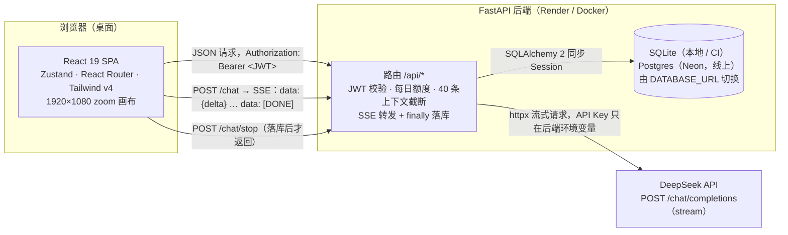

# Baker Chat

"终末地 BAKER 会话消息"角色聊天应用的 React + FastAPI 重写版：登录后与 29 个内置角色逐行流式对话，AI 由后端代理 DeepSeek，会话、消息与设置按用户存在服务端。

> 截图：待线上部署后补充（登录页、角色列表 + 流式回复、设置对话框三张，放在 `docs/` 下并在此处引用）。

## 架构



一次消息的完整数据流（SSE 帧格式、持久化时机、停止协议）见 [docs/interview.md](docs/interview.md) 第 1 节；接口契约见 [docs/api.md](docs/api.md)。

## 技术栈

| 层     | 选型                                                    | 版本                                                           |
| ------ | ------------------------------------------------------- | -------------------------------------------------------------- |
| 前端   | React                                                   | 19.3                                                           |
| 前端   | TypeScript（strict）                                    | 5.9                                                            |
| 前端   | Vite（构建 + dev server，与 Vitest 共用配置）           | 7.3                                                            |
| 前端   | Tailwind CSS（`@theme static` 令牌，单一 `index.css`）  | 4.3                                                            |
| 前端   | Zustand（每个 feature 一个 store）                      | 5.0                                                            |
| 前端   | React Router                                            | 7.18                                                           |
| 前端   | clsx                                                    | 2.1                                                            |
| 后端   | Python                                                  | 3.13                                                           |
| 后端   | FastAPI / Starlette                                     | 0.141 / 1.7                                                    |
| 后端   | SQLAlchemy 2（同步 Session）                            | 2.0                                                            |
| 后端   | Pydantic v2 + pydantic-settings                         | 2.13 / 2.15                                                    |
| 后端   | httpx（DeepSeek 流式客户端）                            | 0.28                                                           |
| 后端   | PyJWT（HS256，7 天）/ bcrypt                            | 2.15 / 5.0                                                     |
| 后端   | psycopg 3（线上 Postgres 驱动）/ uvicorn                | 3.3 / 0.53                                                     |
| 工程化 | pnpm workspace（`frontend`、`e2e`）/ Node               | 9.12 / 22                                                      |
| 工程化 | ESLint + typescript-eslint + eslint-plugin-jsdoc        | 9.39 / 8.70 / 64.5                                             |
| 工程化 | Prettier + prettier-plugin-tailwindcss                  | 3.9 / 0.6                                                      |
| 工程化 | Vitest + React Testing Library + jsdom                  | 4.1 / 16.3 / 27.4                                              |
| 工程化 | ruff（lint + format，含 D 规则）/ pytest + respx        | 0.16 / 9.1 + 0.23                                              |
| 工程化 | Playwright（E2E，仅 chromium）                          | 1.62.1（精确锁定，与本机缓存的 chromium 修订号绑定）           |
| 工程化 | husky + lint-staged + commitlint                        | 9.1 / 16.4 / 19.8                                              |
| 工程化 | GitHub Actions（frontend / backend / e2e 三个 job）     | —                                                              |
| 工程化 | Docker Compose（前端 nginx 镜像 + 后端镜像）            | Docker 28.5 / Compose v2.40（本地实测）                        |
| 工程化 | Render（后端 Docker）/ Vercel（前端）/ Neon（Postgres） | 配置在 `render.yaml`、`frontend/vercel.json`、`docs/deploy.md` |

## 目录结构

```text
.
├── frontend/                 React 前端（pnpm 工作区包）
│   ├── src/
│   │   ├── main.tsx          入口：引入样式、启动登录态校验、挂载 App
│   │   ├── App.tsx           路由：/login、/register 公开，/ 由 RequireAuth 保护
│   │   ├── styles/index.css  唯一全局样式：@import tailwindcss、@theme、@font-face、@utility
│   │   ├── assets/           头像 / 表情 / 素材 / 子集化字体（复用原项目素材）
│   │   ├── constants/        角色表、表情表、设计尺寸等纯数据
│   │   ├── lib/              http.ts（fetch 封装 + 401 处理）、sse.ts（手写 SSE 解析）
│   │   ├── components/       DesignCanvas、DialogShell、DialogButton、Toast、HeaderTop
│   │   ├── features/
│   │   │   ├── auth/         登录、注册、authStore、路由守卫
│   │   │   ├── characters/   角色主卡、会话子卡、卡片坐标计算
│   │   │   ├── chat/         聊天区、SVG 气泡、输入与表情、chatStore、流式逻辑
│   │   │   └── settings/     工具栏、设置对话框六个标签页、对话管理、settingsStore
│   │   └── test/             Vitest 公共设置与 fetch 桩
│   ├── Dockerfile            多阶段：node:22-alpine 构建 → nginx:alpine 托管（SPA 回退）
│   └── vercel.json           Vercel：framework vite + SPA rewrites
├── backend/                  FastAPI 后端
│   ├── app/                  main / config / db / models / schemas / deps / security / ai / characters / routers
│   ├── app/data/character_prompts.json   29 个角色提示词（约 40 万字节，只在后端）
│   ├── tests/                pytest（内存 SQLite + respx 桩上游）
│   ├── Dockerfile            python:3.13-slim，CMD 读 ${PORT:-8000}
│   └── pyproject.toml        依赖与 ruff / pytest 配置
├── e2e/                      Playwright：playwright.config.ts 自动拉起后端（AI_MOCK=1）与前端
├── scripts/measure/          字体子集化、产物体积对比、首个气泡计时、prompt_tokens 曲线
├── docs/
│   ├── api.md                接口契约（前后端共同遵守）
│   ├── conventions.md        工程与注释约定
│   ├── deploy.md             Neon + Render + Vercel 分步部署
│   ├── interview.md          面试讲稿：选型、亮点、优化数据、排查记录
│   └── notes/                各功能区开发时随手记录的原始素材
├── .github/workflows/ci.yml  CI
├── docker-compose.yml        一键本地启动
└── render.yaml               Render Blueprint
```

`endfield-baker-chat/`（原 Vue 3 项目）与 `yuan-Chat/` 只作本地参考，已在 `.gitignore` 中，不进入仓库。

## 本地启动

三种方式任选；都不需要 DeepSeek Key 也能跑通对话（`AI_MOCK=1` 时后端返回固定的三行 mock 回复）。

### 1. Docker Compose 一键启动

```bash
docker compose up --build
# 前端 http://localhost:5173，后端 http://localhost:8000
# 端口被占用时：FRONTEND_PORT=5190 BACKEND_PORT=8090 docker compose up --build
```

- 后端默认 `AI_MOCK=1`；要接真实模型，在 `backend/.env` 填 `DEEPSEEK_API_KEY`，再 `AI_MOCK=0 docker compose up`。
- SQLite 数据在卷 `baker-data` 中，`docker compose down` 保留、`down -v` 删除。

### 2. 分别启动前后端

```bash
# 依赖（一次）
pnpm install                                   # 仓库根：安装 frontend 与 e2e 工作区，并装好 husky 钩子
cd backend && python3.13 -m venv .venv && .venv/bin/pip install -e ".[dev]" && cd ..

# 环境变量
cp backend/.env.example backend/.env           # 至少填 JWT_SECRET（≥32 字节）；无 Key 时设 AI_MOCK=1
cp frontend/.env.example frontend/.env         # VITE_API_BASE_URL=http://localhost:8000

# 后端 http://localhost:8000
cd backend && .venv/bin/uvicorn app.main:app --reload

# 前端 http://localhost:5173（另一个终端）
pnpm dev
```

### 3. E2E（自动拉起前后端）

```bash
pnpm --filter e2e exec playwright install chromium   # 首次
pnpm e2e
```

`e2e/playwright.config.ts` 会在 8020 / 5180 端口拉起独立的后端（`AI_MOCK=1`、临时 SQLite）与前端，跑完自动关闭。

## 环境变量

- 后端：见 [backend/.env.example](backend/.env.example)（`DEEPSEEK_API_KEY`、`DEEPSEEK_BASE_URL`、`DEEPSEEK_MODEL`、`DATABASE_URL`、`JWT_SECRET`、`CORS_ORIGINS`、`DAILY_MESSAGE_LIMIT`、`DEMO_USERNAME` / `DEMO_PASSWORD`、`AI_MOCK`），字段说明在 [docs/api.md](docs/api.md) 第 7 节。
- 前端：见 [frontend/.env.example](frontend/.env.example)，只有 `VITE_API_BASE_URL`（后端根地址，不含 `/api`；构建期写入产物）。

DeepSeek API Key 只存在后端环境变量中，前端产物与浏览器请求里不会出现。

## 测试与检查

```bash
# 前端（frontend/）
pnpm --filter frontend lint        # ESLint，--max-warnings=0，含 jsdoc 规则
pnpm --filter frontend typecheck   # tsc -b
pnpm --filter frontend test        # Vitest + RTL（含流式重渲染度量用例）
pnpm --filter frontend build       # tsc -b && vite build

# 后端（backend/）
.venv/bin/ruff check . && .venv/bin/ruff format --check .
.venv/bin/pytest -q

# E2E
pnpm e2e

# 仓库根：一次跑前端 + e2e 的 lint / typecheck
pnpm lint && pnpm typecheck

# 度量脚本（docs/interview.md 第 4 节有数据与复现步骤）
node scripts/measure/bundle-size.mjs
```

提交时 husky 会对暂存文件运行 lint-staged（ESLint / ruff / Prettier），commit-msg 由 commitlint 校验 Conventional Commits。

## CI

[.github/workflows/ci.yml](.github/workflows/ci.yml) 在 push 与 pull_request 时运行三个 job，命令与本地逐字相同：

| job      | 步骤                                                                                                                                        |
| -------- | ------------------------------------------------------------------------------------------------------------------------------------------- |
| frontend | `pnpm install --frozen-lockfile` → lint → typecheck → test → build（Node 22，pnpm 缓存）                                                    |
| backend  | `pip install -e ".[dev]"` → `ruff check` → `ruff format --check` → `pytest`（Python 3.13）                                                  |
| e2e      | 依赖前两者；`pip install -e backend` → `playwright install --with-deps chromium` → `pnpm --filter e2e test`；失败时上传 `playwright-report` |

## 线上地址

部署后填写（前端 Vercel 地址、后端 Render 地址）。部署步骤见 [docs/deploy.md](docs/deploy.md)：Neon 建库 → Render Blueprint 读取 `render.yaml` → Vercel 导入 `frontend` → 回填 `CORS_ORIGINS` → 线上验收清单。

## 演示账号

登录页展示并可一键填入：用户名 `demo`，密码 `demo123`（由后端启动时按 `DEMO_USERNAME` / `DEMO_PASSWORD` 种子，不存在则创建）。演示账号同样受每日 `DAILY_MESSAGE_LIMIT`（默认 100 条）限制。

## 文档

| 文档                                       | 内容                                                                        |
| ------------------------------------------ | --------------------------------------------------------------------------- |
| [docs/api.md](docs/api.md)                 | HTTP 契约：鉴权、会话与消息、SSE 帧格式与持久化规则、停止生成、设置、提示词 |
| [docs/conventions.md](docs/conventions.md) | 五板斧、前后端目录与命名、中文注释规范（✅ ⚠️ 💡）、Git 约定                |
| [docs/deploy.md](docs/deploy.md)           | Neon + Render + Vercel 分步部署与排查                                       |
| [docs/interview.md](docs/interview.md)     | 面试讲稿：技术选型表、技术亮点、优化记录（实测数据）、问题排查、问答速查    |

## 致谢

- [endfield-baker-chat](https://github.com/NCreeper233/endfield-baker-chat)：原 Vue 3 + Pinia 版本，本项目的视觉、素材、角色提示词与交互基线全部来自它。
- [yuan-Chat](https://github.com/gulugulu33/yuan-Chat)：流式解析、中断处理等技术点的参考来源。
