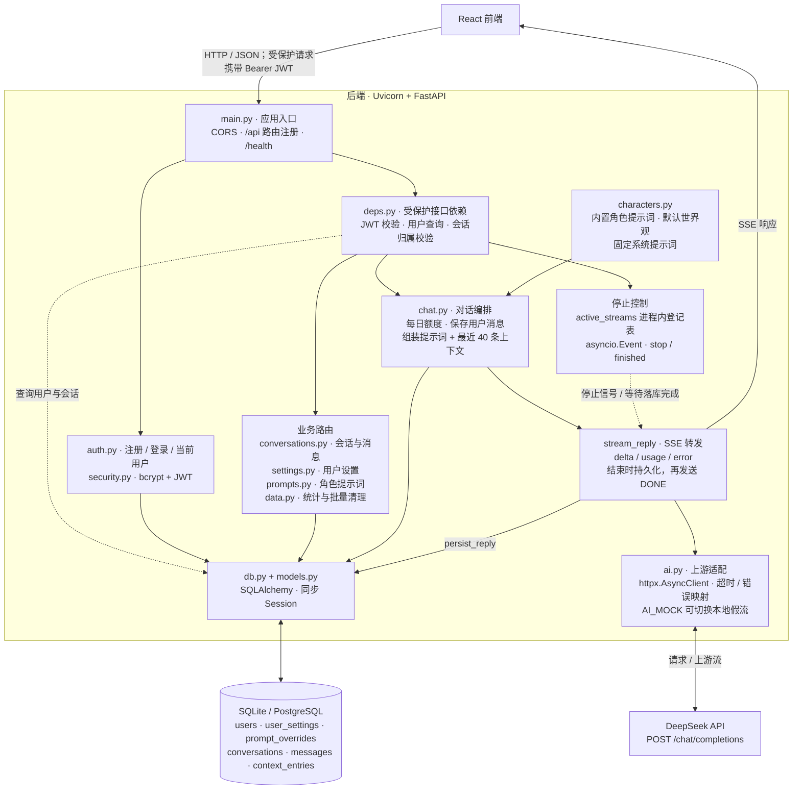
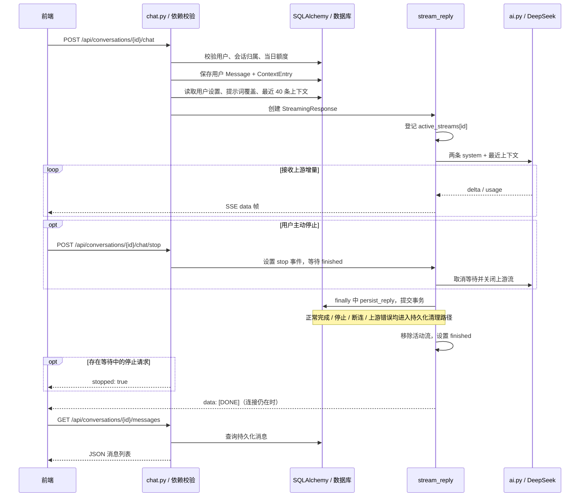

# Baker Chat 后端架构

依据当前 `backend/app` 源码绘制。后端是 FastAPI 单体应用，业务逻辑主要位于路由函数中；图中分组表示职责，不代表独立部署服务。数据库由 `DATABASE_URL` 选择，默认 SQLite，也支持 PostgreSQL。

## 一次对话的时序

## 关键边界

- **鉴权**：注册、登录和健康检查公开；受保护接口通过 `UserDep` 校验 JWT，会话接口通过 `ConversationDep` 校验归属。`/auth/me` 也需要鉴权。
- **消息与记忆分离**：`messages` 保存界面可见消息，`context_entries` 保存发给 AI 的上下文；清空其中一类不会自动清空另一类。
- **流式持久化**：正常结束保存完整回复；停止或断连丢弃未完成的最后半行；上游错误保存已完成消息及错误提示，但不把失败回复追加为 assistant 上下文。
- **停止控制**：`active_streams` 是进程内状态。当前 Docker 启动命令没有配置多个 worker；若扩展为多进程或多实例，需要重新设计停止信号的跨进程协调。
- **启动与配置**：`config.py` 从环境变量及 `backend/.env` 读取设置；`main.py` 的 lifespan 建表、给旧表补上后来新增的列（`db.py` 的 `add_missing_columns`，目前是 `user_settings.typewriter`），并在演示账号不存在时初始化账号、设置和默认会话。
- **连接测试**：`GET /api/ai/ping` 经 `UserDep` 校验后调用 `ai.ping()`，发送最小非流式上游请求；为保持主图清晰，未单列该分支。

## 源码入口

- `backend/app/main.py`：应用入口、生命周期、路由注册。
- `backend/app/deps.py` 与 `backend/app/security.py`：权限依赖、JWT 与密码哈希。
- `backend/app/routers/chat.py`：额度、上下文组装、SSE、停止与回复持久化。
- `backend/app/ai.py`：DeepSeek 请求、模拟流、上游错误处理。
- `backend/app/db.py` 与 `backend/app/models.py`：连接、会话及六张业务表。
