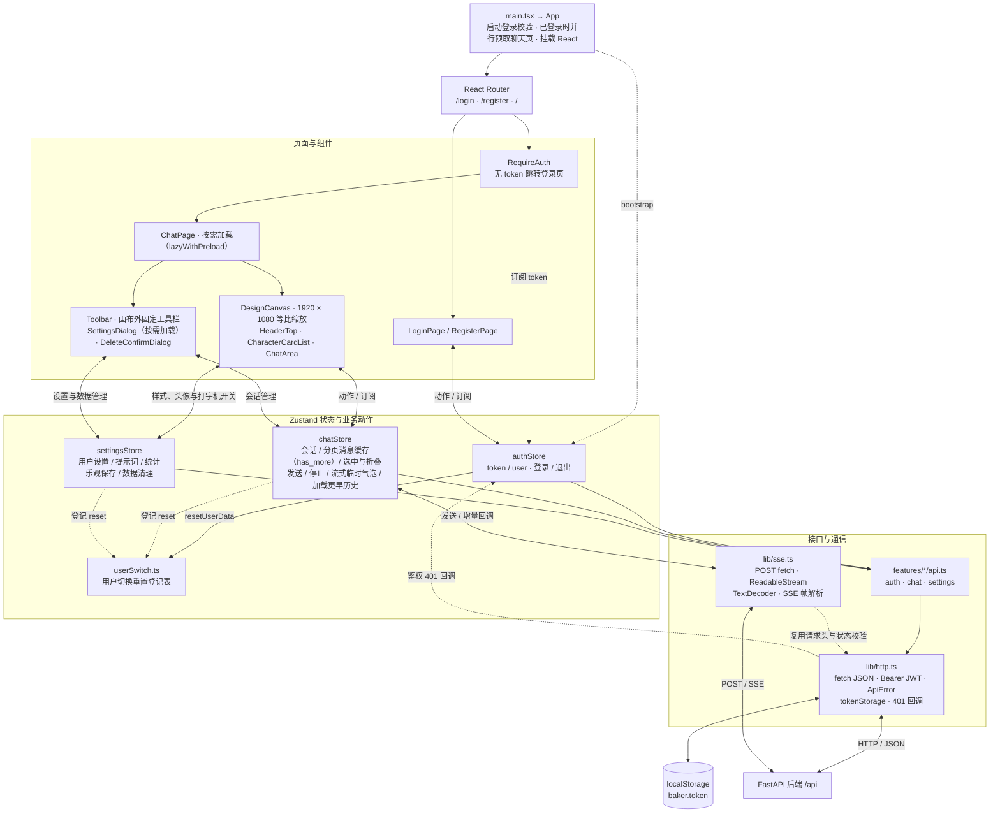
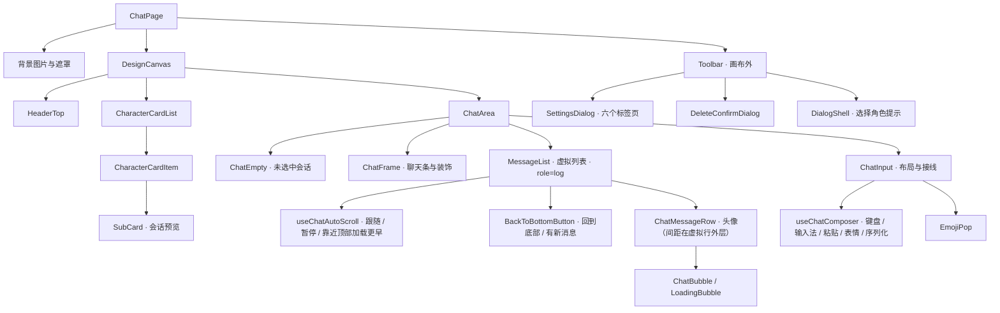
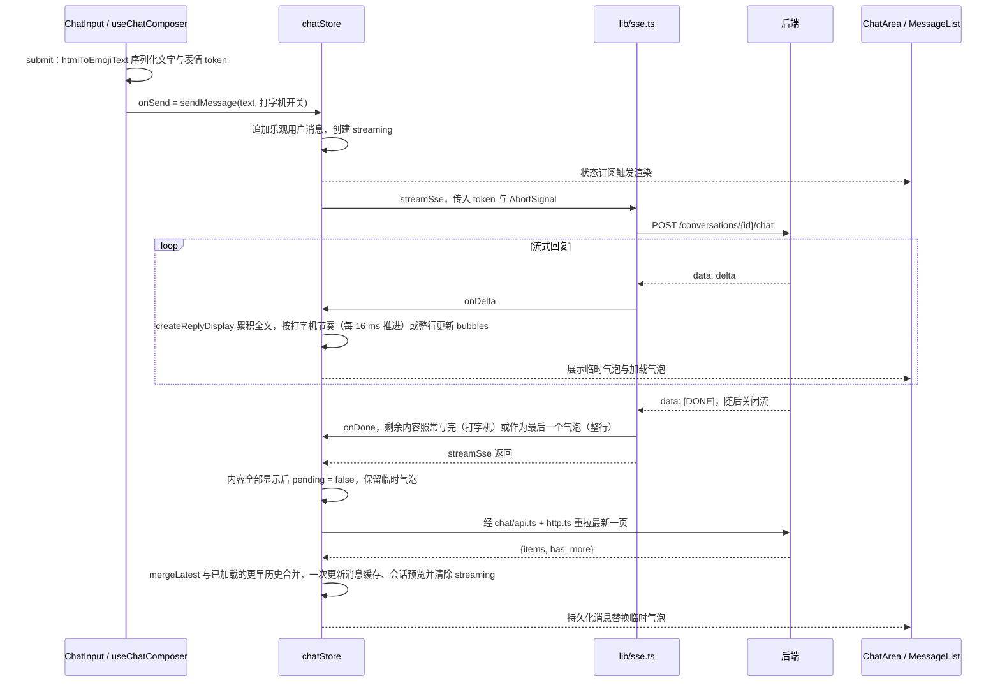

# Baker Chat 前端架构

依据当前 `frontend/src` 源码绘制（2026-09-29，含按需加载、消息分页、虚拟列表、两个 Hook 与打字机输出）。技术栈为 React 19、TypeScript、Vite、React Router、Zustand、Tailwind CSS 4 与 `@tanstack/react-virtual`。图表示运行时职责与主要调用关系，不是完整 import 依赖图。同目录的可交互 HTML 图（`*.html` / `*.json`）生成于这些改动之前，以本文为准。

## 整体架构

实线表示主要调用或数据交互；双向线概括“动作与状态订阅”或“请求与响应”；虚线表示辅助依赖或回调。SSE 自己调用 fetch，不经过 JSON 请求函数 `http()`。

## 聊天页面组件树

## 发送消息的数据流

## 状态与渲染边界

- **共享状态**：三个业务 store 分别负责登录、聊天、设置；`toastStore` 驱动 App 根部的 `Toast`，主图省略其连线。
- **组件局部状态**：工具栏与弹窗开关、设置页草稿、表情面板状态由组件维护；输入内容保存在 contenteditable DOM 中。
- **跨 store 协作**：登录、注册、退出及鉴权过期时，`authStore` 调用 `userSwitch` 登记表的 `resetUserData`，执行聊天与设置 store 在模块加载时登记的 reset（`authStore` 不直接引用它们，两个 store 随聊天页按需加载）；设置页的批量数据清理也同步聊天缓存。这描述当前调用关系，不代表已解决所有异步竞态。
- **持久化**：前端 localStorage 只保存 token；会话、消息与用户设置通过后端持久化。
- **流式状态**：全局只有一个 `streaming`，以 `conversationId` 绑定目标会话；切换会话不会把回复改写到新会话，逐字进度照常推进。停止时界面先收成与落库一致的行，再请求后端 stop 接口，最后 abort 本地读取作为兜底。
- **消息渲染**：`MessageList` 合并已加载的消息与当前会话临时气泡；`chatRows.ts` 按完整列表计算间距和头像显隐，虚拟列表只渲染可视区附近的行；`ChatBubble` 使用 memo 与 ResizeObserver，按内容尺寸绘制 SVG 气泡；滚动规则在 `useChatAutoScroll`。
- **视觉资源**：`styles/index.css` 提供 Tailwind 主题令牌和字体；`constants/` 管理设计坐标、角色、表情与素材映射，`assets/` 存放本地图片和字体。
- **启动校验**：`main.tsx` 发起异步 bootstrap，有 token 时与它并行预取聊天页代码（最多等 200 ms）后挂载 App；路由守卫判断内存 token 是否存在，实际身份与会话访问权限由后端验证。

## 源码入口

- `frontend/src/main.tsx`、`frontend/src/App.tsx`：启动和路由。
- `frontend/src/features/auth/authStore.ts`、`userSwitch.ts`：登录态及用户切换时的重置登记表。
- `frontend/src/components/lazyWithPreload.tsx`、`frontend/src/features/chat/loadChatPage.ts`：可预取的按需加载。
- `frontend/src/features/chat/useChatAutoScroll.ts`、`useChatComposer.ts`：滚动规则与输入框编辑行为。
- `frontend/src/features/chat/ChatPage.tsx`：页面组件组合。
- `frontend/src/features/chat/chatStore.ts`：会话、消息和 SSE 业务编排，含回复的显示驱动 `createReplyDisplay`。
- `frontend/src/features/chat/typewriter.ts`：打字机节奏的纯函数（分行、逐字推进、可见内容）。
- `frontend/src/features/settings/settingsStore.ts`：设置和数据管理。
- `frontend/src/lib/http.ts`、`frontend/src/lib/sse.ts`：两条通信路径。
