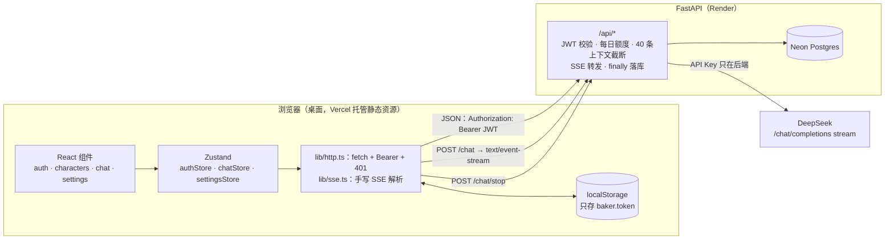
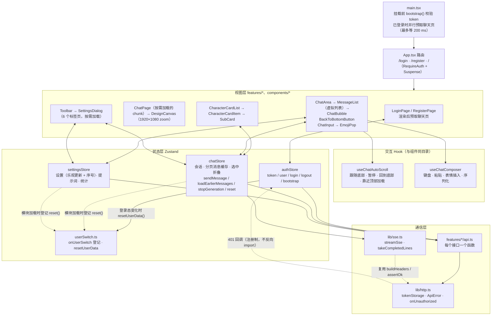
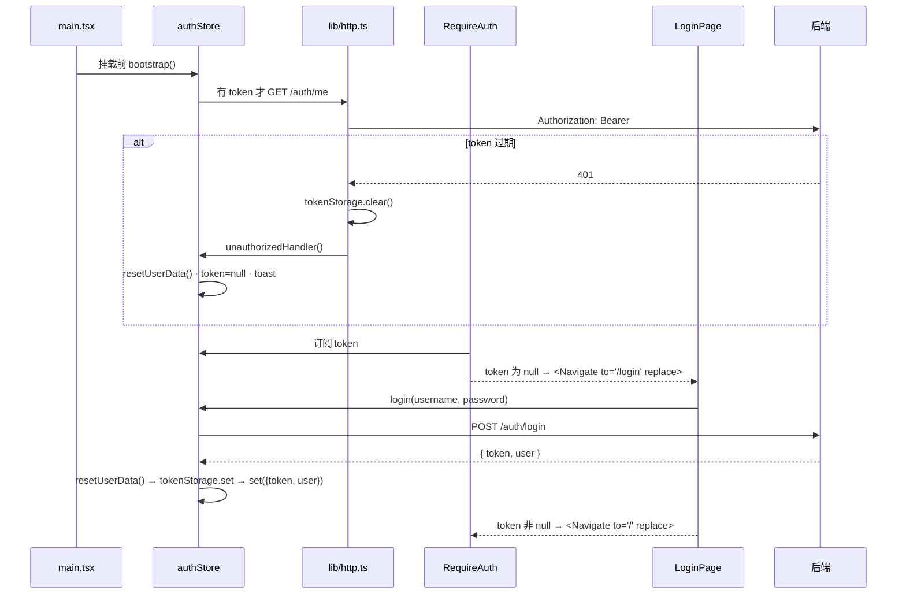
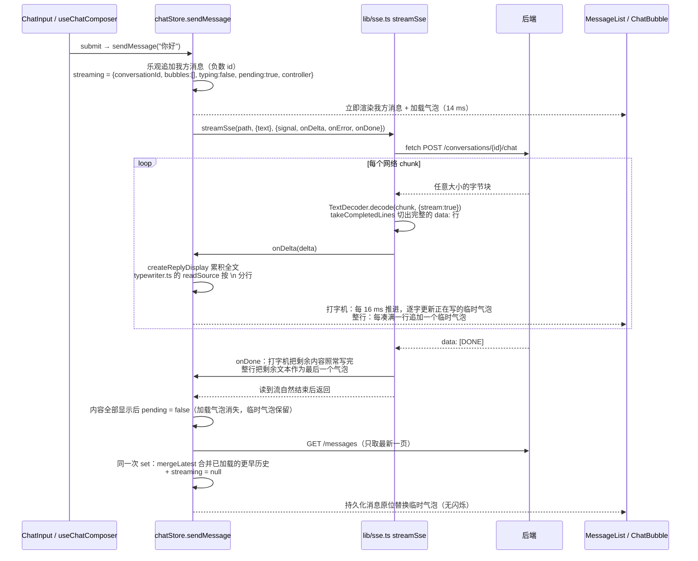
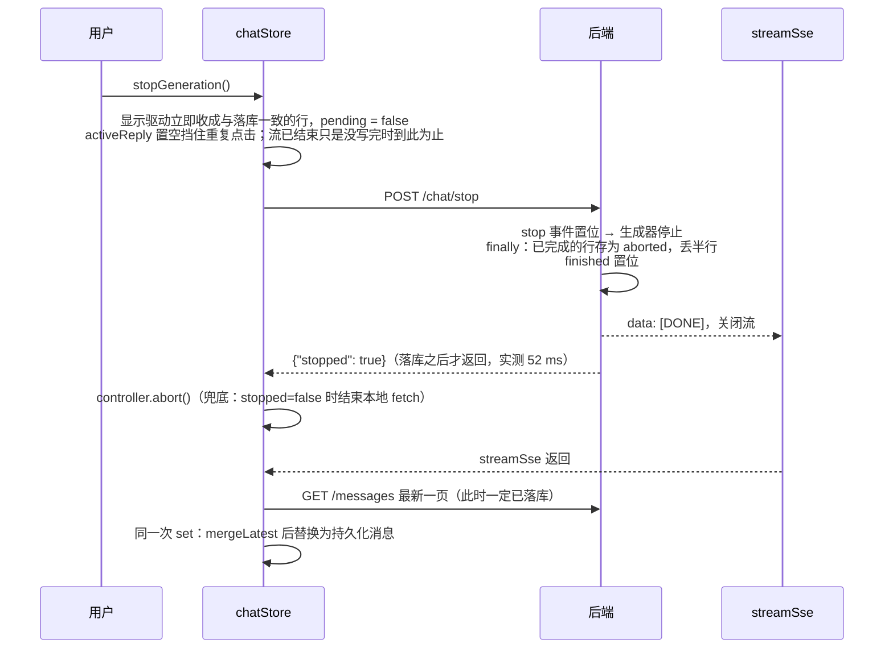

# Baker Chat 前端项目文档

本文从前端视角完整讲一遍 Baker Chat：为什么做、用了什么、怎么分层、每条核心链路怎么走、踩过哪些坑、优化了多少。所有数字都来自 [interview.md](interview.md) 与 `docs/notes/*.md` 的实测记录；代码位置写"文件 + 函数名 / 标识符"，不写行号。

> 阅读提示：第 4 节的"上传"和"重连"两条流程，本项目**没有**做成独立功能（没有文件上传、SSE 断线不自动重连）。这两节先如实说明项目里对应的真实行为，再写"如果要做该怎么做"，面试被追问时照这个口径答，不要说成已实现。

---

## 1. 项目背景

### 1.1 做什么

"终末地 BAKER 会话消息"风格的角色聊天应用：登录后与 29 个内置角色对话，AI 回复**边生成边逐字写出**（打字机效果，可在设置里关闭），每一行是一个 SVG 聊天气泡，界面像素级还原游戏内的消息界面（1920×1080 设计画布）。

线上地址：前端 <https://baker-chat-frontend.vercel.app>，后端 <https://baker-chat-api.onrender.com>（Render 免费实例会休眠，首次访问要等 30–60 秒），演示账号 `demo` / `demo123`。

### 1.2 为什么重写

原项目 [endfield-baker-chat](https://github.com/NCreeper233/endfield-baker-chat) 是 Vue 3 + Pinia 的纯前端页面，有三个工程问题：

| 原项目的问题                                                 | 重写后的做法                                                   |
| ------------------------------------------------------------ | -------------------------------------------------------------- |
| API Key 由用户填在前端，请求从浏览器直连 DeepSeek            | Key 只在后端环境变量，前端产物与请求里都不出现                 |
| 数据全在浏览器 IndexedDB，换设备就没了                       | 有账号体系，会话 / 消息 / 设置按用户存在服务端                 |
| 29 个角色提示词（393,586 字节）打进前端 JS，占产物 JS 的 53% | 提示词移到后端 JSON，前端 JS 722.8 KB → 358.2 KB（2026-09-24） |

所以这是一次"把一个 Demo 页面改造成可部署的完整工程"的重写：前端 React 19 + TypeScript，后端 FastAPI，配套测试、CI、Docker、线上部署。视觉、素材、提示词与交互基线全部来自原项目。

### 1.3 我负责的前端部分

- 登录 / 注册 / 路由守卫 / 401 统一处理
- 29 张角色主卡 + 会话子卡的列表（展开、折叠、选中、新建、删除）
- 聊天区：SVG 气泡、逐字（打字机）流式渲染、停止生成、contenteditable 输入框 + 表情
- 长会话：虚拟列表 + 消息游标分页、自动滚动与"回到底部 / 有新消息"按钮
- 按需加载：聊天页与设置对话框拆成独立 chunk，可预取，代码已到时不进入 Suspense 兜底
- 设置对话框六个标签页（AI 配置、世界观、角色提示词、数据管理、关于、免责声明）
- 工程化：ESLint / Prettier / Vitest + RTL / Playwright E2E / husky + commitlint / CI

规模：前端源码 5,588 行（`src/` 下 ts / tsx / css，不含测试、测试辅助与类型声明），测试 3,936 行，Vitest 27 个文件 179 个用例；后端 pytest 86 个用例，Playwright E2E 4 个用例。

---

## 2. 技术栈

| 类别     | 选型                                   | 版本   | 为什么选它（一句话）                                                                                                                       |
| -------- | -------------------------------------- | ------ | ------------------------------------------------------------------------------------------------------------------------------------------ |
| 框架     | React（只写函数组件 + Hooks）          | 19     | 求职目标岗位主流；项目需要 `memo`、`Profiler` 这类可度量的渲染控制                                                                         |
| 语言     | TypeScript（strict）                   | 5.9    | 前后端契约（`docs/api.md`）落成类型；锁 5.9 是因为 typescript-eslint 8.70 的 peer 范围不到 TS 7                                            |
| 构建     | Vite                                   | 7.3    | 无 SSR / SEO 需求，不需要 Next.js；`import.meta.glob`、`?no-inline`、Vitest 共用配置；动态 `import()` 拆出聊天页 / 设置对话框 chunk        |
| 状态     | Zustand（每个 feature 一个 store）     | 5.0    | 选择器粒度细、能在 React 外调用；对比见 [5.10](#510-为什么用-zustand不用-context--redux--immer)                                            |
| 路由     | React Router                           | 7.18   | 只有 3 个路由，用声明式 `<Navigate>` 做守卫；`/` 的聊天页按需加载（`lazyWithPreload` + `Suspense`）                                        |
| 虚拟列表 | @tanstack/react-virtual（无头）        | 3.14   | 只决定渲染哪几行，滚动规则留在自己的 Hook；约 7.9 kB gzip。react-virtuoso 约 20.2 kB 且自带跟随底部，会和 `useChatAutoScroll` 成为两套方案 |
| 样式     | Tailwind CSS v4（单一 `index.css`）    | 4.3    | `@theme static` 做设计令牌唯一来源，SVG 与 CSS 共用颜色；不再混用 SCSS                                                                     |
| 工具     | clsx                                   | 2.1    | 条件 class 拼接；状态样式优先用 `data-*` 变体，clsx 用得很少                                                                               |
| 通信     | 原生 `fetch` + 手写 SSE 解析           | —      | 不装 axios / fetch-event-source，`lib/http.ts` + `lib/sse.ts` 两个文件                                                                     |
| 单测     | Vitest + React Testing Library + jsdom | 4.1    | 与 Vite 共用配置；fetch 用 `src/test/mockFetch.ts` 桩，SSE 桩流可逐帧推送                                                                  |
| E2E      | Playwright（chromium）                 | 1.62.1 | `webServer` 数组自动拉起后端（`AI_MOCK=1`）与前端                                                                                          |
| 代码规范 | ESLint 9 + jsdoc 规则 + Prettier       | —      | `--max-warnings=0`；Tailwind 插件自动排 class                                                                                              |
| 提交规范 | husky + lint-staged + commitlint       | —      | 提交前只检查暂存文件，提交信息强制 Conventional Commits                                                                                    |
| 部署     | Vercel（前端）/ Docker nginx 镜像      | —      | `vercel.json` 做 SPA rewrites；Docker 多阶段构建 node:22-alpine → nginx:alpine                                                             |

生产依赖只有 6 个：`react`、`react-dom`、`react-router`、`zustand`、`clsx`、`@tanstack/react-virtual`（随聊天页 chunk 按需加载，不进入口 JS）。

后端（了解即可）：FastAPI + SQLAlchemy 2 + Pydantic v2，JWT（HS256，7 天），httpx 代理 DeepSeek 流式接口，SQLite（本地 / CI）与 Neon Postgres（线上）靠 `DATABASE_URL` 切换。

---

## 3. 架构图

> 可交互的 HTML 版本在 `docs/diagrams/`：`baker-chat-architecture.html`（整体）、`frontend-module-dependencies.html`（前端模块）、`frontend-sse-dataflow.html`（SSE 数据流）。下面是能在 GitHub 上直接渲染的 Mermaid 版。HTML 图生成于消息分页、虚拟列表与打字机之前（其中 SSE 数据流一张仍是旧的按行切分实现），以下方 Mermaid 为准。

### 3.1 系统整体



### 3.2 前端分层



分层规则：

- **视图层**只做展示和把用户动作转成 store 动作；组件里没有 `fetch`。有状态的交互逻辑（滚动、键盘与光标）提取成同目录的 Hook：`useChatAutoScroll`、`useChatComposer`，组件只剩渲染与接线。它们都只有一个调用方，按职责拆分而不是为复用抽象（`docs/conventions.md` 第 1 条的补充说明）。
- **状态层**是业务编排：乐观更新、流式状态、错误 toast 都在 store 动作里。组件用选择器按字段订阅。
- **通信层**与业务无关：`lib/` 不 import 任何 `features/`。401 要通知 authStore，用"注册回调"（`onUnauthorized(handler)`）而不是直接 import，避免 `authStore → api → http → authStore` 循环依赖。
- **authStore 不引用 chatStore / settingsStore**：切换用户时要清掉上一个用户的数据，但直接 import 会把两个 store 拉进入口 chunk。改成登记表 `userSwitch.ts`：两个 store 在模块加载时 `onUserSwitch(reset)` 登记，authStore 同步调用 `resetUserData()`；还没加载的 store 没有旧数据，不需要重置。
- **localStorage 只存 token**，读写都经 `lib/http.ts` 的 `tokenStorage`；唯一的例外是构建插件注入 `index.html` 的内联脚本，它只看有没有 token 来决定是否预载聊天页 chunk（键名与 `tokenStorage` 各写一份）。会话、消息、设置都以服务端为准。

### 3.3 目录结构

```text
frontend/src/
├── main.tsx              入口：引入样式 → bootstrap() → 已登录时预取聊天页（最多等 200 ms）→ 挂载 App
├── App.tsx               路由表（AppRoutes 不含 Router，方便测试套 MemoryRouter）；聊天页外包 Suspense，兜底 PendingDots
├── styles/index.css      唯一全局样式：@theme static 令牌、@font-face、@utility scroll-mask
├── lib/
│   ├── http.ts           fetch 封装、tokenStorage、ApiError、401 回调注册
│   └── sse.ts            streamSse、takeCompletedLines
├── components/           DesignCanvas、DialogShell、DialogButton、Toast + toastStore、HeaderTop、
│                         lazyWithPreload（可预取的懒加载）、PendingDots（等待超过 200 ms 才出现的加载动画）
├── constants/            角色表、表情表、设计坐标（design.ts）、素材映射
├── features/
│   ├── auth/             LoginPage、RegisterPage、RequireAuth、authStore、userSwitch（用户切换的重置登记表）、api
│   ├── characters/       CharacterCardList / Item、SubCard、cardLayout（卡片纵坐标计算）
│   ├── chat/             ChatPage、loadChatPage（ChatPageLoader）、ChatArea、MessageList（虚拟列表）、
│   │                     BackToBottomButton、ChatBubble、LoadingBubble、ChatInput、EmojiPop、
│   │                     useChatAutoScroll（滚动规则）、useChatComposer（输入框编辑规则）、
│   │                     chatRows（间距规则）、emojiHtml（token ↔ HTML）、typewriter（打字机节奏的纯函数）、
│   │                     chatStore（含分页合并 mergeLatest、回复显示驱动 createReplyDisplay）、api
│   └── settings/         Toolbar、SettingsDialog + 6 个 Tab、DeleteConfirmDialog、settingsStore、api
└── test/                 setup.ts（含 jsdom 下的 offsetWidth / offsetHeight 桩）、mockFetch.ts（fetch 桩与可逐帧推送的 SSE 桩）
```

`src/` 之外，`frontend/vite.config.ts` 除了 Vite 与 Vitest 共用配置，还有构建插件 `preloadChatPageWhenLoggedIn`（已登录时预载聊天页 chunk，见 [6.6](#66-按需加载)）。

---

## 4. 核心流程

### 4.1 登录与鉴权



关键点：

1. **启动校验放在挂载前**（`main.tsx` 里 `void useAuthStore.getState().bootstrap()`）。如果放进组件的 `useEffect`，开发环境 StrictMode 会让 effect 执行两次，`/me` 请求两次。Zustand store 能在 React 外调用，才能这么写。有 token 时入口还会与 `/me` 并行预取聊天页代码，最多等 200 ms 再挂载（[6.6](#66-按需加载)）。
2. **守卫只看内存里的 token**（`RequireAuth`）。`replace` 让浏览器后退也回不到受保护页。登录页顶部同样一行 `if (token !== null) return <Navigate to="/" replace />`，登录成功后 token 一变就自动跳转，不需要 `useNavigate`。
3. **401 分两种**（`http.ts` 的 `assertOk` + `CREDENTIAL_PATHS`）：
   - `/auth/login`、`/auth/register` 的 401 表示"用户名或密码错误"，交给表单显示。
   - 其他任何接口的 401 表示"登录已过期"：清 token、调 authStore 注册的处理器、弹 toast、守卫跳登录页。
   - 按**接口路径**区分，不按"请求有没有带 token"区分。原因见 [5.6](#56-多标签页退出401-被当成普通错误)。
4. **并发 401 只提示一次**：处理器第一行判断内存 token 是否已为 null，第一个 401 置空后，后面的 401 直接返回。
5. **切换用户时清数据**：`resetUserData()`（`userSwitch.ts`）在登录成功、注册成功、退出、401 四处调用，执行 chatStore（同时中止进行中的流）和 settingsStore 在模块加载时登记的 `reset()`。authStore 不直接 import 这两个 store，它们才能随聊天页按需加载；还没加载的 store 没有旧数据，不需要重置。原因见 [5.7](#57-退出登录后上一个用户的数据闪现给下一个用户)。
6. **token 放 localStorage + Bearer 头**，没用 httpOnly cookie。前端在 Vercel、后端在 Render，属于跨站部署，用 cookie 就要 `SameSite=None; Secure`、CORS `allow_credentials`，还要做 CSRF 防护。代价是 XSS 能读到 token。本项目没有第三方脚本，唯一的 `innerHTML` 写入（`emojiToHtml`）先转义 `& < > "`，粘贴只取纯文本。
7. **密码规则前后端一致**：6–64 个字符，且 UTF-8 不超过 72 字节（bcrypt 的上限）。前端 `RegisterPage.tsx` 的 `isValidPassword` 与后端 `field_validator` 是同一条规则。

### 4.2 "上传"：消息发送（本项目没有文件上传）

**真实情况**：项目里没有文件上传。原 Vue 项目有"自定义背景图上传"和"导出 ZIP"，重写时按需求删掉了，连同 18 张相关素材和 jszip、html-to-image 依赖。用户提交数据的路径只有两类：

1. **发消息**：contenteditable 里的文字和表情序列化成纯文本，`POST /conversations/{id}/chat`，body 是 `{ text }`。
2. **改设置 / 提示词**：`PATCH /settings`、`PUT /prompts/{name}`，JSON body。

**发消息的序列化**（`useChatComposer.ts` + `emojiHtml.ts`；`ChatInput.tsx` 只负责布局、表情弹层开关与停止按钮，把 Hook 返回的处理函数接到输入框和按钮上）：

```text
contenteditable DOM                          提交给后端的 text
你好呀<div>第二行</div>   →   "你好呀\n第二行[sns_emoji_001]"
```

- `handleKeyDown`：Enter 调 `submit` 发送；Shift / Ctrl / Cmd / Alt + Enter 用 `execCommand('insertText', false, '\n')` 换行（原实现漏了 Alt，Alt+Enter 会把消息发出去）；`event.nativeEvent.isComposing` 为 true 时（中文输入法正在选词）什么都不做，否则选词按的回车会把消息发出去。
- `submit`：发送按钮的 `onClick`，Enter 也走它。回复进行中（`disabled`）或内容是空白时不发送；否则用 `htmlToEmojiText` 序列化、清空输入框，交给 `onSend`（即 `chatStore.sendMessage`）。
- `htmlToEmojiText`：深度优先遍历 DOM，只保留文本节点和 `data-emoji` 属性。`<br>` 算换行；Chrome 会把第二行包成 `<div>`，所以块级元素前补一个换行，连续的块级元素不产生空行。
- `handlePaste`：只取 `text/plain`，再 `insertText`。别处复制来的 HTML 不会带进输入框，也就不会带进 XSS 或奇怪样式。
- `insertEmoji`：表情弹层的 `onPick`，在光标处插入表情，`disabled` 时同样不生效（细节见 [5.5](#55-contenteditable-输入框)）。
- 表情存成 `[sns_emoji_NNN]` token。AI 原样收到 token，渲染时 `splitEmojiText` 把文本切成 `string | Emoji` 数组再映射成 React 节点，气泡渲染不用 `dangerouslySetInnerHTML`。

**如果面试官问"文件上传你会怎么做"**（以下是方案，项目中未实现）：

| 环节     | 做法                                                                                                                                                                |
| -------- | ------------------------------------------------------------------------------------------------------------------------------------------------------------------- |
| 选择     | `<input type="file" accept="image/*">` 或拖拽 `onDrop` 读 `dataTransfer.files`；前端先校验类型和大小，但以服务端校验为准                                            |
| 预览     | `URL.createObjectURL(file)` 生成预览地址，组件卸载或换图时 `URL.revokeObjectURL`，否则内存泄漏                                                                      |
| 发送     | `FormData` + `fetch`，**不要**手动设 `Content-Type`，浏览器会自动带上 `multipart/form-data; boundary=…`（本项目 `buildHeaders` 固定写了 JSON 头，要为上传单独处理） |
| 进度     | `fetch` 没有上传进度事件，要进度条就用 `XMLHttpRequest` 的 `xhr.upload.onprogress`（或 axios 的 `onUploadProgress`，底层也是 XHR）                                  |
| 取消     | `AbortController`（fetch）或 `xhr.abort()`                                                                                                                          |
| 大文件   | 切片：`file.slice()` 分块，每块带序号和文件哈希（在 Web Worker 里算，避免卡主线程）；服务端记录已收到的分块，支持断点续传与秒传；最后发一个"合并"请求               |
| 图片压缩 | 头像类小图可先用 canvas 或 `createImageBitmap` 缩放再 `toBlob`，减少流量                                                                                            |

### 4.3 流式回复

这是项目的核心链路。以在"陈千语"会话里输入"你好"并回车为例：



后端 SSE 帧格式（`docs/api.md` §3）：

```text
data: {"delta": "你好，管理员。\n今天"}
data: {"delta": "也辛苦了。"}
data: {"usage": {"prompt_tokens": 812, "completion_tokens": 45}}   ← 可选
data: {"error": "上游认证失败（401）"}                              ← 出错时，之后一定有 [DONE]
data: [DONE]
```

逐步说明：

**① 为什么不用 `EventSource`**：`EventSource` 只能发 GET，不能自定义请求头；对话接口是带 JWT 的 POST。`@microsoft/fetch-event-source` 主要多了自动重连，而本项目的流是一次性的（见 4.4），不需要。最后手写 `fetch` + `ReadableStream` + `TextDecoder`，`lib/sse.ts` 共 109 行（去掉注释与空行 74 行），零依赖。

**② 两层切分**：

- 第一层在 `streamSse`：网络 chunk 的边界和 SSE 帧的边界没有关系，一帧 `data: …\n` 可能被切成两半，`takeCompletedLines(buffer)`（返回 `{ lines, rest }`）缓冲到换行才解析。
- 第二层在 `typewriter.ts` 的 `readSource`：AI 回复每行一个气泡，delta 的边界和回复里 `\n` 的边界也没有关系。`chatStore.ts` 的 `createReplyDisplay` 累积全文，每次按与后端落库相同的规则分行（去首尾空白、跳过空行）；最后一段没有换行的是未收完的行，末尾若是半个表情 token（如 `[sns_em`）先不显示。

**③ 多字节字符**：一个汉字在 UTF-8 里占 3 字节，可能跨两个 chunk。`decoder.decode(value, { stream: true })` 会把不完整的字节序列留在解码器内部，等下一块到了再拼。注意 `stream` 是 `decode()` 的第二个参数，不是构造函数的参数（写错了 `tsc` 会报错，见 [5.1](#51-sse-解析chunk-边界与多字节字符)）。

**④ 状态设计**（`StreamingState`）：

| 字段             | 含义                                                                                     |
| ---------------- | ---------------------------------------------------------------------------------------- |
| `conversationId` | 回复属于哪个会话。用户中途切到别的会话，回复仍写回原会话，不会串台                       |
| `bubbles`        | 当前可见的行，每行一个临时气泡；打字机开启时最后一个可能是正在写的前缀                   |
| `typing`         | 最后一个临时气泡还在写：`ChatBubble` 收到 `typing`，未写完的前缀不写尺寸缓存             |
| `pending`        | 是否显示加载气泡：首个字前、行间停顿、等待下一行；内容全部显示后到重拉完成之间为 `false` |
| `controller`     | 这次请求专用的 `AbortController`                                                         |

全局只有一个 `streaming`，`sendMessage` 开头判断 `get().streaming !== null` 就直接返回，同一时刻只允许一条回复在进行。

**⑤ 避免闭包里的旧状态**：显示驱动写 store 时用 `set((s) => …)` 基于**最新**状态更新，并先比对本次回复自己的 `AbortController`，不引用外层捕获的 `streaming` 对象。async 函数执行期间，store 可能已被停止或 `reset()` 改过，甚至已经开始了下一条回复，捕获的对象是旧的。

**⑥ 结束时用持久化消息替换临时气泡**：流结束、且内容全部显示（打字机写完）后只重拉最新一页（`GET /messages` 不带 `before_id`，默认 50 条），用 `chatStore.ts` 的 `mergeLatest` 与已加载的更早历史合并：两段重叠时保留这一页之前的历史（`has_more` 沿用合并前的值），乐观显示的负数 id 消息丢掉；一次回复超过一页（这一页第一条比已加载的最后一条还新）时两段之间可能缺消息，只保留这一页，更早的向上滚动时重新加载。合并结果和 `streaming: null` 写在**同一次 `set`** 里。如果分两次 `set`，中间会有一帧"临时气泡 + 持久化消息"同时存在，同一段回复显示两遍。能放心在这里重拉，是因为后端在 `finally` 落库之后才发 `[DONE]`，前端收到 `[DONE]` 时数据已经在库里。分页接口见 [api.md](api.md) §2。

**⑦ 收到 `[DONE]` 后不调用 `reader.cancel()`**，而是继续 `read()` 直到 `done`。主动取消会被 Chromium 记成 `net::ERR_ABORTED`，Network 面板每次回复都有一条红色的失败请求（[5.9](#59-每次回复结束network-面板都有一条失败的-chat-请求)）。

**⑧ 渲染**：`MessageList` 把已加载的持久化消息、临时气泡、加载气泡拼成一个数组，`chatRows.ts` 的 `layoutRows`（纯函数）按**完整数组**决定每行的头像显隐和间距（同一人 14 px / 跨方向 33 px / 同侧换人 60 px）；`@tanstack/react-virtual` 的 `useVirtualizer` 只渲染可视区附近的行，行高按实测更新（[6.7](#67-长会话虚拟列表--分页)）。`ChatBubble` 用 `memo` 包裹，已有气泡在流式期间不重渲染（348 → 11 次，引入虚拟列表后 146 → 12 次，见 [6.3](#63-流式期间气泡重渲染348--11)）。滚动规则都在 `useChatAutoScroll`：跟随时内容变高就保持在底部；用户向上滚动、离开底部超过 80 设计 px 才暂停跟随，并显示 `BackToBottomButton`（"回到底部"，暂停期间有新行到达时变为"有新消息"）；我方发送时滚回底部（[6.8](#68-自动滚动)）。

**⑨ 错误**：

- 非 2xx（例如 429 今日额度已用完）：`streamSse` 抛 `ApiError`，`sendMessage` 的 catch 里 toast。后端没保存这条用户消息，重拉后乐观追加的消息自然消失。
- 流中途上游出错：后端发 `data: {"error": …}`，前端不再逐字，立即按行显示已收到的全部文本（包括最后一段没有换行的内容，与后端出错时的落库一致），再追加一个 `[错误: …]` 气泡，随后照常收到 `[DONE]` 并重拉。

**⑩ 打字机**（`typewriter.ts` 的纯函数 + `chatStore.ts` 的 `createReplyDisplay`）：打字机开启时（默认，设置"AI 配置"里可关闭，系统"减少动态效果"时一律整行显示），驱动每 16 ms 用 `step` 推进一次进度：平时约每秒 40 字，积压越多写得越快，正在写的内容最多落后网络约 1 秒；一行写完后固定停顿 0.5 秒（显示加载气泡）再写下一行，停顿不计入追赶；表情 token 作为一个整体出现。流结束后剩余内容照常写完，写完前仍显示停止按钮；停止时立即显示与落库一致的行（流未结束只保留已收完整的行，半行消失），错误帧时立即显示已收到的全部文本与错误气泡。可见内容没变就不写 store；已写完的气泡在后续逐字过程中不重渲染（`memo`，度量见 [interview.md#typewriter](interview.md#typewriter)）。

### 4.4 "重连"：断线与恢复（本项目不自动重连）

**真实情况**：SSE 流断开后**不会自动重连续传**。这是有意的取舍：后端的一次生成和这条 HTTP 连接绑在一起，连接断了生成就结束，没有可以"接上"的东西。项目里处理的是"断了之后数据要一致"，以及几种相关的恢复场景：

| 场景                              | 实际行为                                                                                                                                                                                                                        |
| --------------------------------- | ------------------------------------------------------------------------------------------------------------------------------------------------------------------------------------------------------------------------------- |
| 用户关标签页 / 刷新               | 后端察觉断开后取消生成器，`finally` 里把**已完成的行**存成 `aborted` 状态，丢掉半行。再次打开会话时 `selectConversation` 重拉最新一页，看到的就是这些行                                                                         |
| 流中途网络断开                    | `reader.read()` 抛 `TypeError`，`sendMessage` 的 catch 里 toast，按停止收尾（只保留已收完整的行，加载气泡消失）并尝试重拉；网络还没恢复时重拉也失败，toast 后清掉 `streaming`，临时气泡消失。下次选中会话时会重新拉取服务端结果 |
| token 过期                        | 任意请求 401 → 清登录态 → 跳登录页；没有 refresh token，要重新登录（token 有效期 7 天）                                                                                                                                         |
| 后端冷启动（Render 免费实例休眠） | 第一次请求要等 30–60 秒，没有专门的重试或"唤醒中"提示；演示前先访问一次 `/health`                                                                                                                                               |
| 另一个标签页退出                  | 本页下一次请求 401，同样回到登录页（[5.6](#56-多标签页退出401-被当成普通错误)）                                                                                                                                                 |

**为什么不做**：遵守项目的"五板斧"约定，不为没出现的需求提前设计。流是一次性的，接上重连需要把后端改成"生成与连接解耦"，改动很大，而一轮回复通常 1 秒左右就结束（真实 DeepSeek 全文中位数 1045 ms）。

**如果面试官问"要支持断线续传怎么做"**（方案，未实现）：

1. **后端先解耦**：生成放进后台任务，每个 delta 带递增序号写进 Redis Stream 或数据库，而不是直接写给这条连接。连接只负责"从某个序号开始读"。
2. **SSE 帧加 `id:` 字段**（标准 SSE 就有）。重连时带上 `Last-Event-ID` 头，或 `?after=<seq>` 参数，服务端从断点往后补发。
3. **前端重连策略**：指数退避 + 随机抖动（1 s、2 s、4 s… 封顶 30 s），限制最大次数；监听 `online` 事件立刻重试，`offline` 时暂停；用户点"停止"或切换账号时不重连。
4. **幂等**：发送消息时前端生成一个 `clientMessageId`（例如 `crypto.randomUUID()`），服务端据此去重，避免"请求其实成功了，但响应丢了，重试又发一遍"。
5. **UI**：显示"连接中断，正在重连…"，重连成功后从断点继续追加气泡，已有气泡不重画。

### 4.5 取消（停止生成）

需求：点"停止"后，已显示的气泡保留（打字机开启时，已收完整但还没写出的行也立即完整显示），未完成的半行丢弃，刷新后看到的内容和停止时一样。



**第一版是错的**：一开始的做法是"前端 `abort()` 后立刻 `GET /messages`"。真实浏览器冒烟时，点停止后已显示的那一行消失了，刷新后才出现。看后端日志的请求顺序，abort 之后紧跟着一条 `GET /messages 200`，而后端要等下一次向客户端写数据时才发现连接断了、才落库，GET 抢在落库前返回了空结果。

**四个候选方案**：

| 方案                                     | 问题                                                   |
| ---------------------------------------- | ------------------------------------------------------ |
| abort 后立刻重拉                         | 就是上面的 bug                                         |
| abort 后等固定时间再重拉                 | 真实 DeepSeek 两块数据之间可能隔好几秒，等多久都不可靠 |
| abort 后本地留一份 `aborted` 消息        | 本地和服务端在下次重拉前是两套数据，只是把不一致藏起来 |
| **新增 `POST /chat/stop`，落库后才返回** | 把"先落库、后重拉"变成接口约定，前端不用猜后端时序 ✅  |

**前端细节**：

- **先 stop 再 abort**。如果先 abort，后端多半在收到 stop 之前就察觉断开并注销了这条流的登记，stop 几乎总返回 `stopped: false`，接口语义就含糊了。
- `stopGeneration` 取出当前回复的显示驱动（`activeReply`）后立即置空：连点第二次拿不到驱动就直接返回，只发一次 stop。
- 驱动的 `stop()` 立即把界面收成与落库一致的内容：流还没结束时，已收完整的行（包括正在写和还没写到的）全部立即完整显示，只有还没收到换行的最后一段消失（后端同样丢掉这半行）；流已经结束、只是打字机还没写完时，剩余的行全部立即显示，而且不再 `POST /chat/stop`（服务端已落库，没有要停的流）。之后到达的内容与 `[DONE]` 都被驱动忽略。
- 没有新增 `stopping` 字段：`pending` 只表示是否显示加载气泡（首个字前、行间停顿、等下一行），回复是否在进行看 `streaming` 是否为空，是否已经停止由驱动自己记着。
- abort 的两条路径：真实 `fetch` 被 abort 时 `read()` 以 `AbortError` 拒绝，catch 里看到 `signal.aborted` 就静默返回；测试里手写的桩流不认识 signal，`read()` 仍会返回数据，所以每次读到数据后先检查 `signal.aborted`。

**退出登录时的取消**：`logout` → `resetUserData()` → 登记表里的 `chatStore.reset()` → 取消回复的显示驱动、`streaming.controller.abort()` 并回到初始状态。`sendMessage` 收尾时发现 `streaming` 已不属于本次回复（为空，或已换成 reset 之后新回复的 `controller`）就不再重拉、也不写 store，避免旧用户的消息写进新用户的 store。这条路径不调 stop 接口，服务端靠察觉断开来落库。

**验证**：`chatStore.test.tsx` 断言请求顺序为 `['messages', 'chat', 'chat/stop', 'messages']` 且半行不显示；`stopped=false` 时靠 abort 结束；重复调用只 POST 一次。真实浏览器里 stop 52 ms 返回，64 ms 后发送按钮恢复，刷新后 6 条消息一致。

---

## 5. 难点与解决

每条按"现象 → 怎么定位 → 根因 → 解决 → 验证"写。5.10 以后是面试里容易被追问、之前没答好的问题。

### 5.1 SSE 解析：chunk 边界与多字节字符

- **现象**：先是 `tsc -b` 报 `'stream' does not exist in type 'TextDecoderOptions'`。
- **定位**：查 `lib.dom.d.ts`，`TextDecoderOptions` 只有 `fatal` / `ignoreBOM`，`stream` 是 `decode()` 的选项。
- **根因**：API 位置记错。背后要解决的问题是：浏览器把响应体切成任意大小的 chunk，汉字的 3 个字节可能被切开，一帧 `data:` 也可能被切开。
- **解决**：`new TextDecoder('utf-8')` + `decoder.decode(value, { stream: true })`；`takeCompletedLines` 做行缓冲。
- **验证**：`sse.test.ts` 10 个用例，其中一个专门把 `data: {"delta":"第一行"}\n` 编码后从"行"字的第 2 个字节处切开分两次推送。E2E 的 mock 后端每 80 ms 发 5 个字，故意不和行边界对齐，行缓冲在真实链路上也会用到。

### 5.2 停止生成的竞态

见 [4.5](#45-取消停止生成)。一句话：客户端的"abort 后重拉"和服务端的"察觉断开后落库"是两条互不知情的异步路径，没有先后保证；解决办法是用接口约定顺序（stop 在落库后才返回），不去猜时序。

### 5.3 零尺寸容器里的 `` 宽度全是 0

- **现象**：headless 截图里主卡没有纹理、下划线和角标，子卡图标框是空的，聊天条不显示。
- **定位**：用 CDP `Runtime.evaluate` 遍历这些 ``，打印 `getBoundingClientRect()` 和 computed style：高度都对，宽度全是 0，`naturalWidth > 0`（说明图片已加载）。
- **根因**：Tailwind v4 的 preflight 有 `img { max-width: 100% }`。原项目的布局用 0×0 的"原点容器"，子元素按设计稿坐标绝对定位铺开。容器宽 0，`100%` 就是 0，把 `w-[434.72px]` 压成了 0。jsdom 没有布局，单元测试测不出来。
- **解决**：只给零尺寸容器里带显式宽度的 16 张 `` 加 `max-w-none`，不加全局覆盖（全局覆盖会影响其他正常图片）。preflight 的另外两条也要处理：`img { display: block }` 会让表情换行，所以表情显式 `inline-block`；列表样式被清空，免责声明显式 `list-disc`。
- **验证**：重新截图，图片宽度恢复为 434.72 / 137.59 / 48 …，聊天条宽 1323。

### 5.4 SVG 气泡的尺寸测量

- **难点**：气泡是 SVG（圆角矩形 + 尾巴），文字放在 `foreignObject` 里。矩形尺寸必须等于文字实际渲染尺寸加内边距。文字里有表情 ``，字体可能晚到（`font-display: swap`），画布还有 CSS `zoom` 缩放。
- **候选**：
  - canvas `measureText`（原项目的做法）：不认识 ``，字体没加载完测得不准，原项目只好挂载前 `await document.fonts.load`。
  - `useLayoutEffect` 读 `offsetWidth`：取整，丢掉小数（行高是 31.32）；字体换好后不会重测。
  - `getBoundingClientRect`：在 `zoom` 下返回的是缩放后的视口坐标，还要除以 zoom。
  - **`ResizeObserver`**：`contentRect` 是元素自身坐标系的 CSS 像素，不受 zoom 影响；字体晚到导致尺寸变化时会再回调 ✅。
- **附带好处**：`ResizeObserver` 回调发生在浏览器渲染步骤里，React 的更新在之后的任务里提交，所以新气泡第一帧一定按加载气泡的尺寸画，第二帧才是真实尺寸，配合 CSS transition 就有了"从加载气泡变大"的过渡。原项目为此要写"双 rAF"，这里时序天然成立。
- **验证**：单行气泡高 49.31（设计稿 49.32）；1280×720（zoom 2/3）下 SVG 宽度与 zoom 1 时只有亚像素差。

### 5.5 contenteditable 输入框

textarea 没法在文字中间显示图片，所以用 contenteditable，随之而来几个问题。下表的处理都在 `useChatComposer.ts`，`ChatInput.tsx` 只做接线：

| 现象                                               | 根因                                               | 解决                                                                                                                 |
| -------------------------------------------------- | -------------------------------------------------- | -------------------------------------------------------------------------------------------------------------------- |
| 中文输入法选词时按回车，消息被发出去               | 选词阶段的 keydown 也会触发                        | `event.nativeEvent.isComposing` 为 true 时不处理                                                                     |
| 第二行被 Chrome 包成 `<div>`，序列化后少了换行     | contenteditable 的默认行为                         | `htmlToEmojiText` 遇到块级元素先补换行                                                                               |
| 点表情按钮后输入框失焦、选区丢失，表情只能插到末尾 | 按钮的 mousedown 默认会抢焦点                      | 表情按钮 / 发送按钮 / 表情格的 `onMouseDown` 调 `preventDefault`（`keepInputFocus`）                                 |
| 点过页头再点表情，表情插到了文字最前面             | 输入框失焦后 `focus()`，Chrome 把光标放在开头      | `insertEmoji` 先判断选区是否在输入框内，不在就 `selectAllChildren` + `collapseToEnd` 移到末尾，再 `Range.insertNode` |
| 手动插入换行节点后，撤销（Ctrl+Z）失效             | 直接改 DOM 不进浏览器的撤销栈                      | 换行和粘贴用 `execCommand('insertText')`（虽标为 deprecated，但没有能保留撤销栈的替代 API）                          |
| 粘贴带进外部 HTML 与样式                           | 默认粘贴富文本                                     | `handlePaste` 只取 `text/plain`                                                                                      |
| Alt+Enter 把消息发了出去                           | 原实现只把 Shift / Ctrl / Cmd + Enter 当换行       | 修饰键判断补上 `altKey`                                                                                              |
| 回复期间，仍开着的表情弹层能把表情插进禁用的输入框 | 输入框不可编辑、表情按钮禁用，但已打开的弹层还能点 | Hook 接收 `disabled`，`submit` 与 `insertEmoji` 在禁用时都不生效                                                     |

验证：E2E 断言后端存储的文本正好是 `'第一行\n第二行[sns_emoji_001]'`；`useChatComposer.test.tsx` 12 个用例覆盖 Enter / 四种组合键 / 输入法 / 空白 / 粘贴 / 表情插入与序列化 / 失焦后插到末尾 / 禁用时不生效，`ChatInput.test.tsx` 6 个用例只测接线，含把打字机开关传给 `sendMessage`（jsdom 没有 `execCommand`，测试里用桩代替）。

### 5.6 多标签页退出，401 被当成普通错误

- **现象**：标签页 2 退出登录后，标签页 1 点子卡，请求 401，但页面停在主页，没有跳转也没有提示。
- **定位**：真实 Chromium 开两个页面共用一个 context 复现。
- **根因**：第一版按"请求带了 token 才算过期"来判断 401。标签页 2 已经清掉了 localStorage，标签页 1 的请求就不带 token，条件不成立，401 被静默吞掉。
- **解决**：改为按接口路径判断，除登录 / 注册外所有 401 都算过期；并发 401 的去重从 http 层挪到 authStore 的处理器。`streamSse` 也改成和 `http()` 一样接收不含 `/api` 的 path，两条路径用同一个 `assertOk`。
- **验证**：`RequireAuth.test.tsx`"另一标签页退出后本页的 401 也回到 /login"；真实浏览器里 URL 变为 `/login`，提示只出现 1 次。
- **可以继续改进**：监听 `storage` 事件，另一个标签页清掉 token 时本页立刻同步退出，不用等下一次请求（未实现）。

### 5.7 退出登录后，上一个用户的数据闪现给下一个用户

- **现象**：A 退出后注册 B，在 B 的数据到达之前，主页显示的是 A 的会话展开状态、预览和聊天条样式；A 没结束的回复流在结束后重拉，还会把 A 的消息写回 store。
- **定位**：用 Playwright 路由拦截，把 B 的 `GET /conversations` 延迟 2 s、`GET /settings` 延迟 6 s，把时间窗口放大到肉眼可见。
- **根因**：`logout` 只清了 token 和 user，另外两个 store 的数据留在内存里，等着被下一次加载覆盖；`sendMessage` 流结束后无条件重拉。
- **解决**：`resetUserData()` 在四处调用（见 4.1）；`chatStore.reset()` 同步中止进行中的流并回到初始状态；`sendMessage` 写回与重拉前后都比对本次回复自己的 `AbortController`：`streaming` 为空，或已换成 reset 之后新回复的 controller，就不写 store、不重拉。
- **验证**：`authStore.test.ts`、`chatStore.test.tsx`、`settingsStore.test.ts` 各有用例；真实浏览器里 A 的预览出现 0 次。

### 5.8 连点设置时的 PATCH 竞态

- **现象**：`PATCH /settings` 有延迟时，快速点两次聊天条样式，两次请求体一样，界面只前进一档；加了乐观更新后，先回来的旧响应又会让界面闪回旧样式。
- **根因**：两个问题叠在一起。① 处理函数从本次渲染的闭包里读 `settings`，两次点击都基于同一个旧值计算"下一个"。② 两个请求并发时，响应到达顺序不保证。
- **解决**：`settingsStore.updateSettings` 先把 patch 合进本地再发请求，成功后用响应覆盖，失败回滚并 toast；模块级序号 `patchSeq`，只有最新一次请求的响应或回滚才写回本地。组件的点击处理改成从 `useSettingsStore.getState()` 读最新值，不读闭包。
- **验证**：PATCH 延迟 1.5 s、间隔 150 ms 连点两次，请求体为 `[{strip_variant:1},{strip_variant:2}]`，界面和服务端最终一致。

### 5.9 每次回复结束，Network 面板都有一条失败的 chat 请求

- **根因**：收到 `[DONE]` 后立刻 `reader.cancel()`，主动中止了还没读完的响应体，Chromium 把这类请求记为失败。
- **解决**：收到 `[DONE]` 后继续 `read()` 到 `done`。服务端发完 `[DONE]` 就关闭连接，这一步几乎不耗时。
- **验证**：Playwright 监听 `requestfailed`，`/chat` 的失败事件从每次 1 条变成 0 条。

### 5.10 为什么用 Zustand，不用 Context / Redux / immer

> 这一条是之前被问住的问题（"为什么没用 immer？用 immer 会更好吗？"），事后专门做了对比实验。

**Context + useReducer**：Context 的值一变，所有消费它的组件都重渲染。流式期间 `streaming` 变得很频繁（打字机开启时约每 16 ms 写出新字就变一次，整行模式每来一行变一次），放进 Context 会把 29 张主卡和全部子卡一起带着重渲染；拆成多个 Context 又要自己写选择器。

**Redux Toolkit**：3 个 store 用不上 slice、thunk、Provider 这一套样板代码。

**Zustand 的两个关键能力**：

1. **选择器粒度**：`SubCard` 用 `useChatStore((s) => s.activeConversationId === conversation.id)` 这样的布尔选择器，选中切换时只有值翻转的那张卡重渲染（实测点击子卡：子卡渲染 1 次，主卡 0 次）。Zustand 5 内部用 React 的 `useSyncExternalStore` 订阅，选择器返回值用 `Object.is` 比较，变了才触发重渲染。所以选择器要返回原始值或 store 里已有的引用；如果每次返回新对象或新数组，就会每次都判定为变化（需要多字段时用 `useShallow`，本项目的选择器都返回单个字段，没用到）。
2. **能在 React 外调用**：`main.tsx` 挂载前 `bootstrap()`、http 层的 401 回调里 `setState`、组件事件里 `getState()` 读最新值（5.8）。

**immer（对比实验结论：不用是对的）**：用 immer 中间件把 chatStore 重写了一版，实测对比：

| 对比项                            | 手写展开（实验时） | immer 中间件    |
| --------------------------------- | ------------------ | --------------- |
| chatStore 行数                    | 316                | 313             |
| 单次 `set` 耗时                   | 0.1–0.4 µs         | 3–13 µs         |
| 一条 10 行流式回复的 store 总耗时 | 约 3 µs            | 约 70 µs        |
| 包体积                            | +0                 | 约 +3.8 KB gzip |
| 函数式 updater 返回值的类型检查   | 有                 | 没有            |

行数是实验当时的快照；之后加入历史消息分页与打字机的显示驱动，`chatStore.ts` 现为 556 行。

- **更新都很浅**：最深只改到某个会话的 `last_message`，每处一行展开，immer 几乎不省代码。
- **类型检查变弱**：immer 中间件把 updater 声明成返回 `void`，返回了字段写错的对象 `tsc` 也不报错（实测过）。
- **性能不是决定因素**：慢一个数量级，但都在微秒级，用户感知不到。
- **混用有坑**：只改一部分 store 会出现两种写法；在没包中间件的 store 里写 immer 风格的"直接改 draft、不返回"，会把整个 state 更新成 `undefined`。
- **什么时候值得用 immer**：频繁修改三层以上的嵌套数据，或者经常按下标改数组里的多个元素。

⚠️ 注意：`interview.md` 选型表里"同一次 set 写两个字段的意图不如显式返回对象直观"这条理由站不住（immer 里写两行赋值一样直观），面试时用上面的实测理由。

### 5.11 为什么消息行的 key 用相对编号，不用消息 id

"key 用数据的 id"是常见说法，这里有意不用：

- 流结束后，临时气泡（没有 id）要换成持久化消息（有新 id）。如果 key 用 id，每个气泡都会卸载再挂载，尺寸过渡动画重播一次，看起来像"闪一下"（原项目为此专门维护了一个 `frozenPrevRects` Map）。
- 最初用下标当 key：下标就是"第几个槽位"，替换时组件实例和测量状态都保留。加入分页后，更早的历史会插到列表**前面**，已有行的下标整体后移，下标 key 就错位了。
- 现在的 key 是"以挂载时第一条消息为原点的编号"（`MessageList` 里 `useVirtualizer` 的 `getItemKey`：`index - originIndex`）：插入更早的历史得到负数，末尾追加得到更大的数，已有行的编号不变；临时气泡换成持久化消息时位置不变、编号也不变，组件实例和虚拟列表按 key 保存的行高测量结果都沿用。配合 `memo`，文本相同的气泡直接跳过渲染。
- 原点消息不在了（清空消息；一次回复超过一页后只保留最新一页；重新打开缓存多于一页的会话后只剩最新一页）时，以当前第一条消息为新原点，"已显示行数"阈值同时改成当前行数；挂载时列表为空的，第一条消息出现后以它为原点，阈值不变。
- **为什么这里安全**：列表只有三种变化：前面插入更早的历史、末尾追加、原位替换为内容相同的持久化消息，不会在中间插入、删除或重排。index key 出问题的场景（中间插入 / 排序导致组件状态错位）在这里不会发生。
- 原点与"已显示行数"阈值放在同一个 state 里（`useState(() => ({ id, threshold: rows.length }))`），编号 ≥ 阈值的才是挂载后新追加的行，才播放过渡；首屏已有的行和向上加载的历史（编号为负）直接显示。

### 5.12 为什么 hover 效果交给 CSS

- 原 Vue 实现用组件状态记录 hover，指针从主卡移到子卡时，还要在 `pointerleave` 里判断 `relatedTarget`，避免中间一帧白层闪烁。
- 主卡和子卡在 DOM 里是兄弟元素，浏览器在同一帧里切换两者的 `:hover`，白层各自 0.2 s 淡入淡出，天然平滑。所以 hover 全部交给 Tailwind 的 `group-hover/card:`，选中 / 折叠这类持久状态写成根元素上的 `data-*` 属性，子元素用 `group-data-selected/card:` 变体跟随。
- 结果：hover 全程 0 次 React 渲染，store 里没有 hover 字段。

### 5.13 设置页草稿：不用 effect 同步 props 到 state

- 第一版写了 `useEffect(() => setDraft(current.prompt), [current])`，ESLint（react-hooks v7）直接报 `set-state-in-effect`。这种写法每次同步多一次渲染，用户正在编辑时还可能被外部变化覆盖。
- 改成派生：`draft: string | null`，`null` 表示"没编辑过"，显示值是 `draft ?? current?.prompt ?? ''`；换角色或保存成功后 `setDraft(null)`。没有 effect，也没有二次渲染。

### 5.14 测试中遇到的两个异步陷阱

- **async 函数返回的 Promise 会被展开**：测试辅助函数写成 `async function startStreaming() { …; return sending; }`，本意是返回"还在进行的发送 Promise"，但 async 函数会把返回的 Promise 展开，`await startStreaming()` 实际等到了整条流结束，三个停止用例全部超时。改为返回 `{ sending }` 对象。
- **React 自动批处理与逐帧 `act`**：度量重渲染次数时，如果一次性推多帧数据，React 18+ 的自动批处理会把它们合成一次提交，测出来的次数偏少。每推一帧就 `await act(...)` 一次，才能测到真实的逐帧行为。

### 5.15 CSS `zoom` 做设计稿等比缩放

- 所有坐标都是 1920×1080 设计稿的绝对值，窗口变化时按 `min(innerWidth / 1920, innerHeight / 1080)` 整体缩放（`DesignCanvas.tsx` 的 `computeZoom`）。
- 选 `zoom` 不选 `transform: scale()`：`scale` 不改变布局尺寸，容器仍占原来大小，要自己算居中偏移；`zoom` 直接改变布局尺寸，外层 flex 就能居中。
- `resize` 事件用 `requestAnimationFrame` 节流，同一帧内多次 resize 只算一次；卸载时移除监听并 `cancelAnimationFrame`。
- 代价：只支持桌面浏览器；Firefox 126 起才支持 `zoom`。

---

## 6. 优化点

### 6.1 汇总

| 优化项                                | 优化前               | 优化后                                                               | 幅度                    | 方法                                                            |
| ------------------------------------- | -------------------- | -------------------------------------------------------------------- | ----------------------- | --------------------------------------------------------------- |
| 字体文件                              | 4,319,844 B          | 928,912 B                                                            | −78.5%                  | fontTools 子集化                                                |
| 前端产物合计                          | 5,338.0 KB（Vue 版） | 1,656.6 KB（2026-09-24；2026-09-28 按需加载改动后 1,691.9 KB）       | −69.0%（改动后 −68.3%） | 字体子集 + 提示词移后端 + 去依赖                                |
| 前端 JS                               | 722.8 KB             | 358.2 KB（2026-09-24；2026-09-28 按需加载改动后三个文件共 393.1 KB） | −50.4%（改动后 −45.6%） | 提示词移后端，去 jszip 等 3 个依赖                              |
| 入口 JS（gzip，Vite 报告）            | 133.41 kB（唯一 JS） | 88.24 kB                                                             | −33.9%                  | 聊天页 / 设置对话框按需加载 + 预取                              |
| 流式期间 ChatBubble 重渲染            | 348 次               | 11 次                                                                | 约 1/32                 | `memo` + 原始值 props + 稳定的行 key（虚拟列表后重测 146 → 12） |
| 打字机逐字写出期间已写完气泡的重渲染  | 413 次（去掉 memo）  | 0 次                                                                 | —                       | `memo` + 原始值 props（含 `typing`）；可见内容没变就不写 store  |
| 打开 2000 条会话（4× 降速）           | 1063.2 ms            | 80 ms                                                                | −92.5%                  | 消息游标分页（每页 50 条）+ 虚拟列表                            |
| 打开时的消息 JSON（2000 条）          | 421.3 KB             | 11.3 KB                                                              | —                       | 打开会话只取最近 50 条                                          |
| 聊天区元素（2000 条，加载全部历史后） | 17,931               | 119                                                                  | −99.3%                  | 虚拟列表只渲染可视区附近的行                                    |
| 滚动帧 p95（2000 条，4× 降速）        | 91.1 ms              | 24 ms                                                                | 超过 33 ms 的帧 562 → 8 | 虚拟列表                                                        |
| hover 时的 React 渲染                 | 每次移动都渲染       | 0 次                                                                 | —                       | CSS `:hover` + `group` 变体                                     |
| 首个 AI 气泡（真实 DeepSeek）         | 5017 ms              | 751 ms                                                               | −85%                    | 关闭 DeepSeek 思考模式                                          |
| 流式按行 vs 等全文（整行显示时测得）  | 1045 ms 看到首句     | 751 ms 看到首句                                                      | 提前 294 ms             | 按 `\n` 分段，每行一个气泡                                      |
| 第 60 条消息的 prompt tokens          | 约 7100（外推估算）  | 5704（实测）                                                         | 约 −20%                 | 后端只带最近 40 条上下文                                        |

### 6.2 字体子集化

- **问题**：HarmonyOS Sans SC 字体 4.32 MB，是产物里最大的资源，占首屏传输总量的 86%。
- **做法**：`scripts/measure/subset-font.py`（fontTools）。字符集 = ASCII 可打印字符 + GB2312 标点 + GB2312 一、二级汉字 6,763 个 + 前端源码和提示词里出现的全部字符，去重 7,064 个。
- **取舍**：备选方案"只取项目里出现过的字"只有 365 KB，但常用字只覆盖 2,758 / 6,763，AI 回复里会频繁出现缺字、和系统字体混排，所以放弃。
- **回退验证**：子集外的生僻字（例如"喆"）由系统字体绘制，不会显示成方块；`@font-face` 用 `font-display: swap`，字体没到时先用系统字体显示文字。

### 6.3 流式期间气泡重渲染：348 → 11

- **测量**：`rerender.measure.test.tsx`，用 `<Profiler>` 包住 `<ChatArea>`，20 条历史消息，推 30 帧 delta（组成 10 行），`vi.mock` 把 `ChatBubble` 换成计数包装，对照组只差一个 `memo`。
- **结果**（引入虚拟列表前）：两组 commit 都是 14 次；不加 `memo` 时每次 commit 都重跑全部气泡，共 348 次；加 `memo` 后只有 11 次（我方消息 1 次 + 10 个新气泡各挂载 1 次）。
- **为什么 memo 有效**：`ChatBubble` 的 props（`side`、`text`、`animate`，以及打字机加入的 `typing`）都是原始值，浅比较能命中；如果传的是每次新建的对象或内联函数，`memo` 就没用了。
- **为什么差距会越来越大**：不加 memo 时每来一行都要重渲染已有的所有行，代价随对话长度线性增长。
- **引入虚拟列表后（2026-09-28 重测）**：commit 26 次（两组相同）；ChatBubble 渲染 memo 版挂载 7 + 发送到重拉完成 12，对照版挂载 14 + 146。挂载的第一次提交只渲染末尾附近的行，所以挂载数小于 20；多出来的提交来自虚拟列表的测量回调（新行挂载后被测量，测量结果变化让列表再提交一次），memo 让这些提交里的已有气泡照样跳过；对照版变少是因为每次提交只重跑已渲染的行，不再是全部行。用例断言相应放宽为"挂载渲染 ≤ 20"。
- **加入打字机后（2026-09-29）**：这个用例以整行模式运行（`sendMessage(text, false)`），数字不变；同一文件的第二个用例测打字机开启时的渲染：已写完的行再次渲染 memo 版 0 次、对照版 413 次，见 `docs/notes/measurements.md` 第 11.1 节。
- **说明**：jsdom 里 `ResizeObserver` 是桩，真实浏览器中每个新气泡还会因测量回调多渲染 1 次，两组各 +11，比例不变（引入虚拟列表前的推算）。jsdom 没有布局，测试环境让 `offsetHeight` 返回内联 style 的高度（`src/test/setup.ts`），否则虚拟列表一行都不渲染。

### 6.4 产物体积：−69%

下表是 2026-09-24（提交 5fcec89，字体子集化、提示词移到后端之后）的数据。2026-09-28 按需加载改动前后用同一脚本对两边实际构建（改动前为 `git archive` 导出的 HEAD 6f2055b）：JS 359.0 → 393.1 KB（gzip 130.3 → 142.2 KB，拆成入口 267.8 KB、聊天页 110.7 KB、设置对话框 14.6 KB 三个文件），产物合计 1,657.4 → 1,691.9 KB（比 Vue 版 −68.3%）；JS 多出的 34.1 KB 来自虚拟列表库与新增代码，首屏只下载入口，见 [6.6](#66-按需加载)；分类明细见 `docs/notes/measurements.md` 第 10.3 节。

| 类别 | Vue 版    | React 版  | 差值                                                                          |
| ---- | --------- | --------- | ----------------------------------------------------------------------------- |
| JS   | 722.8 KB  | 358.2 KB  | −364.5 KB（提示词 384.4 KB + 去掉 3 个依赖 120.1 KB − React 比 Vue 大的部分） |
| CSS  | 37.5 KB   | 40.7 KB   | +3.2 KB（preflight + `@theme static` 全量令牌）                               |
| 字体 | 4218.6 KB | 907.1 KB  | −78.5%                                                                        |
| 图片 | 358.5 KB  | 349.7 KB  | 删掉 18 张导出 / 上传 / 移动端专用素材                                        |
| 合计 | 5338.0 KB | 1656.6 KB | −69.0%（gzip 4850.0 → 1396.3 KB）                                             |

其他体积相关的细节：37 张表情图用 `import.meta.glob(..., { query: '?no-inline' })` 加载，不被 Vite 按 4 KB 阈值 base64 内联进 JS。

### 6.5 首个气泡：5017 ms → 751 ms

- **发现**：接上真实 DeepSeek 后跑 `scripts/measure/first-bubble.mjs`（页面内 `MutationObserver` 计时），首个气泡和全文完成几乎同一毫秒出现（中位数都是 5017 ms），按行流式完全没起作用。
- **定位**：绕过前后端直接请求上游，逐帧记录类型和时间：模型默认开启"思考模式"，思考内容占满了 token 预算，正文要等思考结束后才一次性到达（28 个 delta 在 3 ms 内到齐）。
- **解决**：后端请求体加 `thinking: {"type": "disabled"}`。角色闲聊不需要推理。
- **结果**：首个气泡 751 ms，全文 1045 ms，首句比"等全文再显示"早 294 ms；回复越长，提前越多。
- 这一项改的是后端参数，但问题是从前端的首屏指标发现的：前端自己的链路（Enter → 加载气泡 14 ms，mock 下首个气泡 168 ms，整行显示时测得）一直很快，要分清楚慢在哪一段，才知道该改哪里。

### 6.6 按需加载

- **问题**：原来只有一个入口 JS（gzip 133.41 kB），未登录打开 `/login` 也要下载聊天区、角色列表、设置对话框的全部代码；`authStore` 为了切换用户时清数据直接 import 了 `chatStore` 与 `settingsStore`，只给页面套 `React.lazy` 移不走它们。
- **做法**：
  - `userSwitch.ts` 登记表切断 authStore 对两个 store 的静态引用（见 [3.2](#32-前端分层)）。
  - `components/lazyWithPreload.tsx`：`lazyWithPreload(load)` 返回 `{ Component, preload }`。预取时记下加载好的组件，渲染时代码已到就直接渲染真实组件，没到才走 `React.lazy` + Suspense；挂载时选定的路径用 `useState` 固定，避免中途换组件类型丢状态。聊天页的加载器是 `loadChatPage.ts` 的 `ChatPageLoader`，设置对话框的是 `Toolbar.tsx` 的 `SettingsDialogLoader`。
  - 预取时机：`main.tsx` 有 token 时在挂载前与 `/me` 并行预取聊天页，最多等 200 ms 再挂载；登录 / 注册页渲染后预取聊天页；聊天页挂载后（`Toolbar` 的 effect）预取设置对话框，第一次打开后保持挂载，选中的标签照旧保留。
  - Suspense 兜底 `PendingDots` 复用加载气泡的三方块动画，从计时起点超过 200 ms 才显示，代码很快到达时看不到闪烁。
  - `frontend/vite.config.ts` 的构建插件 `preloadChatPageWhenLoggedIn` 往 `index.html` 注入一行内联脚本：localStorage 里有 token 才给聊天页 chunk 加 `modulepreload`，已登录刷新时它与入口 JS 同时下载，登录页不受影响。
- **踩过的坑**：只开 `React.lazy` + 提前 `import()` 时，已登录刷新 26 → 335 ms、打开设置约 300 ms。`React.lazy` 第一次渲染总会挂起一次（模块 Promise 要等微任务才兑现），同步更新里一挂起就提交兜底，React 19 又让兜底至少停留 300 ms；"预取"只让下载提前，没让组件跳过挂起。
- **结果**（`chat-perf.mjs --lazy`，新浏览器上下文、禁用缓存，5 次中位数）：

| 指标                             | 改动前               | 改动后                                                                                            |
| -------------------------------- | -------------------- | ------------------------------------------------------------------------------------------------- |
| 入口 JS gzip（Vite 报告）        | 133.41 kB（唯一 JS） | 88.24 kB（−33.9%；聊天页 chunk 51.68 kB、设置 5.66 kB；加入打字机后为 52.90 / 5.76 kB，入口不变） |
| 无限速：已登录刷新 → 聊天页挂载  | 26.2 ms              | 23.9 ms                                                                                           |
| 无限速：点击设置 → 对话框出现    | 4.5 ms               | 4.5 ms                                                                                            |
| 慢速 4G：`/login` 首次内容绘制   | 1080 ms              | 860 ms                                                                                            |
| 慢速 4G：已登录刷新 → 聊天页挂载 | 1069.7 ms            | 1104.9 ms（不加 `modulepreload` 时 1345.6 ms）                                                    |

- **代价**：已登录刷新下载的 JS 总量 130.6 → 143.0 KB（虚拟列表库与新代码，以及预取的设置对话框 chunk），换来登录页更快；chunk 加载失败没有处理（[6.10](#610-还能继续优化的地方未做)）；内联脚本里的 token 键名与 `lib/http.ts` 各写一份。详见 [interview.md#lazy-preload](interview.md#lazy-preload)、[interview.md#entry-chunk](interview.md#entry-chunk)。

### 6.7 长会话：虚拟列表 + 分页

- **问题**（基线：同一份种子数据，4× CPU 降速，5 次中位数）：2000 条会话打开要 1063.2 ms，聊天区 17,931 个元素，滚轮从底滚到顶帧时长 p95 91.1 ms；打开会话与每条回复结束都要重拉全量消息，2000 条约 421.3 KB JSON。`memo(ChatBubble)` 只能避免已有气泡重渲染，消除不了首次挂载 2000 行的成本。
- **虚拟列表**（`MessageList` 里 `@tanstack/react-virtual` 的 `useVirtualizer`）：
  - 行高是动态的（文字、表情、字体晚到都会改变气泡尺寸），必须实测。画布有 CSS zoom，库默认用 `getBoundingClientRect` 量到的是缩放后的尺寸，而 `scrollTop` 是设计 px，所以 `measureElement` 改取 ResizeObserver 的 `borderBoxSize`（未缩放、带小数）。
  - 头像显隐与间距依赖上一行，仍按完整数组计算，虚拟列表只决定渲染哪一段。渲染的行放在一个整体 `translateY` 的容器里按文档流排列，行间距放在**上一行**的 `paddingBottom`（测量尺寸含 padding、不含 margin）。
  - `getItemKey` 用以原点为基准的编号（[5.11](#511-为什么消息行的-key-用相对编号不用消息-id)），`estimateSize` 96，`overscan` 6，`initialOffset` 取最大值（首次渲染就取末尾的行），`anchorTo: 'end'`（插入更早的历史时按行键在计算渲染范围之前修正滚动偏移，可见消息不动），并设置 `shouldAdjustScrollPositionOnItemSizeChange`：顶部在可视区上沿之上的行，第一次测量与之后长高都补偿（等同浏览器的滚动锚定），插入更早历史后的 1 秒内原第一条消息上方的行无论是否可见都补偿。
  - `ChatBubble` 按"朝向 + 文本"缓存测得的尺寸，滚回来重新挂载的气泡直接按上次尺寸绘制。
- **分页**（接口见 [api.md](api.md) §2）：`GET /messages?limit=&before_id=` 返回 `{items, has_more}`，后端按 id 倒序多取 1 条判断 `has_more`，不查总数。`chatStore` 打开会话只取最近 50 条；滚到距顶部 200 设计 px 以内时 `loadEarlierMessages` 取更早的一页插到前面，同一时刻只加载一次，加载期间会话被重新打开就丢弃这一页；回复结束用 `mergeLatest` 合并最新一页（4.3 ⑥）。加载更早历史时的加载气泡放在粘在可视区顶部、高度为 0 的容器里，出现和消失都不推动内容，用滚轮小步触发加载时也看得到。滚动容器 `role="log"` 设了 `aria-live="off"`，虚拟列表增删行时读屏软件不会把旧消息当新消息播报。
- **为什么两个都做**：虚拟列表减少渲染量（DOM 与每帧工作量），分页减少网络传输和内存里的消息缓存。只虚拟化，打开 2000 条仍要下载 421 KB JSON；只分页，用户一直向上翻，已加载的行仍会全部挂在 DOM 上。
- **踩过的坑**：加载更早历史后可见消息先是上移约 260 px（在 Hook 里按 `scrollHeight` 增量补偿，而虚拟列表这次渲染仍按旧偏移渲染并测量了新插入的行），改用 `anchorTo` 后仍偏 9 px（间距原来放在本行的 `paddingTop`，原来的第一行在顶部长出了间距），间距改放到上一行的 `paddingBottom` 后 ≤ 2 px；交付前评审又发现停在顶部留白里（`scrollTop` < 73.32）加载时仍跳 14–33 px（新插入的行露在可视区顶部，库的补偿判断用了没刷新的起点、且不补偿可见行在气泡测量后长高），加上上面的补偿规则后 1280×720 与 1920×1080 下连续 4 轮都 ≤ 0.5 px（[interview.md 5.25](interview.md#525-停在顶部留白里加载更早历史可见消息仍会跳-1433-px)）；jsdom 没有布局，虚拟列表一行都不渲染，`src/test/setup.ts` 让 `offsetWidth` / `offsetHeight` 返回内联 style 的宽高。
- **结果**（`chat-perf.mjs`，Chromium 151，4× CPU 降速，5 次中位数）：

| 指标（2000 条会话）                    | 改动前    | 改动后          |
| -------------------------------------- | --------- | --------------- |
| 打开耗时                               | 1063.2 ms | 80 ms（−92.5%） |
| 打开时的消息 JSON                      | 421.3 KB  | 11.3 KB         |
| 聊天区元素（加载全部历史后）           | 17,931    | 119（−99.3%）   |
| 滚动帧 p95                             | 91.1 ms   | 24 ms           |
| 超过 33 ms 的帧 / Long Animation Frame | 562 / 295 | 8 / 0           |
| JS 堆                                  | 15.7 MB   | 5.7 MB          |

- **代价**：100 条的短会话在 4× 降速下滚动帧 p50 / p95 从 8.3 / 9.2 升到 15.7 / 17.6 ms（原来 100 行都已挂载，滚动只是合成；虚拟化后每帧要挂载、测量进入可视区的行，仍在 33 ms 以内）；加载全部 2000 条共 40 页请求；每个新行测量后多一次列表提交（6.3）；一次回复超过一页（50 行）时只保留最新一页；新增依赖约 7.9 kB gzip（在聊天页 chunk）。详见 [interview.md#virtual-list](interview.md#virtual-list)、[interview.md#long-list](interview.md#long-list)。

### 6.8 自动滚动

- **问题**：原实现只要内容高度变化就 `scrollTop = scrollHeight`，用户向上翻看历史时，AI 每出一行都把视图拉回底部。
- **规则**（全部在 `useChatAutoScroll.ts`，`MessageList` 只渲染消息和按钮）：
  - 打开（切换）会话时在 `useLayoutEffect` 里、绘制前滚到底部；我方发送（末尾出现负数 id 的乐观消息）时调 `scrollToBottom()`，即使用户正在向上浏览。
  - `ResizeObserver` 观察内容容器：跟随时内容变高（新行、流式气泡、气泡测量完成）保持在底部；暂停时若内容缩短到底部附近（清空消息）就恢复跟随。
  - 滚动监听：距底 ≤ 80 设计 px 恢复跟随；**scrollTop 变小且距底 > 80** 才暂停；距顶 ≤ 200 调 `onReachTop` 加载更早的历史。
  - 暂停时显示 `BackToBottomButton`，文字为"回到底部"，暂停期间最后一行的编号变了就变为"有新消息"；点击后 `scrollToBottom(true)` 平滑滚动，其余滚动都是瞬时的。
  - 跟随状态放 ref（回调读最新值，监听不随渲染重建），按钮显隐用 state；卸载时断开 observer、移除监听。插入更早历史时保持位置交给虚拟列表的 `anchorTo`（6.7）。
- **为什么只看"向上滚动"**：只看距底距离的话，首次打开时程序刚滚到底，气泡测量又让内容长了一截（调研实测 60 条时约 125 px），会被误判为用户离开；监听 wheel / touch / 键盘意图的话，滚动条拖动、触摸板惯性、键盘翻页来源太多，容易漏判。程序滚到底和内容变高都不会让 scrollTop 变小，只有用户向上滚才会。阈值 80 设计 px ≈ 一条单行消息（气泡 49.32 + 间距 33）；Chromium 下 `scrollTop` / `scrollHeight` 不受 zoom 影响，不用换算。
- **为什么提成 Hook**：它是一组内聚、有状态的行为，和"显示消息与按钮"是两种职责；提出来后滚动规则能用 `useChatAutoScroll.test.tsx` 的 11 个用例单独验证。只有一个调用方也提取，依据是 `docs/conventions.md` 第 1 条的补充说明（参数和返回值只服务当前调用方）；`useChatComposer` 同理。
- **验证**：`e2e/tests/scroll.spec.ts` 在真实浏览器里断言打开停在底部（≤ 2 px）、滚轮向上出现按钮、点击回到底部、发送后向上浏览时后续回复行不改变滚动位置（≤ 2 px）且按钮变为"有新消息"、加载更早历史后锚点消息位置变化 ≤ 2 px。
- **代价**：阈值是固定设计 px，窗口放大（zoom > 1）时一格滚轮不一定能离开阈值；鼠标停在按钮上时滚轮不滚动列表（按钮是列表的兄弟元素）。详见 [interview.md#auto-scroll](interview.md#auto-scroll)。

### 6.9 其他体验与性能细节

- **乐观更新**：发消息时我方消息立即出现（负数临时 id），子卡预览同步更新；设置修改先改本地再请求，失败回滚。
- **加载气泡 14 ms 出现**：`sendMessage` 在发请求之前就写入 `streaming.pending = true`。
- **自动滚到底**：不用"消息数变了就 `scrollTop = scrollHeight`"，因为气泡尺寸要在挂载后一帧才测出来，那时 `scrollHeight` 还没变。改用 `ResizeObserver` 观察内容容器高度，尺寸过渡期间每帧回调，滚动平滑跟随；只有用户向上滚动、离开底部超过 80 设计 px 时才暂停，并显示回到底部按钮，规则见 [6.8](#68-自动滚动)。
- **首屏气泡不闪**：首屏气泡测量完成前是 `invisible`（仍参与布局、照常测量），不会先以加载尺寸闪一帧；测得的尺寸按"朝向 + 文本"缓存，虚拟列表里滚回来重新挂载的气泡直接按上次尺寸绘制。
- **resize 用 rAF 节流**（5.15）。
- **`@theme static`**：SVG 的 `fill` 和内联 style 里的 `var(--color-…)` Tailwind 扫描不到，默认模式会漏掉这些变量；`static` 全量输出，代价 CSS +2.2 KB。

### 6.10 还能继续优化的地方（未做）

| 问题                                                                                                                                                                                                             | 可以怎么改                                                                                    |
| ---------------------------------------------------------------------------------------------------------------------------------------------------------------------------------------------------------------- | --------------------------------------------------------------------------------------------- |
| 展开任意一张主卡，29 张主卡都重渲染（`groups` / `tops` 每次是新数组）                                                                                                                                            | `useMemo` 缓存分组 + `memo(CharacterCardItem)`；每张卡只有 16 个 DOM 节点，没测到卡顿所以没做 |
| 设置对话框一打开就发 3 个请求，其中 `/prompts` 约 400 KB                                                                                                                                                         | 按标签页懒加载；或列表接口只返回 `is_custom`，选中角色后再取正文                              |
| 字体仍占产物 gzip 合计的 64%（907.4 / 1,407.8 KB）                                                                                                                                                               | 按 unicode-range 切成多个子集文件，按需加载                                                   |
| 提示词保存失败后草稿丢失                                                                                                                                                                                         | store 动作失败时 reject，由组件决定保留草稿                                                   |
| 其他标签页退出后本页要等下次请求才发现                                                                                                                                                                           | 监听 `storage` 事件同步登录态                                                                 |
| 按需加载的 chunk 加载失败没有处理：发版后仍开着的旧页面去取已删除的 chunk 会失败，停在加载动画或空白，要手动刷新                                                                                                 | 监听 `vite:preloadError` 刷新一次                                                             |
| Safari 输入法：只检查了 `nativeEvent.isComposing`，Safari 在 `compositionend` 之后才派发 Enter 的 keydown（`keyCode 229`），可能误发送                                                                           | 补上 `keyCode 229` 的判断；本项目只有 Chromium 测试环境，未验证、未补                         |
| 短会话（100 条）虚拟化后，4× 降速下滚动帧 p95 从 9.2 升到 17.6 ms                                                                                                                                                | 仍在 33 ms 以内，暂不处理                                                                     |
| 一次回复超过一页（50 行）时只保留最新一页，已加载的更早历史要重新向上加载                                                                                                                                        | 按 `before_id` 补拉两段之间缺的消息，而不是丢掉已加载的历史                                   |
| 加载更早历史的回调在普通 `useEffect` 里写入 ref：程序恰好在插入后几毫秒内把 `scrollTop` 设为 0 时，这次触顶读到的还是加载中的空回调，要再滚动一下才继续加载（验收压力测试 12 次中出现 1 次，滚轮浏览基本碰不到） | `useChatAutoScroll` 改在 `useLayoutEffect` 里更新回调，或加载结束后仍在顶部附近时再触发一次   |
| 断线不重连、后端冷启动无提示                                                                                                                                                                                     | 见 [4.4](#44-重连断线与恢复本项目不自动重连)                                                  |

---

## 7. 测试与工程化（简表）

| 层级     | 工具                   | 数量             | 覆盖                                                                                                                                            |
| -------- | ---------------------- | ---------------- | ----------------------------------------------------------------------------------------------------------------------------------------------- |
| 单元     | Vitest + RTL + jsdom   | 27 文件 179 用例 | SSE 解析、按行分段、打字机节奏、间距规则、表情互转、表单、守卫、三个 store、分页合并、两个 Hook（自动滚动、输入框）、重渲染度量                 |
| 后端     | pytest + respx         | 86 用例          | 鉴权、隔离、截断、额度、四种结束方式、消息分页、设置字段与启动补列                                                                              |
| E2E      | Playwright（chromium） | 4 用例           | 注册 → 选角色 → 发消息 → 3 个气泡逐字写出 → 查 API 与刷新；打字机逐字过程与关闭开关后整行出现；守卫 + 登录 + 退出；长会话的滚动、虚拟列表与分页 |
| 静态检查 | ESLint / tsc           | —                | `--max-warnings=0`，含 jsdoc 规则                                                                                                               |
| CI       | GitHub Actions         | 3 个 job         | frontend / backend / e2e，命令与本地脚本逐字相同                                                                                                |

jsdom 没有布局引擎，所以布局类问题（5.3 的 `max-width`、5.4 的气泡尺寸、坐标还原）都靠 Playwright 在真实 Chromium 里用 `getBoundingClientRect` 与设计稿常量逐项比对，误差 ≤ 0.02 px。虚拟列表在 jsdom 里要靠 `src/test/setup.ts` 让 `offsetWidth` / `offsetHeight` 返回内联 style 的宽高才会渲染行；滚动行为（停在底部、暂停跟随、加载更早历史后位置不动）由 `e2e/tests/scroll.spec.ts` 在真实浏览器里断言。

---

## 8. 面试速答

1. **为什么不用 EventSource？** 只能 GET、不能带 `Authorization` 头，对话接口是带 JWT 的 POST。
2. **流式数据怎么变成一行行气泡？** 两层切分：先用 `takeCompletedLines` 按 `\n` 切出完整的 SSE 帧，再由 `typewriter.ts` 的 `readSource` 把回复文本按 `\n` 分成气泡行；打字机开启时正在写的那一行逐字出现（行间停顿 0.5 秒），关闭时凑满一行才出一个气泡；`TextDecoder` 的 `stream: true` 处理跨块的汉字。
3. **停止生成怎么保证数据一致？** 先调 `POST /chat/stop`，后端落库后才返回，再 `abort()` 兜底，最后重拉。第一版"abort 后立刻重拉"会读到空结果，是真实遇到的 bug。
4. **断线了怎么办？** 不自动重连，后端把已完成的行存下来，重新打开会话时重拉。要做续传，需要后端把生成和连接解耦、SSE 带 `id`、前端指数退避重连、发送带幂等 id。
5. **为什么用 Zustand？为什么不用 immer？** 选择器粒度细、能在 React 外调用；immer 实测省不了代码，还削弱类型检查。
6. **token 为什么放 localStorage？** 前后端跨站部署，cookie 方案要处理 `SameSite=None`、credentials、CSRF；XSS 风险通过转义和纯文本粘贴控制。
7. **行 key 用什么？** 以挂载时第一条消息为原点的编号。流结束后临时气泡要原位换成持久化消息，用 id 会重新挂载、动画重播；最初用下标（下标即槽位），加入分页后前面会插入更早的历史、下标整体后移，所以改成相对编号：插入的历史是负数，末尾追加变大，替换时编号不变。
8. **做过哪些有数据的优化？** 字体 −78.5%、产物 −69%（按需加载改动后 −68.3%）、流式重渲染 348 → 11（引入虚拟列表后重测 146 → 12）、hover 0 渲染、首个气泡 5017 → 751 ms、入口 JS gzip 133.41 → 88.24 kB（−33.9%）、4× 降速下打开 2000 条会话 1063 → 80 ms（聊天区元素 17,931 → 119，滚动帧 p95 91 → 24 ms）。
9. **虚拟列表和分页只做一个行不行？** 不行，解决的问题不同：虚拟列表减少渲染量（DOM 与每帧工作量），分页减少网络传输和消息缓存；`memo` 两个都替代不了，它只避免已有气泡重渲染。
10. **`useChatAutoScroll` 只有一个调用方，为什么还提成 Hook？** 滚动是一组内聚的有状态行为，和渲染是两种职责，提出来后能用 11 个单测单独验证；参数和返回值只服务当前调用方，符合规范第 1 条的补充说明。
11. **预取了 chunk，为什么打开还慢 300 ms？** `React.lazy` 第一次渲染总会挂起一次，同步更新里一挂起就提交兜底，React 19 让兜底至少停留 300 ms；所以代码已到时直接渲染真实组件（`lazyWithPreload`），没到才走 lazy。

---

## 附：相关文档

| 文档                                                                   | 内容                                                         |
| ---------------------------------------------------------------------- | ------------------------------------------------------------ |
| [interview.md](interview.md)                                           | 面试讲稿全文：选型表、22 个亮点、25 条排查记录               |
| [api.md](api.md)                                                       | 接口契约、SSE 帧格式、停止协议                               |
| [diagrams/frontend-architecture.md](diagrams/frontend-architecture.md) | 前端架构 Mermaid 图、组件树                                  |
| [notes/measurements.md](notes/measurements.md)                         | 度量原始记录（第 10 节：按需加载与长会话；第 11 节：打字机） |
| [conventions.md](conventions.md)                                       | 五板斧、目录与命名、注释规范                                 |
