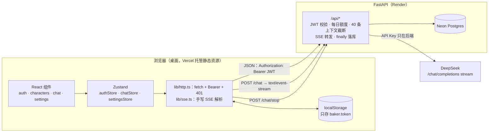
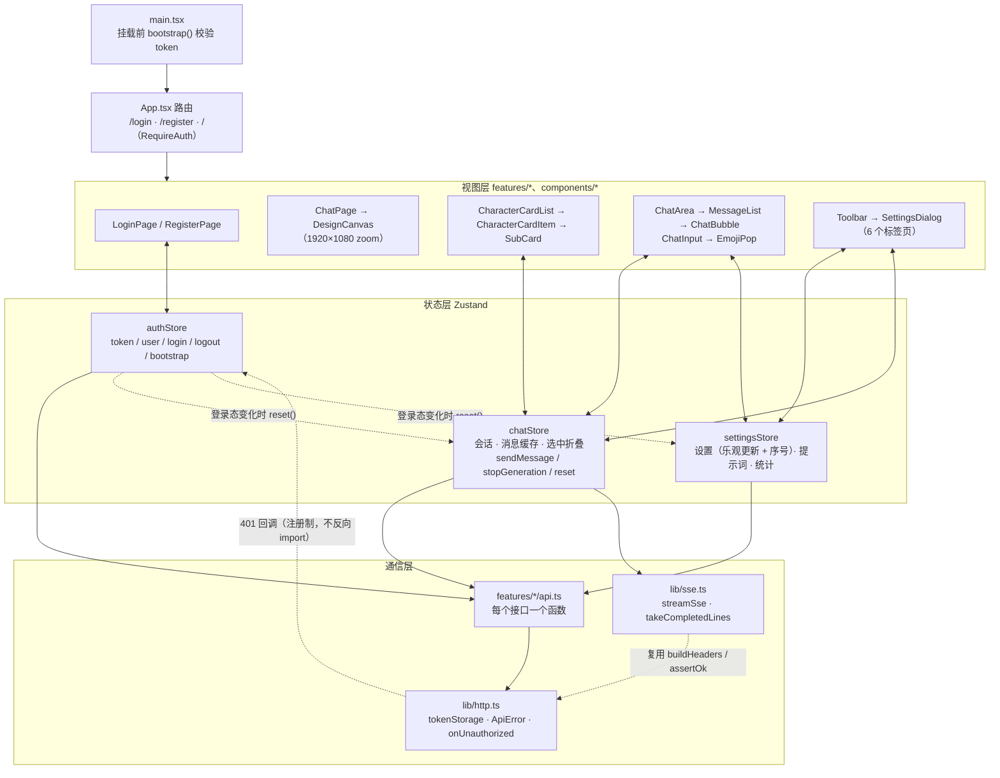
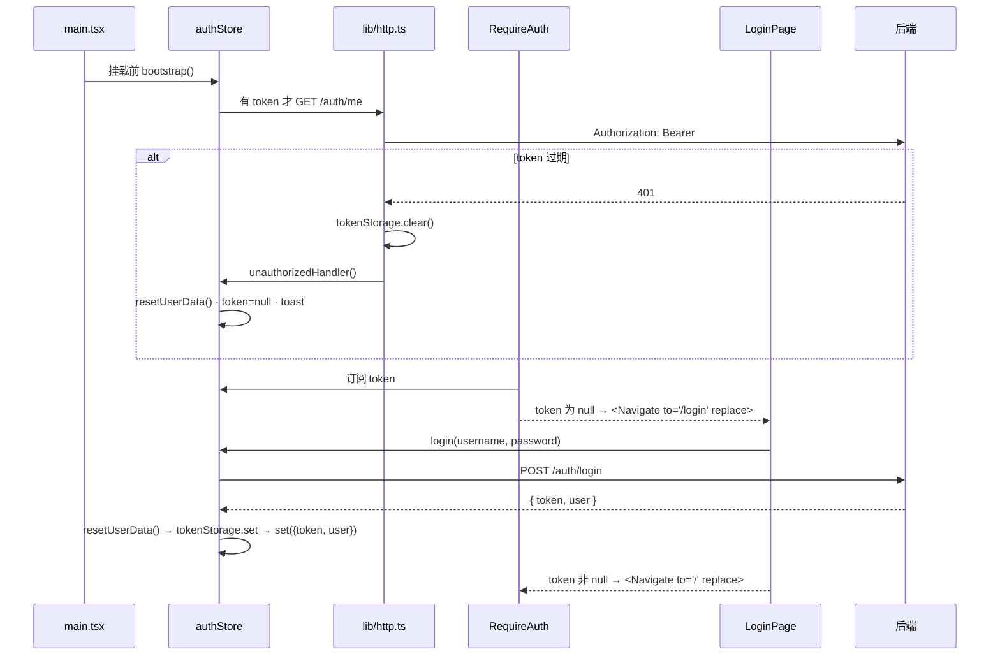
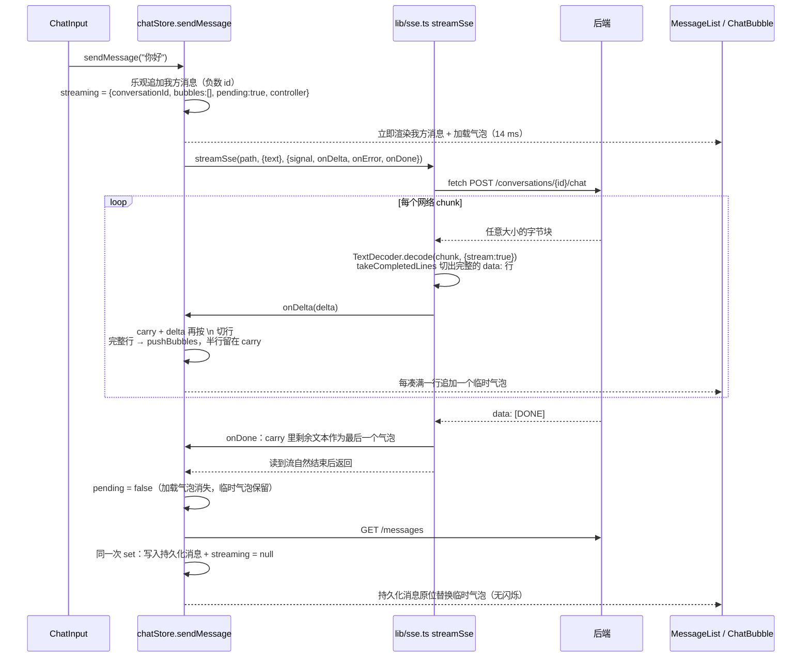
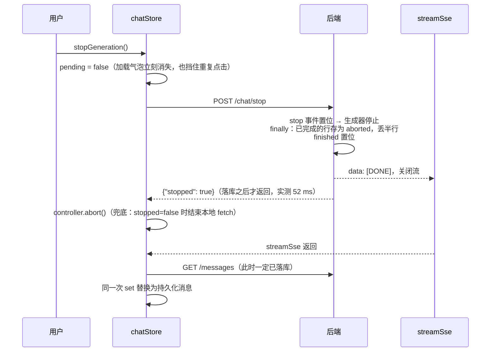

# Baker Chat 前端项目文档

本文从前端视角完整讲一遍 Baker Chat：为什么做、用了什么、怎么分层、每条核心链路怎么走、踩过哪些坑、优化了多少。所有数字都来自 [interview.md](interview.md) 与 `docs/notes/*.md` 的实测记录；代码位置写"文件 + 函数名 / 标识符"，不写行号。

> 阅读提示：第 4 节的"上传"和"重连"两条流程，本项目**没有**做成独立功能（没有文件上传、SSE 断线不自动重连）。这两节先如实说明项目里对应的真实行为，再写"如果要做该怎么做"，面试被追问时照这个口径答，不要说成已实现。

---

## 1. 项目背景

### 1.1 做什么

"终末地 BAKER 会话消息"风格的角色聊天应用：登录后与 29 个内置角色对话，AI 回复**边生成边按行出现**，每一行是一个 SVG 聊天气泡，界面像素级还原游戏内的消息界面（1920×1080 设计画布）。

线上地址：前端 <https://baker-chat-frontend.vercel.app>，后端 <https://baker-chat-api.onrender.com>（Render 免费实例会休眠，首次访问要等 30–60 秒），演示账号 `demo` / `demo123`。

### 1.2 为什么重写

原项目 [endfield-baker-chat](https://github.com/NCreeper233/endfield-baker-chat) 是 Vue 3 + Pinia 的纯前端页面，有三个工程问题：

| 原项目的问题                                                 | 重写后的做法                                     |
| ------------------------------------------------------------ | ------------------------------------------------ |
| API Key 由用户填在前端，请求从浏览器直连 DeepSeek            | Key 只在后端环境变量，前端产物与请求里都不出现   |
| 数据全在浏览器 IndexedDB，换设备就没了                       | 有账号体系，会话 / 消息 / 设置按用户存在服务端   |
| 29 个角色提示词（393,586 字节）打进前端 JS，占产物 JS 的 53% | 提示词移到后端 JSON，前端 JS 722.8 KB → 358.2 KB |

所以这是一次"把一个 Demo 页面改造成可部署的完整工程"的重写：前端 React 19 + TypeScript，后端 FastAPI，配套测试、CI、Docker、线上部署。视觉、素材、提示词与交互基线全部来自原项目。

### 1.3 我负责的前端部分

- 登录 / 注册 / 路由守卫 / 401 统一处理
- 29 张角色主卡 + 会话子卡的列表（展开、折叠、选中、新建、删除）
- 聊天区：SVG 气泡、按行流式渲染、停止生成、contenteditable 输入框 + 表情
- 设置对话框六个标签页（AI 配置、世界观、角色提示词、数据管理、关于、免责声明）
- 工程化：ESLint / Prettier / Vitest + RTL / Playwright E2E / husky + commitlint / CI

规模：前端源码 4,558 行（不含测试），测试 2,638 行，Vitest 21 个文件 125 个用例。

---

## 2. 技术栈

| 类别     | 选型                                   | 版本   | 为什么选它（一句话）                                                                            |
| -------- | -------------------------------------- | ------ | ----------------------------------------------------------------------------------------------- |
| 框架     | React（只写函数组件 + Hooks）          | 19     | 求职目标岗位主流；项目需要 `memo`、`Profiler` 这类可度量的渲染控制                              |
| 语言     | TypeScript（strict）                   | 5.9    | 前后端契约（`docs/api.md`）落成类型；锁 5.9 是因为 typescript-eslint 8.70 的 peer 范围不到 TS 7 |
| 构建     | Vite                                   | 7.3    | 无 SSR / SEO 需求，不需要 Next.js；`import.meta.glob`、`?no-inline`、Vitest 共用配置            |
| 状态     | Zustand（每个 feature 一个 store）     | 5.0    | 选择器粒度细、能在 React 外调用；对比见 [5.10](#510-为什么用-zustand不用-context--redux--immer) |
| 路由     | React Router                           | 7.18   | 只有 3 个路由，用声明式 `<Navigate>` 做守卫                                                     |
| 样式     | Tailwind CSS v4（单一 `index.css`）    | 4.3    | `@theme static` 做设计令牌唯一来源，SVG 与 CSS 共用颜色；不再混用 SCSS                          |
| 工具     | clsx                                   | 2.1    | 条件 class 拼接；状态样式优先用 `data-*` 变体，clsx 用得很少                                    |
| 通信     | 原生 `fetch` + 手写 SSE 解析           | —      | 不装 axios / fetch-event-source，`lib/http.ts` + `lib/sse.ts` 两个文件                          |
| 单测     | Vitest + React Testing Library + jsdom | 4.1    | 与 Vite 共用配置；fetch 用 `src/test/mockFetch.ts` 桩，SSE 桩流可逐帧推送                       |
| E2E      | Playwright（chromium）                 | 1.62.1 | `webServer` 数组自动拉起后端（`AI_MOCK=1`）与前端                                               |
| 代码规范 | ESLint 9 + jsdoc 规则 + Prettier       | —      | `--max-warnings=0`；Tailwind 插件自动排 class                                                   |
| 提交规范 | husky + lint-staged + commitlint       | —      | 提交前只检查暂存文件，提交信息强制 Conventional Commits                                         |
| 部署     | Vercel（前端）/ Docker nginx 镜像      | —      | `vercel.json` 做 SPA rewrites；Docker 多阶段构建 node:22-alpine → nginx:alpine                  |

生产依赖只有 5 个：`react`、`react-dom`、`react-router`、`zustand`、`clsx`。

后端（了解即可）：FastAPI + SQLAlchemy 2 + Pydantic v2，JWT（HS256，7 天），httpx 代理 DeepSeek 流式接口，SQLite（本地 / CI）与 Neon Postgres（线上）靠 `DATABASE_URL` 切换。

---

## 3. 架构图

> 可交互的 HTML 版本在 `docs/diagrams/`：`baker-chat-architecture.html`（整体）、`frontend-module-dependencies.html`（前端模块）、`frontend-sse-dataflow.html`（SSE 数据流）。下面是能在 GitHub 上直接渲染的 Mermaid 版。

### 3.1 系统整体



### 3.2 前端分层



分层规则：

- **视图层**只做展示和把用户动作转成 store 动作；组件里没有 `fetch`。
- **状态层**是业务编排：乐观更新、流式状态、错误 toast 都在 store 动作里。组件用选择器按字段订阅。
- **通信层**与业务无关：`lib/` 不 import 任何 `features/`。401 要通知 authStore，用"注册回调"（`onUnauthorized(handler)`）而不是直接 import，避免 `authStore → api → http → authStore` 循环依赖。
- **localStorage 只存 token**，唯一读写入口是 `lib/http.ts` 的 `tokenStorage`；会话、消息、设置都以服务端为准。

### 3.3 目录结构

```text
frontend/src/
├── main.tsx              入口：引入样式 → bootstrap() → 挂载 App
├── App.tsx               路由表（AppRoutes 不含 Router，方便测试套 MemoryRouter）
├── styles/index.css      唯一全局样式：@theme static 令牌、@font-face、@utility scroll-mask
├── lib/
│   ├── http.ts           fetch 封装、tokenStorage、ApiError、401 回调注册
│   └── sse.ts            streamSse、takeCompletedLines
├── components/           DesignCanvas、DialogShell、DialogButton、Toast + toastStore、HeaderTop
├── constants/            角色表、表情表、设计坐标（design.ts）、素材映射
├── features/
│   ├── auth/             LoginPage、RegisterPage、RequireAuth、authStore、api
│   ├── characters/       CharacterCardList / Item、SubCard、cardLayout（卡片纵坐标计算）
│   ├── chat/             ChatPage、ChatArea、MessageList、ChatBubble、LoadingBubble、ChatInput、
│   │                     EmojiPop、chatRows（间距规则）、emojiHtml（token ↔ HTML）、chatStore、api
│   └── settings/         Toolbar、SettingsDialog + 6 个 Tab、DeleteConfirmDialog、settingsStore、api
└── test/                 setup.ts、mockFetch.ts（fetch 桩与可逐帧推送的 SSE 桩）
```

---

## 4. 核心流程

### 4.1 登录与鉴权



关键点：

1. **启动校验放在挂载前**（`main.tsx` 里 `void useAuthStore.getState().bootstrap()`）。如果放进组件的 `useEffect`，开发环境 StrictMode 会让 effect 执行两次，`/me` 请求两次。Zustand store 能在 React 外调用，才能这么写。
2. **守卫只看内存里的 token**（`RequireAuth`）。`replace` 让浏览器后退也回不到受保护页。登录页顶部同样一行 `if (token !== null) return <Navigate to="/" replace />`，登录成功后 token 一变就自动跳转，不需要 `useNavigate`。
3. **401 分两种**（`http.ts` 的 `assertOk` + `CREDENTIAL_PATHS`）：
   - `/auth/login`、`/auth/register` 的 401 表示"用户名或密码错误"，交给表单显示。
   - 其他任何接口的 401 表示"登录已过期"：清 token、调 authStore 注册的处理器、弹 toast、守卫跳登录页。
   - 按**接口路径**区分，不按"请求有没有带 token"区分。原因见 [5.6](#56-多标签页退出401-被当成普通错误)。
4. **并发 401 只提示一次**：处理器第一行判断内存 token 是否已为 null，第一个 401 置空后，后面的 401 直接返回。
5. **切换用户时清数据**：`resetUserData()` 在登录成功、注册成功、退出、401 四处调用，把 chatStore（同时中止进行中的流）和 settingsStore 重置。原因见 [5.7](#57-退出登录后上一个用户的数据闪现给下一个用户)。
6. **token 放 localStorage + Bearer 头**，没用 httpOnly cookie。前端在 Vercel、后端在 Render，属于跨站部署，用 cookie 就要 `SameSite=None; Secure`、CORS `allow_credentials`，还要做 CSRF 防护。代价是 XSS 能读到 token。本项目没有第三方脚本，唯一的 `innerHTML` 写入（`emojiToHtml`）先转义 `& < > "`，粘贴只取纯文本。
7. **密码规则前后端一致**：6–64 个字符，且 UTF-8 不超过 72 字节（bcrypt 的上限）。前端 `RegisterPage.tsx` 的 `isValidPassword` 与后端 `field_validator` 是同一条规则。

### 4.2 "上传"：消息发送（本项目没有文件上传）

**真实情况**：项目里没有文件上传。原 Vue 项目有"自定义背景图上传"和"导出 ZIP"，重写时按需求删掉了，连同 18 张相关素材和 jszip、html-to-image 依赖。用户提交数据的路径只有两类：

1. **发消息**：contenteditable 里的文字和表情序列化成纯文本，`POST /conversations/{id}/chat`，body 是 `{ text }`。
2. **改设置 / 提示词**：`PATCH /settings`、`PUT /prompts/{name}`，JSON body。

**发消息的序列化**（`ChatInput.tsx` + `emojiHtml.ts`）：

```text
contenteditable DOM                          提交给后端的 text
你好呀<div>第二行</div>   →   "你好呀\n第二行[sns_emoji_001]"
```

- `handleKeyDown`：Enter 发送；Shift / Ctrl / Cmd + Enter 用 `execCommand('insertText', false, '\n')` 换行；`event.nativeEvent.isComposing` 为 true 时（中文输入法正在选词）什么都不做，否则选词按的回车会把消息发出去。
- `htmlToEmojiText`：深度优先遍历 DOM，只保留文本节点和 `data-emoji` 属性。`<br>` 算换行；Chrome 会把第二行包成 `<div>`，所以块级元素前补一个换行，连续的块级元素不产生空行。
- `handlePaste`：只取 `text/plain`，再 `insertText`。别处复制来的 HTML 不会带进输入框，也就不会带进 XSS 或奇怪样式。
- 表情存成 `[sns_emoji_NNN]` token。AI 原样收到 token，渲染时 `splitEmojiText` 把文本切成 `string | Emoji` 数组再映射成 React 节点，气泡渲染不用 `dangerouslySetInnerHTML`。

**如果面试官问"文件上传你会怎么做"**（以下是方案，项目中未实现）：

| 环节     | 做法                                                                                                                                                                |
| -------- | ------------------------------------------------------------------------------------------------------------------------------------------------------------------- |
| 选择     | `<input type="file" accept="image/*">` 或拖拽 `onDrop` 读 `dataTransfer.files`；前端先校验类型和大小，但以服务端校验为准                                            |
| 预览     | `URL.createObjectURL(file)` 生成预览地址，组件卸载或换图时 `URL.revokeObjectURL`，否则内存泄漏                                                                      |
| 发送     | `FormData` + `fetch`，**不要**手动设 `Content-Type`，浏览器会自动带上 `multipart/form-data; boundary=…`（本项目 `buildHeaders` 固定写了 JSON 头，要为上传单独处理） |
| 进度     | `fetch` 没有上传进度事件，要进度条就用 `XMLHttpRequest` 的 `xhr.upload.onprogress`（或 axios 的 `onUploadProgress`，底层也是 XHR）                                  |
| 取消     | `AbortController`（fetch）或 `xhr.abort()`                                                                                                                          |
| 大文件   | 切片：`file.slice()` 分块，每块带序号和文件哈希（在 Web Worker 里算，避免卡主线程）；服务端记录已收到的分块，支持断点续传与秒传；最后发一个"合并"请求               |
| 图片压缩 | 头像类小图可先用 canvas 或 `createImageBitmap` 缩放再 `toBlob`，减少流量                                                                                            |

### 4.3 流式回复

这是项目的核心链路。以在"陈千语"会话里输入"你好"并回车为例：



后端 SSE 帧格式（`docs/api.md` §3）：

```text
data: {"delta": "你好，管理员。\n今天"}
data: {"delta": "也辛苦了。"}
data: {"usage": {"prompt_tokens": 812, "completion_tokens": 45}}   ← 可选
data: {"error": "上游认证失败（401）"}                              ← 出错时，之后一定有 [DONE]
data: [DONE]
```

逐步说明：

**① 为什么不用 `EventSource`**：`EventSource` 只能发 GET，不能自定义请求头；对话接口是带 JWT 的 POST。`@microsoft/fetch-event-source` 主要多了自动重连，而本项目的流是一次性的（见 4.4），不需要。最后手写 `fetch` + `ReadableStream` + `TextDecoder`，约 60 行，零依赖。

**② 两层"按行切分"**，用同一个函数 `takeCompletedLines(buffer)`，它返回 `{ lines, rest }`：

- 第一层在 `streamSse`：网络 chunk 的边界和 SSE 帧的边界没有关系，一帧 `data: …\n` 可能被切成两半，所以要缓冲到换行才解析。
- 第二层在 `chatStore.sendMessage` 的 `onDelta`：AI 回复每行一个气泡，delta 的边界和回复里 `\n` 的边界也没有关系，未完成的半行放在闭包变量 `carry` 里。

**③ 多字节字符**：一个汉字在 UTF-8 里占 3 字节，可能跨两个 chunk。`decoder.decode(value, { stream: true })` 会把不完整的字节序列留在解码器内部，等下一块到了再拼。注意 `stream` 是 `decode()` 的第二个参数，不是构造函数的参数（写错了 `tsc` 会报错，见 [5.1](#51-sse-解析chunk-边界与多字节字符)）。

**④ 状态设计**（`StreamingState`）：

| 字段             | 含义                                                                             |
| ---------------- | -------------------------------------------------------------------------------- |
| `conversationId` | 回复属于哪个会话。用户中途切到别的会话，回复仍写回原会话，不会串台               |
| `bubbles`        | 已经收完整的行，每行一个临时气泡                                                 |
| `pending`        | "还会有新内容"，决定是否显示加载气泡；停止后、以及流结束到重拉完成之间为 `false` |
| `controller`     | 这次请求专用的 `AbortController`                                                 |

全局只有一个 `streaming`，`sendMessage` 开头判断 `get().streaming !== null` 就直接返回，同一时刻只允许一条回复在进行。

**⑤ 避免闭包里的旧状态**：`pushBubbles` 用 `set((s) => …)` 基于**最新**状态追加，不引用外层捕获的 `streaming` 对象。async 函数执行期间，store 可能已被停止或 `reset()` 改过，捕获的对象是旧的。

**⑥ 结束时用持久化消息替换临时气泡**：流结束后 `GET /messages`，并在**同一次 `set`** 里写入消息和 `streaming: null`。如果分两次 `set`，中间会有一帧"临时气泡 + 持久化消息"同时存在，同一段回复显示两遍。能放心在这里重拉，是因为后端在 `finally` 落库之后才发 `[DONE]`，前端收到 `[DONE]` 时数据已经在库里。

**⑦ 收到 `[DONE]` 后不调用 `reader.cancel()`**，而是继续 `read()` 直到 `done`。主动取消会被 Chromium 记成 `net::ERR_ABORTED`，Network 面板每次回复都有一条红色的失败请求（[5.9](#59-每次回复结束network-面板都有一条失败的-chat-请求)）。

**⑧ 渲染**：`MessageList` 把持久化消息、临时气泡、加载气泡拼成一个数组，`chatRows.ts` 的 `layoutRows`（纯函数）决定每行的头像显隐和间距（同一人 14 px / 跨方向 33 px / 同侧换人 60 px）。`ChatBubble` 用 `memo` 包裹，已有气泡在流式期间不重渲染（348 → 11 次，见 [6.3](#63-流式期间气泡重渲染348--11)）。内容高度变化由 `ResizeObserver` 触发滚到底部。

**⑨ 错误**：

- 非 2xx（例如 429 今日额度已用完）：`streamSse` 抛 `ApiError`，`sendMessage` 的 catch 里 toast。后端没保存这条用户消息，重拉后乐观追加的消息自然消失。
- 流中途上游出错：后端发 `data: {"error": …}`，前端追加一个 `[错误: …]` 气泡，随后照常收到 `[DONE]` 并重拉。

### 4.4 "重连"：断线与恢复（本项目不自动重连）

**真实情况**：SSE 流断开后**不会自动重连续传**。这是有意的取舍：后端的一次生成和这条 HTTP 连接绑在一起，连接断了生成就结束，没有可以"接上"的东西。项目里处理的是"断了之后数据要一致"，以及几种相关的恢复场景：

| 场景                              | 实际行为                                                                                                                                                                                                     |
| --------------------------------- | ------------------------------------------------------------------------------------------------------------------------------------------------------------------------------------------------------------ |
| 用户关标签页 / 刷新               | 后端察觉断开后取消生成器，`finally` 里把**已完成的行**存成 `aborted` 状态，丢掉半行。再次打开会话时 `selectConversation` 重拉，看到的就是这些行                                                              |
| 流中途网络断开                    | `reader.read()` 抛 `TypeError`，`sendMessage` 的 catch 里 toast，然后照常 `pending = false` 并尝试重拉；网络还没恢复时重拉也失败，toast 后清掉 `streaming`，临时气泡消失。下次选中会话时会重新拉取服务端结果 |
| token 过期                        | 任意请求 401 → 清登录态 → 跳登录页；没有 refresh token，要重新登录（token 有效期 7 天）                                                                                                                      |
| 后端冷启动（Render 免费实例休眠） | 第一次请求要等 30–60 秒，没有专门的重试或"唤醒中"提示；演示前先访问一次 `/health`                                                                                                                            |
| 另一个标签页退出                  | 本页下一次请求 401，同样回到登录页（[5.6](#56-多标签页退出401-被当成普通错误)）                                                                                                                              |

**为什么不做**：遵守项目的"五板斧"约定，不为没出现的需求提前设计。流是一次性的，接上重连需要把后端改成"生成与连接解耦"，改动很大，而一轮回复通常 1 秒左右就结束（真实 DeepSeek 全文中位数 1045 ms）。

**如果面试官问"要支持断线续传怎么做"**（方案，未实现）：

1. **后端先解耦**：生成放进后台任务，每个 delta 带递增序号写进 Redis Stream 或数据库，而不是直接写给这条连接。连接只负责"从某个序号开始读"。
2. **SSE 帧加 `id:` 字段**（标准 SSE 就有）。重连时带上 `Last-Event-ID` 头，或 `?after=<seq>` 参数，服务端从断点往后补发。
3. **前端重连策略**：指数退避 + 随机抖动（1 s、2 s、4 s… 封顶 30 s），限制最大次数；监听 `online` 事件立刻重试，`offline` 时暂停；用户点"停止"或切换账号时不重连。
4. **幂等**：发送消息时前端生成一个 `clientMessageId`（例如 `crypto.randomUUID()`），服务端据此去重，避免"请求其实成功了，但响应丢了，重试又发一遍"。
5. **UI**：显示"连接中断，正在重连…"，重连成功后从断点继续追加气泡，已有气泡不重画。

### 4.5 取消（停止生成）

需求：点"停止"后，已显示的气泡保留，未完成的半行丢弃，刷新后看到的内容和停止时一样。



**第一版是错的**：一开始的做法是"前端 `abort()` 后立刻 `GET /messages`"。真实浏览器冒烟时，点停止后已显示的那一行消失了，刷新后才出现。看后端日志的请求顺序，abort 之后紧跟着一条 `GET /messages 200`，而后端要等下一次向客户端写数据时才发现连接断了、才落库，GET 抢在落库前返回了空结果。

**四个候选方案**：

| 方案                                     | 问题                                                   |
| ---------------------------------------- | ------------------------------------------------------ |
| abort 后立刻重拉                         | 就是上面的 bug                                         |
| abort 后等固定时间再重拉                 | 真实 DeepSeek 两块数据之间可能隔好几秒，等多久都不可靠 |
| abort 后本地留一份 `aborted` 消息        | 本地和服务端在下次重拉前是两套数据，只是把不一致藏起来 |
| **新增 `POST /chat/stop`，落库后才返回** | 把"先落库、后重拉"变成接口约定，前端不用猜后端时序 ✅  |

**前端细节**：

- **先 stop 再 abort**。如果先 abort，后端多半在收到 stop 之前就察觉断开并注销了这条流的登记，stop 几乎总返回 `stopped: false`，接口语义就含糊了。
- `pending = false` 同时起两个作用：加载气泡立刻消失；`stopGeneration` 开头判断 `!streaming.pending` 就返回，连点只发一次 stop。
- `onDone` 只在 `pending` 仍为 `true` 时才把 `carry` 里的半行显示为最后一个气泡。停止时后端丢掉了半行，前端也不显示，两边一致。
- 没有新增 `stopping` 字段。"pending 但正在停止"是不该存在的状态组合，把 `pending` 的含义定为"还会有新内容"就够了。
- abort 的两条路径：真实 `fetch` 被 abort 时 `read()` 以 `AbortError` 拒绝，catch 里看到 `signal.aborted` 就静默返回；测试里手写的桩流不认识 signal，`read()` 仍会返回数据，所以每次读到数据后先检查 `signal.aborted`。

**退出登录时的取消**：`logout` → `resetUserData()` → `chatStore.reset()` → `streaming.controller.abort()` 并回到初始状态。`sendMessage` 在流结束后看到 `streaming === null` 就不再重拉，避免旧用户的消息写进新用户的 store。这条路径不调 stop 接口，服务端靠察觉断开来落库。

**验证**：`chatStore.test.tsx` 断言请求顺序为 `['messages', 'chat', 'chat/stop', 'messages']` 且半行不显示；`stopped=false` 时靠 abort 结束；重复调用只 POST 一次。真实浏览器里 stop 52 ms 返回，64 ms 后发送按钮恢复，刷新后 6 条消息一致。

---

## 5. 难点与解决

每条按"现象 → 怎么定位 → 根因 → 解决 → 验证"写。5.10 以后是面试里容易被追问、之前没答好的问题。

### 5.1 SSE 解析：chunk 边界与多字节字符

- **现象**：先是 `tsc -b` 报 `'stream' does not exist in type 'TextDecoderOptions'`。
- **定位**：查 `lib.dom.d.ts`，`TextDecoderOptions` 只有 `fatal` / `ignoreBOM`，`stream` 是 `decode()` 的选项。
- **根因**：API 位置记错。背后要解决的问题是：浏览器把响应体切成任意大小的 chunk，汉字的 3 个字节可能被切开，一帧 `data:` 也可能被切开。
- **解决**：`new TextDecoder('utf-8')` + `decoder.decode(value, { stream: true })`；`takeCompletedLines` 做行缓冲。
- **验证**：`sse.test.ts` 10 个用例，其中一个专门把 `data: {"delta":"第一行"}\n` 编码后从"行"字的第 2 个字节处切开分两次推送。E2E 的 mock 后端每 80 ms 发 5 个字，故意不和行边界对齐，行缓冲在真实链路上也会用到。

### 5.2 停止生成的竞态

见 [4.5](#45-取消停止生成)。一句话：客户端的"abort 后重拉"和服务端的"察觉断开后落库"是两条互不知情的异步路径，没有先后保证；解决办法是用接口约定顺序（stop 在落库后才返回），不去猜时序。

### 5.3 零尺寸容器里的 `` 宽度全是 0

- **现象**：headless 截图里主卡没有纹理、下划线和角标，子卡图标框是空的，聊天条不显示。
- **定位**：用 CDP `Runtime.evaluate` 遍历这些 ``，打印 `getBoundingClientRect()` 和 computed style：高度都对，宽度全是 0，`naturalWidth > 0`（说明图片已加载）。
- **根因**：Tailwind v4 的 preflight 有 `img { max-width: 100% }`。原项目的布局用 0×0 的"原点容器"，子元素按设计稿坐标绝对定位铺开。容器宽 0，`100%` 就是 0，把 `w-[434.72px]` 压成了 0。jsdom 没有布局，单元测试测不出来。
- **解决**：只给零尺寸容器里带显式宽度的 16 张 `` 加 `max-w-none`，不加全局覆盖（全局覆盖会影响其他正常图片）。preflight 的另外两条也要处理：`img { display: block }` 会让表情换行，所以表情显式 `inline-block`；列表样式被清空，免责声明显式 `list-disc`。
- **验证**：重新截图，图片宽度恢复为 434.72 / 137.59 / 48 …，聊天条宽 1323。

### 5.4 SVG 气泡的尺寸测量

- **难点**：气泡是 SVG（圆角矩形 + 尾巴），文字放在 `foreignObject` 里。矩形尺寸必须等于文字实际渲染尺寸加内边距。文字里有表情 ``，字体可能晚到（`font-display: swap`），画布还有 CSS `zoom` 缩放。
- **候选**：
  - canvas `measureText`（原项目的做法）：不认识 ``，字体没加载完测得不准，原项目只好挂载前 `await document.fonts.load`。
  - `useLayoutEffect` 读 `offsetWidth`：取整，丢掉小数（行高是 31.32）；字体换好后不会重测。
  - `getBoundingClientRect`：在 `zoom` 下返回的是缩放后的视口坐标，还要除以 zoom。
  - **`ResizeObserver`**：`contentRect` 是元素自身坐标系的 CSS 像素，不受 zoom 影响；字体晚到导致尺寸变化时会再回调 ✅。
- **附带好处**：`ResizeObserver` 回调发生在浏览器渲染步骤里，React 的更新在之后的任务里提交，所以新气泡第一帧一定按加载气泡的尺寸画，第二帧才是真实尺寸，配合 CSS transition 就有了"从加载气泡变大"的过渡。原项目为此要写"双 rAF"，这里时序天然成立。
- **验证**：单行气泡高 49.31（设计稿 49.32）；1280×720（zoom 2/3）下 SVG 宽度与 zoom 1 时只有亚像素差。

### 5.5 contenteditable 输入框

textarea 没法在文字中间显示图片，所以用 contenteditable，随之而来几个问题：

| 现象                                               | 根因                                          | 解决                                                                                                                     |
| -------------------------------------------------- | --------------------------------------------- | ------------------------------------------------------------------------------------------------------------------------ |
| 中文输入法选词时按回车，消息被发出去               | 选词阶段的 keydown 也会触发                   | `event.nativeEvent.isComposing` 为 true 时不处理                                                                         |
| 第二行被 Chrome 包成 `<div>`，序列化后少了换行     | contenteditable 的默认行为                    | `htmlToEmojiText` 遇到块级元素先补换行                                                                                   |
| 点表情按钮后输入框失焦、选区丢失，表情只能插到末尾 | 按钮的 mousedown 默认会抢焦点                 | 表情按钮 / 发送按钮 / 表情格的 `onMouseDown` 调 `preventDefault`（`keepInputFocus`）                                     |
| 点过页头再点表情，表情插到了文字最前面             | 输入框失焦后 `focus()`，Chrome 把光标放在开头 | `handlePickEmoji` 先判断选区是否在输入框内，不在就 `selectAllChildren` + `collapseToEnd` 移到末尾，再 `Range.insertNode` |
| 手动插入换行节点后，撤销（Ctrl+Z）失效             | 直接改 DOM 不进浏览器的撤销栈                 | 换行和粘贴用 `execCommand('insertText')`（虽标为 deprecated，但没有能保留撤销栈的替代 API）                              |
| 粘贴带进外部 HTML 与样式                           | 默认粘贴富文本                                | `handlePaste` 只取 `text/plain`                                                                                          |

验证：E2E 断言后端存储的文本正好是 `'第一行\n第二行[sns_emoji_001]'`；`ChatInput.test.tsx` 8 个用例（jsdom 没有 `execCommand`，测试里用桩代替）。

### 5.6 多标签页退出，401 被当成普通错误

- **现象**：标签页 2 退出登录后，标签页 1 点子卡，请求 401，但页面停在主页，没有跳转也没有提示。
- **定位**：真实 Chromium 开两个页面共用一个 context 复现。
- **根因**：第一版按"请求带了 token 才算过期"来判断 401。标签页 2 已经清掉了 localStorage，标签页 1 的请求就不带 token，条件不成立，401 被静默吞掉。
- **解决**：改为按接口路径判断，除登录 / 注册外所有 401 都算过期；并发 401 的去重从 http 层挪到 authStore 的处理器。`streamSse` 也改成和 `http()` 一样接收不含 `/api` 的 path，两条路径用同一个 `assertOk`。
- **验证**：`RequireAuth.test.tsx`"另一标签页退出后本页的 401 也回到 /login"；真实浏览器里 URL 变为 `/login`，提示只出现 1 次。
- **可以继续改进**：监听 `storage` 事件，另一个标签页清掉 token 时本页立刻同步退出，不用等下一次请求（未实现）。

### 5.7 退出登录后，上一个用户的数据闪现给下一个用户

- **现象**：A 退出后注册 B，在 B 的数据到达之前，主页显示的是 A 的会话展开状态、预览和聊天条样式；A 没结束的回复流在结束后重拉，还会把 A 的消息写回 store。
- **定位**：用 Playwright 路由拦截，把 B 的 `GET /conversations` 延迟 2 s、`GET /settings` 延迟 6 s，把时间窗口放大到肉眼可见。
- **根因**：`logout` 只清了 token 和 user，另外两个 store 的数据留在内存里，等着被下一次加载覆盖；`sendMessage` 流结束后无条件重拉。
- **解决**：`resetUserData()` 在四处调用（见 4.1）；`chatStore.reset()` 同步中止进行中的流并回到初始状态；`sendMessage` 重拉前后都检查 `streaming === null`。
- **验证**：`authStore.test.ts`、`chatStore.test.tsx`、`settingsStore.test.ts` 各有用例；真实浏览器里 A 的预览出现 0 次。

### 5.8 连点设置时的 PATCH 竞态

- **现象**：`PATCH /settings` 有延迟时，快速点两次聊天条样式，两次请求体一样，界面只前进一档；加了乐观更新后，先回来的旧响应又会让界面闪回旧样式。
- **根因**：两个问题叠在一起。① 处理函数从本次渲染的闭包里读 `settings`，两次点击都基于同一个旧值计算"下一个"。② 两个请求并发时，响应到达顺序不保证。
- **解决**：`settingsStore.updateSettings` 先把 patch 合进本地再发请求，成功后用响应覆盖，失败回滚并 toast；模块级序号 `patchSeq`，只有最新一次请求的响应或回滚才写回本地。组件的点击处理改成从 `useSettingsStore.getState()` 读最新值，不读闭包。
- **验证**：PATCH 延迟 1.5 s、间隔 150 ms 连点两次，请求体为 `[{strip_variant:1},{strip_variant:2}]`，界面和服务端最终一致。

### 5.9 每次回复结束，Network 面板都有一条失败的 chat 请求

- **根因**：收到 `[DONE]` 后立刻 `reader.cancel()`，主动中止了还没读完的响应体，Chromium 把这类请求记为失败。
- **解决**：收到 `[DONE]` 后继续 `read()` 到 `done`。服务端发完 `[DONE]` 就关闭连接，这一步几乎不耗时。
- **验证**：Playwright 监听 `requestfailed`，`/chat` 的失败事件从每次 1 条变成 0 条。

### 5.10 为什么用 Zustand，不用 Context / Redux / immer

> 这一条是之前被问住的问题（"为什么没用 immer？用 immer 会更好吗？"），事后专门做了对比实验。

**Context + useReducer**：Context 的值一变，所有消费它的组件都重渲染。流式期间 `streaming` 每来一行就变一次，放进 Context 会把 29 张主卡和全部子卡一起带着重渲染；拆成多个 Context 又要自己写选择器。

**Redux Toolkit**：3 个 store 用不上 slice、thunk、Provider 这一套样板代码。

**Zustand 的两个关键能力**：

1. **选择器粒度**：`SubCard` 用 `useChatStore((s) => s.activeConversationId === conversation.id)` 这样的布尔选择器，选中切换时只有值翻转的那张卡重渲染（实测点击子卡：子卡渲染 1 次，主卡 0 次）。Zustand 5 内部用 React 的 `useSyncExternalStore` 订阅，选择器返回值用 `Object.is` 比较，变了才触发重渲染。所以选择器要返回原始值或 store 里已有的引用；如果每次返回新对象或新数组，就会每次都判定为变化（需要多字段时用 `useShallow`，本项目的选择器都返回单个字段，没用到）。
2. **能在 React 外调用**：`main.tsx` 挂载前 `bootstrap()`、http 层的 401 回调里 `setState`、组件事件里 `getState()` 读最新值（5.8）。

**immer（对比实验结论：不用是对的）**：用 immer 中间件把 chatStore 重写了一版，实测对比：

| 对比项                            | 现在（手写展开） | immer 中间件    |
| --------------------------------- | ---------------- | --------------- |
| chatStore 行数                    | 316              | 313             |
| 单次 `set` 耗时                   | 0.1–0.4 µs       | 3–13 µs         |
| 一条 10 行流式回复的 store 总耗时 | 约 3 µs          | 约 70 µs        |
| 包体积                            | +0               | 约 +3.8 KB gzip |
| 函数式 updater 返回值的类型检查   | 有               | 没有            |

- **更新都很浅**：最深只改到某个会话的 `last_message`，每处一行展开，immer 几乎不省代码。
- **类型检查变弱**：immer 中间件把 updater 声明成返回 `void`，返回了字段写错的对象 `tsc` 也不报错（实测过）。
- **性能不是决定因素**：慢一个数量级，但都在微秒级，用户感知不到。
- **混用有坑**：只改一部分 store 会出现两种写法；在没包中间件的 store 里写 immer 风格的"直接改 draft、不返回"，会把整个 state 更新成 `undefined`。
- **什么时候值得用 immer**：频繁修改三层以上的嵌套数据，或者经常按下标改数组里的多个元素。

⚠️ 注意：`interview.md` 选型表里"同一次 set 写两个字段的意图不如显式返回对象直观"这条理由站不住（immer 里写两行赋值一样直观），面试时用上面的实测理由。

### 5.11 为什么消息列表的 key 用下标

"不要用 index 当 key"是常见说法，这里是有意反着用：

- 流结束后，临时气泡（没有 id）要换成持久化消息（有新 id）。如果 key 用 id，每个气泡都会卸载再挂载，尺寸过渡动画重播一次，看起来像"闪一下"（原项目为此专门维护了一个 `frozenPrevRects` Map）。
- 用下标当 key，下标就是"第几个槽位"，替换时组件实例和测量状态都保留；配合 `memo`，文本相同的气泡直接跳过渲染。
- **为什么这里安全**：列表只会在末尾追加，或整体替换为内容相同的持久化消息，不会在中间插入、删除或重排。index key 出问题的场景（中间插入 / 排序导致组件状态错位）在这里不会发生。
- 挂载时用 `useState(rows.length)` 记下初始行数，下标 ≥ 初始行数的才是新追加的行，才播放过渡；首屏已有的行直接显示。

### 5.12 为什么 hover 效果交给 CSS

- 原 Vue 实现用组件状态记录 hover，指针从主卡移到子卡时，还要在 `pointerleave` 里判断 `relatedTarget`，避免中间一帧白层闪烁。
- 主卡和子卡在 DOM 里是兄弟元素，浏览器在同一帧里切换两者的 `:hover`，白层各自 0.2 s 淡入淡出，天然平滑。所以 hover 全部交给 Tailwind 的 `group-hover/card:`，选中 / 折叠这类持久状态写成根元素上的 `data-*` 属性，子元素用 `group-data-selected/card:` 变体跟随。
- 结果：hover 全程 0 次 React 渲染，store 里没有 hover 字段。

### 5.13 设置页草稿：不用 effect 同步 props 到 state

- 第一版写了 `useEffect(() => setDraft(current.prompt), [current])`，ESLint（react-hooks v7）直接报 `set-state-in-effect`。这种写法每次同步多一次渲染，用户正在编辑时还可能被外部变化覆盖。
- 改成派生：`draft: string | null`，`null` 表示"没编辑过"，显示值是 `draft ?? current?.prompt ?? ''`；换角色或保存成功后 `setDraft(null)`。没有 effect，也没有二次渲染。

### 5.14 测试中遇到的两个异步陷阱

- **async 函数返回的 Promise 会被展开**：测试辅助函数写成 `async function startStreaming() { …; return sending; }`，本意是返回"还在进行的发送 Promise"，但 async 函数会把返回的 Promise 展开，`await startStreaming()` 实际等到了整条流结束，三个停止用例全部超时。改为返回 `{ sending }` 对象。
- **React 自动批处理与逐帧 `act`**：度量重渲染次数时，如果一次性推多帧数据，React 18+ 的自动批处理会把它们合成一次提交，测出来的次数偏少。每推一帧就 `await act(...)` 一次，才能测到真实的逐帧行为。

### 5.15 CSS `zoom` 做设计稿等比缩放

- 所有坐标都是 1920×1080 设计稿的绝对值，窗口变化时按 `min(innerWidth / 1920, innerHeight / 1080)` 整体缩放（`DesignCanvas.tsx` 的 `computeZoom`）。
- 选 `zoom` 不选 `transform: scale()`：`scale` 不改变布局尺寸，容器仍占原来大小，要自己算居中偏移；`zoom` 直接改变布局尺寸，外层 flex 就能居中。
- `resize` 事件用 `requestAnimationFrame` 节流，同一帧内多次 resize 只算一次；卸载时移除监听并 `cancelAnimationFrame`。
- 代价：只支持桌面浏览器；Firefox 126 起才支持 `zoom`。

---

## 6. 优化点

### 6.1 汇总

| 优化项                        | 优化前               | 优化后          | 幅度        | 方法                               |
| ----------------------------- | -------------------- | --------------- | ----------- | ---------------------------------- |
| 字体文件                      | 4,319,844 B          | 928,912 B       | −78.5%      | fontTools 子集化                   |
| 前端产物合计                  | 5,338.0 KB（Vue 版） | 1,656.6 KB      | −69.0%      | 字体子集 + 提示词移后端 + 去依赖   |
| 前端 JS                       | 722.8 KB             | 358.2 KB        | −50.4%      | 提示词移后端，去 jszip 等 3 个依赖 |
| 流式期间 ChatBubble 重渲染    | 348 次               | 11 次           | 约 1/32     | `memo` + 原始值 props + 下标 key   |
| hover 时的 React 渲染         | 每次移动都渲染       | 0 次            | —           | CSS `:hover` + `group` 变体        |
| 首个 AI 气泡（真实 DeepSeek） | 5017 ms              | 751 ms          | −85%        | 关闭 DeepSeek 思考模式             |
| 流式按行 vs 等全文            | 1045 ms 看到首句     | 751 ms 看到首句 | 提前 294 ms | 按 `\n` 分段，每行一个气泡         |
| 第 60 条消息的 prompt tokens  | 约 7100（外推估算）  | 5704（实测）    | 约 −20%     | 后端只带最近 40 条上下文           |

### 6.2 字体子集化

- **问题**：HarmonyOS Sans SC 字体 4.32 MB，是产物里最大的资源，占首屏传输总量的 86%。
- **做法**：`scripts/measure/subset-font.py`（fontTools）。字符集 = ASCII 可打印字符 + GB2312 标点 + GB2312 一、二级汉字 6,763 个 + 前端源码和提示词里出现的全部字符，去重 7,064 个。
- **取舍**：备选方案"只取项目里出现过的字"只有 365 KB，但常用字只覆盖 2,758 / 6,763，AI 回复里会频繁出现缺字、和系统字体混排，所以放弃。
- **回退验证**：子集外的生僻字（例如"喆"）由系统字体绘制，不会显示成方块；`@font-face` 用 `font-display: swap`，字体没到时先用系统字体显示文字。

### 6.3 流式期间气泡重渲染：348 → 11

- **测量**：`rerender.measure.test.tsx`，用 `<Profiler>` 包住 `<ChatArea>`，20 条历史消息，推 30 帧 delta（组成 10 行），`vi.mock` 把 `ChatBubble` 换成计数包装，对照组只差一个 `memo`。
- **结果**：两组 commit 都是 14 次；不加 `memo` 时每次 commit 都重跑全部气泡，共 348 次；加 `memo` 后只有 11 次（我方消息 1 次 + 10 个新气泡各挂载 1 次）。
- **为什么 memo 有效**：`ChatBubble` 的 props（`side`、`text`、`animate`）都是原始值，浅比较能命中；如果传的是每次新建的对象或内联函数，`memo` 就没用了。
- **为什么差距会越来越大**：不加 memo 时每来一行都要重渲染已有的所有行，代价随对话长度线性增长。
- **说明**：jsdom 里 `ResizeObserver` 是桩，真实浏览器中每个新气泡还会因测量回调多渲染 1 次，两组各 +11，比例不变。

### 6.4 产物体积：−69%

| 类别 | Vue 版    | React 版  | 差值                                                                          |
| ---- | --------- | --------- | ----------------------------------------------------------------------------- |
| JS   | 722.8 KB  | 358.2 KB  | −364.5 KB（提示词 384.4 KB + 去掉 3 个依赖 120.1 KB − React 比 Vue 大的部分） |
| CSS  | 37.5 KB   | 40.7 KB   | +3.2 KB（preflight + `@theme static` 全量令牌）                               |
| 字体 | 4218.6 KB | 907.1 KB  | −78.5%                                                                        |
| 图片 | 358.5 KB  | 349.7 KB  | 删掉 18 张导出 / 上传 / 移动端专用素材                                        |
| 合计 | 5338.0 KB | 1656.6 KB | −69.0%（gzip 4850.0 → 1396.3 KB）                                             |

其他体积相关的细节：37 张表情图用 `import.meta.glob(..., { query: '?no-inline' })` 加载，不被 Vite 按 4 KB 阈值 base64 内联进 JS。

### 6.5 首个气泡：5017 ms → 751 ms

- **发现**：接上真实 DeepSeek 后跑 `scripts/measure/first-bubble.mjs`（页面内 `MutationObserver` 计时），首个气泡和全文完成几乎同一毫秒出现（中位数都是 5017 ms），按行流式完全没起作用。
- **定位**：绕过前后端直接请求上游，逐帧记录类型和时间：模型默认开启"思考模式"，思考内容占满了 token 预算，正文要等思考结束后才一次性到达（28 个 delta 在 3 ms 内到齐）。
- **解决**：后端请求体加 `thinking: {"type": "disabled"}`。角色闲聊不需要推理。
- **结果**：首个气泡 751 ms，全文 1045 ms，首句比"等全文再显示"早 294 ms；回复越长，提前越多。
- 这一项改的是后端参数，但问题是从前端的首屏指标发现的：前端自己的链路（Enter → 加载气泡 14 ms，mock 下首个气泡 168 ms）一直很快，要分清楚慢在哪一段，才知道该改哪里。

### 6.6 其他体验与性能细节

- **乐观更新**：发消息时我方消息立即出现（负数临时 id），子卡预览同步更新；设置修改先改本地再请求，失败回滚。
- **加载气泡 14 ms 出现**：`sendMessage` 在发请求之前就写入 `streaming.pending = true`。
- **自动滚到底**：不用"消息数变了就 `scrollTop = scrollHeight`"，因为气泡尺寸要在挂载后一帧才测出来，那时 `scrollHeight` 还没变。改用 `ResizeObserver` 观察内容容器高度，尺寸过渡期间每帧回调，滚动平滑跟随。
- **首屏气泡不闪**：首屏气泡测量完成前是 `invisible`（仍参与布局、照常测量），不会先以加载尺寸闪一帧。
- **resize 用 rAF 节流**（5.15）。
- **`@theme static`**：SVG 的 `fill` 和内联 style 里的 `var(--color-…)` Tailwind 扫描不到，默认模式会漏掉这些变量；`static` 全量输出，代价 CSS +2.2 KB。

### 6.7 还能继续优化的地方（未做）

| 问题                                                                  | 可以怎么改                                                                                    |
| --------------------------------------------------------------------- | --------------------------------------------------------------------------------------------- |
| 展开任意一张主卡，29 张主卡都重渲染（`groups` / `tops` 每次是新数组） | `useMemo` 缓存分组 + `memo(CharacterCardItem)`；每张卡只有 16 个 DOM 节点，没测到卡顿所以没做 |
| 设置对话框一打开就发 3 个请求，其中 `/prompts` 约 400 KB              | 按标签页懒加载；或列表接口只返回 `is_custom`，选中角色后再取正文                              |
| 消息列表没有虚拟滚动                                                  | 单会话消息量不大，暂不需要；若上千条可用 react-virtuoso 等支持动态高度的方案                  |
| 路由没有代码分割                                                      | 登录页与主页可 `React.lazy` 拆包；主页是登录后唯一页面，收益有限                              |
| 字体仍占传输总量的 65%                                                | 按 unicode-range 切成多个子集文件，按需加载                                                   |
| 提示词保存失败后草稿丢失                                              | store 动作失败时 reject，由组件决定保留草稿                                                   |
| 其他标签页退出后本页要等下次请求才发现                                | 监听 `storage` 事件同步登录态                                                                 |
| 断线不重连、后端冷启动无提示                                          | 见 [4.4](#44-重连断线与恢复本项目不自动重连)                                                  |

---

## 7. 测试与工程化（简表）

| 层级     | 工具                   | 数量             | 覆盖                                                                          |
| -------- | ---------------------- | ---------------- | ----------------------------------------------------------------------------- |
| 单元     | Vitest + RTL + jsdom   | 21 文件 125 用例 | SSE 解析、按行分段、间距规则、表情互转、表单、守卫、三个 store、重渲染度量    |
| E2E      | Playwright（chromium） | 2 用例           | 注册 → 选角色 → 发消息 → 3 个气泡逐行出现 → 查 API 与刷新；守卫 + 登录 + 退出 |
| 静态检查 | ESLint / tsc           | —                | `--max-warnings=0`，含 jsdoc 规则                                             |
| CI       | GitHub Actions         | 3 个 job         | frontend / backend / e2e，命令与本地脚本逐字相同                              |

jsdom 没有布局引擎，所以布局类问题（5.3 的 `max-width`、5.4 的气泡尺寸、坐标还原）都靠 Playwright 在真实 Chromium 里用 `getBoundingClientRect` 与设计稿常量逐项比对，误差 ≤ 0.02 px。

---

## 8. 面试速答

1. **为什么不用 EventSource？** 只能 GET、不能带 `Authorization` 头，对话接口是带 JWT 的 POST。
2. **流式数据怎么变成一行行气泡？** 两层行缓冲：先按 `\n` 切出完整的 SSE 帧，再把回复文本按 `\n` 切成气泡行，半行留在缓冲区；`TextDecoder` 的 `stream: true` 处理跨块的汉字。
3. **停止生成怎么保证数据一致？** 先调 `POST /chat/stop`，后端落库后才返回，再 `abort()` 兜底，最后重拉。第一版"abort 后立刻重拉"会读到空结果，是真实遇到的 bug。
4. **断线了怎么办？** 不自动重连，后端把已完成的行存下来，重新打开会话时重拉。要做续传，需要后端把生成和连接解耦、SSE 带 `id`、前端指数退避重连、发送带幂等 id。
5. **为什么用 Zustand？为什么不用 immer？** 选择器粒度细、能在 React 外调用；immer 实测省不了代码，还削弱类型检查。
6. **token 为什么放 localStorage？** 前后端跨站部署，cookie 方案要处理 `SameSite=None`、credentials、CSRF；XSS 风险通过转义和纯文本粘贴控制。
7. **key 为什么用下标？** 列表只追加或原位替换，下标就是槽位，替换时组件不重新挂载、动画不重播。
8. **做过哪些有数据的优化？** 字体 −78.5%、产物 −69%、流式重渲染 348 → 11、hover 0 渲染、首个气泡 5017 → 751 ms。

---

## 附：相关文档

| 文档                                                                   | 内容                                           |
| ---------------------------------------------------------------------- | ---------------------------------------------- |
| [interview.md](interview.md)                                           | 面试讲稿全文：选型表、18 个亮点、20 条排查记录 |
| [api.md](api.md)                                                       | 接口契约、SSE 帧格式、停止协议                 |
| [diagrams/frontend-architecture.md](diagrams/frontend-architecture.md) | 前端架构 Mermaid 图、组件树                    |
| [notes/measurements.md](notes/measurements.md)                         | 度量原始记录                                   |
| [conventions.md](conventions.md)                                       | 五板斧、目录与命名、注释规范                   |
