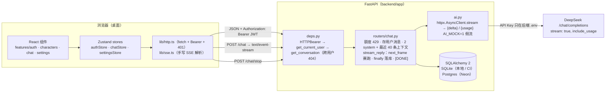

# Baker Chat 面试讲稿

"注释中简要说，文档里细致讲"：源码里的 `💡` 注释只点明结论并指向本文的锚点（第 3、4 节的标题就是锚点 id），细节、数据与取舍都写在这里。所有数字来自 `docs/notes/*.md` 记录的实测（2026-09-24，macOS / Apple Silicon，Node 22.22、Python 3.13.5），唯一的例外是第 4 节 prompt-tokens 里明确标注为线性外推的"不截断约 7100"；用例数与代码行数以 2026-09-25 缺陷修复轮后的本机实跑为准。代码位置一律写"文件 + 函数名 / 标识符"，不写行号。

## 1. 项目概览

### 1.1 定位

把一个 Vue 3 + Pinia 的"终末地 BAKER 会话消息"角色聊天页面（`endfield-baker-chat`，数据全在浏览器 IndexedDB，API Key 由用户填在前端）重写成一个有账号、有后端、可部署的完整工程：

- 前端 React 19 + TypeScript strict + Vite 7 + Tailwind CSS v4 + Zustand + React Router，像素还原原项目的 1920×1080 设计画布、SVG 气泡与角色卡视觉。
- 后端 FastAPI + SQLAlchemy 2 + Pydantic v2：JWT 登录、按用户隔离的会话 / 消息 / 上下文 / 设置 / 提示词覆盖，代理 DeepSeek 并以 SSE 转发流式回复；SQLite 与 Postgres 用 `DATABASE_URL` 切换。
- 工程化：ESLint（含 jsdoc 规则）/ Prettier / ruff（含 D 规则）、Vitest + RTL（21 文件 125 用例）、pytest + respx（78 用例）、Playwright E2E（2 用例）、GitHub Actions 三 job、husky + lint-staged + commitlint、Docker Compose 一键启动、Render + Vercel + Neon 部署配置。
- 规模：前端源码 4,558 行（`src/` 下 ts / tsx / css，不含测试文件 2,638 行）、后端 1,211 行（`app/`；测试 1,148 行），`wc -l` 实测；仓库遵守"五板斧"（不超前设计、不过度工程、不防御未出现的错误、不向后兼容、不写胶水代码）。

### 1.2 架构图



### 1.3 一次消息的完整数据流

以用户在"陈千语"会话输入"你好"回车为例（代码路径均为当前实现）：

1. **输入序列化**：`frontend/src/features/chat/ChatInput.tsx` 的 `handleKeyDown` 拦截 Enter（`nativeEvent.isComposing` 时不发送），`handleSend` 用 `emojiHtml.ts` 的 `htmlToEmojiText` 把 contenteditable 的 DOM 序列化成含 `[sns_emoji_NNN]` token 与 `\n` 的纯文本，交给 `chatStore.sendMessage`。
2. **乐观追加**：`chatStore.ts` `sendMessage` 先把一条负数 id 的我方消息追加到 `messagesByConversation[id]`（同一次 `set` 里用 `withLastMessage` 更新子卡预览），并把 `streaming = { conversationId, bubbles: [], pending: true, controller }` 写入 store。`MessageList` 因 `pending` 立即渲染加载气泡（实测 Enter → 加载气泡 14 ms）。
3. **发起流式请求**：`lib/sse.ts` `streamSse` 以 `fetch` POST `/api/conversations/{id}/chat`，body `{text}`，头 `Authorization: Bearer <jwt>`，绑定本次请求独立的 `AbortController.signal`。
4. **后端准入**（`backend/app/routers/chat.py` `chat`）：
   - `ConversationDep` 解析会话并校验归属（不存在或不属于当前用户 → 404）。
   - `count_today_messages` 统计 UTC+8 当天 `side='mine'` 的消息数，达到 `DAILY_MESSAGE_LIMIT` → `429 今日额度已用完`，用户消息不保存。
   - **第一次持久化**：保存用户消息（`Message(side='mine', status='completed')`）与 `ContextEntry(role='user')`，`commit`。此时即使上游失败，用户消息也已在库里。
   - 组装上游 `messages`：`[system: 固定系统提示词 + 世界观, system: 角色提示词（用户覆盖优先）, …最近 40 条 ContextEntry]`，返回 `StreamingResponse(stream_reply(...))`，头 `Cache-Control: no-cache`、`X-Accel-Buffering: no`。
5. **流式转发**（`stream_reply`）：把 `ActiveStream(stop, finished)` 登记到进程内 `active_streams[conversation_id]`；循环 `next_frame(upstream, stream.stop)`，每帧原样转成 SSE：

   ```text
   data: {"delta": "你好，管理员。\n今天"}
   data: {"delta": "也辛苦了。"}
   data: {"usage": {"prompt_tokens": 812, "completion_tokens": 45}}   ← 上游最后一帧，可选
   data: [DONE]
   ```

   上游 401/429/5xx/超时被 `ai.py` 映射成中文原因抛 `UpstreamError`，路由转成 `data: {"error": "上游认证失败（401）"}` 再发 `[DONE]`。

6. **前端按行分段**：`streamSse` 用 `TextDecoder.decode(chunk, {stream: true})` 累积字节、`takeCompletedLines` 按 `\n` 切出完整的 `data:` 行；`onDelta` 里 `chatStore` 再用同一个 `takeCompletedLines` 把回复文本按 `\n` 切成行，每凑成一整行就 `pushBubbles` 追加一个临时气泡（`bubbles`），未完成的半行留在 `carry`。首个气泡：mock 后端下 168 ms，真实 DeepSeek（关闭思考后）751 ms（页面内 `MutationObserver` 计时，见 [first-bubble](#first-bubble)）。
7. **第二次持久化**（`finally`，`persist_reply`）：流以任何方式结束（正常 / 上游出错 / `POST /chat/stop` / 客户端断开）都在 `finally` 里同步写库：全文按 `\n` 拆行、去空白、丢空行，每行一条 `other` 消息；正常 `completed`，中断 `aborted` 且丢弃最后的半行；出错额外写一条 `[错误: …]` 的 `failed` 消息。上下文：正常写完整回复，中断只写已完成的行，出错不写。会话在流进行中已被删除时（`db.get(Conversation)` 为 `None`）什么也不写。注销登记、置位 `finished` 放在内层 `finally`，落库失败也一定执行；**最后才** `yield "data: [DONE]"`。
8. **前端收尾**：`onDone` 只在 `pending` 仍为 `true` 时把 `carry` 里剩余的非空文本作为最后一个气泡（用户已请求停止时后端丢弃了这段半行，前端同样不显示）；`streamSse` 收到 `[DONE]` 后不 `cancel()` 而是读到流自然结束再返回；`sendMessage` 随后先把 `pending` 置 `false`（加载气泡消失、临时气泡保留），若 `streaming` 已被 `reset()`（退出登录 / 删除全部对话）清空则到此为止，否则 `GET /messages`，把持久化消息写入与 `streaming: null` 放在同一次 `set` 里，列表不会出现"临时气泡 + 持久化消息"并存的中间帧。因为 `[DONE]` 与 stop 响应都在落库之后发出，这次重拉一定读到完整结果。
9. **渲染**：`MessageList.tsx` 把持久化消息 + 临时气泡（+ 加载气泡）拼成一个数组，`chatRows.ts` `layoutRows` 逐行决定头像显隐与间距（同人 14 / 跨方向 33 / 同侧换人 60），`ChatBubble`（`memo`）用 `ResizeObserver` 量出文字块尺寸再画 SVG，内容容器高度变化由另一个 `ResizeObserver` 触发滚到底部。

停止生成：点击"停止" → `stopGeneration` 立即 `pending=false` → `POST /chat/stop`（后端 `stop_chat` 置位 `stop`、等 `finished`，即等第 7 步完成后才返回 `{"stopped": true}`，实测 52 ms）→ `controller.abort()` 兜底 → `sendMessage` 在流结束后重拉。详见 [abort-race](#abort-race)。

## 2. 技术选型表

| 决策点                     | 候选方案                                                                                                                   | 取舍理由                                                                                                                                                                                                                                                                                                                                                                                                                                                                                                                                                                                         | 结论                                                                                                                                                                                                                                                                     |
| -------------------------- | -------------------------------------------------------------------------------------------------------------------------- | ------------------------------------------------------------------------------------------------------------------------------------------------------------------------------------------------------------------------------------------------------------------------------------------------------------------------------------------------------------------------------------------------------------------------------------------------------------------------------------------------------------------------------------------------------------------------------------------------ | ------------------------------------------------------------------------------------------------------------------------------------------------------------------------------------------------------------------------------------------------------------------------ |
| 状态管理                   | ① Zustand ② Context + useReducer ③ Redux Toolkit                                                                           | ② Context 的值一变所有消费者都重渲染，29 张主卡 + 子卡 + 流式期间每帧更新的 `streaming` 放在同一个 Context 里会把整棵树拖下水，拆成多个 Context 又要自己写选择器；③ slice / createAsyncThunk / Provider 的样板对 3 个 store 来说过重，且 immer 让"同一次 set 写两个字段"的意图不如显式返回对象直观。Zustand 的选择器天然做到 `SubCard` 用 `s.activeConversationId === id` 布尔选择器只让翻转的那张卡重渲染（实测点击子卡 SubCard 渲染 1 次、主卡 0 次），store 还能在 React 外调用：`main.tsx` 挂载前 `useAuthStore.getState().bootstrap()`、`lib/http` 的 401 回调 `useAuthStore.setState(...)` | ① Zustand 5，`auth` / `chat` / `settings` 各一个 store，组件按字段订阅                                                                                                                                                                                                   |
| SSE 解析                   | ① `EventSource` ② `@microsoft/fetch-event-source` ③ 手写 `fetch` + `ReadableStream`                                        | ① 只支持 GET、不能带 `Authorization` 头，而对话接口是带 JWT 的 POST；② 引入依赖换取的只是自动重连与解析，本项目的流是一次性的，后端 `[DONE]` 后不会再有数据，不需要重连                                                                                                                                                                                                                                                                                                                                                                                                                          | ③ `lib/sse.ts` 60 行：`TextDecoder(stream)` 处理跨块多字节字符、`takeCompletedLines` 行缓冲、独立 `AbortSignal`；见 [sse](#sse)                                                                                                                                          |
| CSS 方案                   | ① Tailwind v4 全量（`@theme` 令牌 + 一个 `index.css`）② Tailwind + SCSS 混用（原 `_variables.scss` / mixin 照搬）          | ② 两套来源：颜色既在 SCSS 变量又在 `colors.ts`，mixin（`dialog-shell`、`hover-overlay`、`scroll-mask`）与工具类各管一半，评审时要在两种语法之间来回；v4 的 `@theme` 本身就是设计令牌的唯一来源，`@utility` 能表达 `scroll-mask` 这种带参数的 mixin，`data-*:` 变体能表达状态样式                                                                                                                                                                                                                                                                                                                 | ① 只有 Tailwind v4 + `src/styles/index.css`；不引入 SCSS / CSS Modules / cva / tailwind-merge；见 [tailwind-theme](#tailwind-theme)                                                                                                                                      |
| 消息列表布局               | ① flex 纵向流 + 头像绝对定位 ② 逐条计算坐标（原 `useChatRows`：累加每条气泡的 top / bottom 后绝对定位）                    | ② 每条的坐标依赖前一条的测量高度，而测量是异步的（`ResizeObserver` 回调在首帧之后），就要再算一轮再渲染一轮；原项目为此在挂载前 `await document.fonts.load` 并用 canvas `measureText` 估宽                                                                                                                                                                                                                                                                                                                                                                                                       | ① 行高由气泡决定，头像 `position:absolute; top:-18.74` 不占行高，间距用 `marginTop`；实测坐标与设计稿差 ≤ 0.02 px；见 [flex-layout](#flex-layout)                                                                                                                        |
| 气泡尺寸                   | ① canvas `measureText` + 隐藏 ruler 取大值（原项目）② `useLayoutEffect` 读 `offsetWidth` ③ `ResizeObserver`                | ① canvas 不认识表情 ``、字体没到就不准、两套结果取大值是在掩盖误差；② `offsetWidth` 是整数丢小数，`getBoundingClientRect` 在 CSS `zoom` 下是缩放后坐标，字体 swap 后都不会重测                                                                                                                                                                                                                                                                                                                                                                                                              | ③ `contentRect` 是元素自身坐标系的 CSS px、不受 zoom 影响、字体晚到会再次回调；见 [bubble-measure](#bubble-measure)                                                                                                                                                      |
| JWT 存放                   | ① `localStorage` + `Authorization: Bearer` ② httpOnly cookie                                                               | 前端在 Vercel、后端在 Render，是跨站部署：② 需要 `SameSite=None; Secure`、CORS `allow_credentials`、再加 CSRF 防护，而且 Playwright / 度量脚本要注入登录态时 cookie 远不如写一个 `localStorage` 键方便；① 的风险是 XSS 可读 token，本项目没有第三方脚本，唯一一处 `innerHTML` 写入（`emojiHtml.ts` 的 `emojiToHtml`）先转义 `& < > "` 再替换 token                                                                                                                                                                                                                                               | ① `lib/http.ts` 的 `tokenStorage` 是唯一碰 `localStorage` 的地方；token 7 天过期，除登录 / 注册接口外的 401 统一清登录态并重置数据；见 [jwt-401](#jwt-401)                                                                                                               |
| 数据库                     | ① SQLite / Postgres 由 `DATABASE_URL` 切换 ② 只用 SQLite ③ 只用 Postgres                                                   | ② Render 免费实例的磁盘不持久，重启即丢数据；③ 本地与 CI 要多起一个 Postgres 服务，pytest 也慢。SQLAlchemy 2 的方言差异只在两处暴露：主键复用与 naive 时间，都在模型层抹平                                                                                                                                                                                                                                                                                                                                                                                                                       | ① 本地 / CI SQLite 文件或内存库，线上 Neon `postgresql+psycopg://`；见 [sqlite-postgres](#sqlite-postgres)                                                                                                                                                               |
| ORM 会话模型               | ① 同步 `Session` ② 异步 SQLAlchemy（aiosqlite / asyncpg）                                                                  | ② 要为 SQLite 与 Postgres 各装一套异步驱动；更关键的是流式回复的落库恰恰需要"不会被取消打断"的同步代码——asyncio 的取消只在 `await` 处投递                                                                                                                                                                                                                                                                                                                                                                                                                                                        | ① 普通路由用 `def`（FastAPI 放线程池），只有 `/chat` 的生成器是 `async`，`finally` 里用新的同步 `SessionLocal()` 写库；见 [sse-persist](#sse-persist)                                                                                                                    |
| 停止生成                   | ① 显式 `POST /chat/stop`（落库后才返回）② 仅靠客户端 `abort()` 断开 ③ abort 后固定延时再重拉 ④ 本地保留 aborted 消息不重拉 | ② 服务端要等生成器下一次向客户端写入才察觉断开并落库，前端 abort 后立刻重拉会读到空结果（真实发生的 bug）；③ 真实 DeepSeek 两块之间可能相隔数秒，延时多少都不可靠；④ 用负数 id 的本地消息掩盖协议缺陷，本地与服务端在下次重拉前是两套真相                                                                                                                                                                                                                                                                                                                                                        | ① stop 返回即代表已持久化，`[DONE]` 也只在落库后发出，前端永远在"落库之后"重拉；见 [abort-race](#abort-race)                                                                                                                                                             |
| stop 如何唤醒生成器        | ① 每帧转发前检查 `asyncio.Event` ② `asyncio.wait` 让"上游下一帧"与 stop 事件赛跑 ③ 上游消费放独立 task + `Queue`           | ① 生成器挂在 `await` 上游下一帧时看不到事件，stop 要等下一帧才返回（DeepSeek 首 token 前可能秒级，上游挂死时是 60 s 读超时）；③ 仍要在 `queue.get()` 上做同样的赛跑，多一层没有收益                                                                                                                                                                                                                                                                                                                                                                                                              | ② `next_frame()` 每帧建两个 task，stop 先到就取消对上游的等待并关闭连接；用"发完 2 帧后永不再出数据"的 respx 流证明 stop 不依赖上游                                                                                                                                      |
| 密码哈希                   | ① 直接用 `bcrypt` ② `passlib[bcrypt]`                                                                                      | ② passlib 1.7.4 自 2020 年停更，与 bcrypt ≥ 4.1 不兼容（读不到 `bcrypt.__about__`，登录时 `AttributeError`）；多一层没有收益                                                                                                                                                                                                                                                                                                                                                                                                                                                                     | ① `security.py` 的 `hashpw` / `checkpw` 各一行；密码规则 6–64 个字符（Unicode 码点）且 UTF-8 ≤ 72 字节（bcrypt 上限），后端 `AuthRequest` 的 `field_validator` / 前端 `RegisterPage.tsx` 的 `isValidPassword` 同一条规则，超限提示"密码为 6–64 位；含中文时最多 24 个字" |
| 上游调用                   | ① `httpx.AsyncClient.stream` 手写 ② openai SDK                                                                             | ② SDK 把 HTTP 状态码和 SSE 帧都封装掉了，按契约把 401/429/5xx/超时映射成中文原因反而要拆它的异常层级；一个供应商不值得一层抽象（五板斧）                                                                                                                                                                                                                                                                                                                                                                                                                                                         | ① `ai.py` 解析 `data:` 行约 20 行，`httpx.Timeout(connect=10, read=60, write=10, pool=10)`，错误统一抛 `UpstreamError(中文原因)`                                                                                                                                         |
| 角色提示词存放             | ① 后端 JSON 数据文件 ② Python 字典字面量 ③ 前端常量（原项目）                                                              | ③ 393,586 字节的 TS 全部打进前端产物（占原 JS 的 53%）；② 40 万字节的 `.py` 每次 ruff / format 都要扫，还要为它关 E501                                                                                                                                                                                                                                                                                                                                                                                                                                                                           | ① `backend/app/data/character_prompts.json`，启动 `json.loads` 一次 0.42 ms；见 [prompts-backend](#prompts-backend)                                                                                                                                                      |
| 构建工具                   | ① Vite 7 ② Next.js ③ CRA / webpack                                                                                         | ② 页面是登录后的固定 1920×1080 画布，没有 SEO 与 SSR 需求，Server Components 与文件路由只会增加概念；③ CRA 已停止维护，webpack 配置量大且冷启动慢。Vite 还提供 `import.meta.glob`（头像 / 表情按目录加载）、`?no-inline`（37 张表情不 base64 内联）、`@tailwindcss/vite` 插件，`vite.config.ts` 同时是 Vitest 配置                                                                                                                                                                                                                                                                               | ① Vite 7.3（锁 `^7`：任务与 conventions 指定 Vite 7；当日最新的 TS 7 是 Go 版新编译器，与 typescript-eslint 8.70 的 peer 范围 `<6.1` 不匹配，vitest 4.1 的 peer 也只到 Vite 7）                                                                                          |
| 401 处理与分层             | ① `lib/http` 直接 `import useAuthStore` ② `window.location.assign('/login')` ③ http 暴露 `onUnauthorized(handler)`         | ① lib → features 反向依赖且 authStore → api → http → authStore 循环 import；② 整页刷新，内存里的 toast 会丢，"提示 + 跳转"做不到同时满足                                                                                                                                                                                                                                                                                                                                                                                                                                                         | ③ authStore 加载时注册一次；守卫 `RequireAuth` 订阅 token，为 null 即 `<Navigate replace>`                                                                                                                                                                               |
| hover 在主卡与子卡之间传递 | ① 照搬 Vue：组件 hover 状态 + `pointerleave` 判断 `relatedTarget` ② hover 写进 chatStore ③ 纯 CSS `:hover` + `group`       | ① 每次指针移动都走 React 状态，`relatedTarget` 逻辑是在补 JS 状态机的缝；② 同样要重渲染，还把纯视觉状态放进全局 store                                                                                                                                                                                                                                                                                                                                                                                                                                                                            | ③ 主卡与子卡是兄弟元素，浏览器同一帧切换两者的 `:hover`，hover 全程 0 次 React 渲染；见 [hover-css](#hover-css)                                                                                                                                                          |
| 设置页草稿与 store 同步    | ① `useEffect(() => setDraft(current.prompt), [current])` ② `key={selected + prompt}` 强制重挂载 ③ `draft: string \| null`  | ① 命中 react-hooks v7 的 `set-state-in-effect`，每次同步多一次渲染；② 用 key 表达"重置"不直观且 textarea 失焦                                                                                                                                                                                                                                                                                                                                                                                                                                                                                    | ③ null = 未编辑、显示 store 生效文本，换角色 / 保存后置回 null；见 [settings-draft](#settings-draft)                                                                                                                                                                     |
| E2E 拉起前后端             | ① 手写 globalSetup 起子进程并轮询 ② Playwright `webServer` 数组                                                            | ① 就绪探测、超时、退出清理都要自己写                                                                                                                                                                                                                                                                                                                                                                                                                                                                                                                                                             | ② 按数组顺序串行：后端 `/health` 200 后才起 Vite；`reuseExistingServer: false` 保证干净实例                                                                                                                                                                              |
| 前端镜像构建上下文         | ① `./frontend` ② 仓库根 + `dockerfile: frontend/Dockerfile` + 根 `.dockerignore` 白名单                                    | ① 上下文里没有根目录的 `pnpm-lock.yaml`，只能不锁版本地 `pnpm install`                                                                                                                                                                                                                                                                                                                                                                                                                                                                                                                           | ② `--frozen-lockfile --filter frontend --ignore-scripts`（跳过 husky prepare），`.dockerignore` 用 `*` + `!` 白名单，两个旧项目与 `node_modules` 不进上下文                                                                                                              |

## 3. 技术亮点

每个亮点按"背景与问题 → 技术调研与选型 → 如何发现问题 → 如何解决 → 结果与代价"五段写；标题即源码 `💡` 注释指向的锚点。

### sse

**手写 SSE 解析：行缓冲与多字节切分**（`frontend/src/lib/sse.ts`）

- **背景与问题**：对话接口是带 JWT 的 `POST`，响应是 `text/event-stream`；回复必须边到边显示、按行分段成气泡。浏览器把响应体切成任意大小的 chunk，一帧 `data: …\n` 可能被切成两半，一个汉字的 3 个 UTF-8 字节也可能跨 chunk。
- **技术调研与选型**：`EventSource` 只支持 GET、不能带 `Authorization` 头，直接出局；`@microsoft/fetch-event-source` 提供的重连在这里没有意义（后端流是一次性的）。手写 `fetch` + `ReadableStream` + `TextDecoder`，总共 60 行、零依赖。
- **如何发现问题**：`tsc -b` 报 `'stream' does not exist in type 'TextDecoderOptions'`——任务描述把 `stream` 写在构造函数里，查 `lib.dom.d.ts` 才知道它属于 `decode()` 的第二参数。随后专门写了用例 `sse.test.ts`"中文多字节字符被切在两个 chunk 之间时不产生乱码"：把 `data: {"delta":"第一行"}\n` 编码后在"行"的第 2 个字节处切开分两次推送。
- **如何解决**：`streamSse` 用 `new TextDecoder('utf-8')` + `decoder.decode(value, { stream: true })` 让不完整的多字节序列留在解码器内部；`takeCompletedLines` 按 `\n` 切出完整行、把未完成的尾部作为 `rest` 留在缓冲区；`dispatchLine` 识别 `data:` 前缀、`[DONE]`、`delta` / `usage` / `error` 三种帧。同一个 `takeCompletedLines` 被 `chatStore.sendMessage` 复用来把回复文本切成气泡行——SSE 帧与 AI 回复都是"按 `\n` 分段的流"。abort 处理有两条路径：真实 `fetch` 被 abort 时 `read()` 以 `AbortError` 拒绝（`streamSse` 的 catch 看到 `signal.aborted` 就静默返回），手写的测试桩流不认识 signal、`read()` 会返回数据，所以读到数据后先查 `signal.aborted`。收到 `[DONE]` 后不调用 `reader.cancel()`，而是继续 `read()` 到流自然结束：主动取消会被 Chromium 记成 `net::ERR_ABORTED`（第 5 节 5.18）。
- **结果与代价**：`sse.test.ts` 10 个用例（一行跨两个 chunk、多字节切分、一个 chunk 多帧、error 帧、`[DONE]` 后不再处理且不取消流、abort 后不再回调、非 2xx 抛 `ApiError`）；mock 后端每 80 ms 发 5 个字且故意不与行边界对齐（`ai.py` `MOCK_CHUNK_SIZE = 5`），行缓冲在 E2E 里真正被用到。代价：不支持重连；一帧 JSON 不合法会直接抛错（契约保证后端只发合法 JSON，按五板斧不防御）。

### sse-persist

**后端 `finally` 落库覆盖四种结束方式**（`backend/app/routers/chat.py` `stream_reply` / `persist_reply`）

- **背景与问题**：一次回复可能以四种方式结束——上游正常发完、上游 / 网络出错、用户显式停止、客户端断开（关标签页）。spec 要求"已显示的行保留、未完成的半行丢弃、刷新后一致"，即无论怎样结束都必须把已收到的行写进数据库，并且客户端收到 `[DONE]` 时 `GET /messages` 已能读到。
- **技术调研与选型**：异步 SQLAlchemy 需要为 SQLite / Postgres 各装一套驱动，而且异步写库本身可能被取消打断；同步 `Session` 反而是优点——asyncio 的取消只能在 `await` 处投递，同步代码块不会被打断。错误传递选择抛 `UpstreamError(中文原因)`（`ai.py`），而不是让生成器 yield 错误对象，避免每一层都判断。
- **如何发现问题**：用 `curl -N --max-time 0.25` 对 `AI_MOCK=1` 的真实服务器断开连接：250 ms 内收到 3 帧（"收到，管理" / "员。\n这是" / "一条来自 "），断开后库里只有 1 条 `other` 消息"收到，管理员。"（`aborted`），半行"这是一条来自 "被丢弃，uvicorn 无 Traceback。Starlette 察觉断开后取消生成器所在的 task，生成器在 `await` 处收到 `CancelledError`（直接 `aclose()` 时是 `GeneratorExit`），两条路径分别有测试。
- **如何解决**：`stream_reply` 的 `status` 默认就是 `"aborted"`，只有循环自然跑完才改成 `"completed"`；`except ai.UpstreamError` 把 `status` 置为 `failed` 并先 yield 一帧 `{"error": …}`；`finally` 调用同步的 `persist_reply`：全文 `split("\n")`，`aborted` 时丢掉最后一段半行，每行一条 `other` 消息；出错额外写 `[错误: …]` 的 `failed` 消息；上下文"正常写全文 / 中断写已完成行 / 出错不写"。`persist_reply` 先 `db.get(Conversation)`，会话在流进行中已被删除时直接返回、什么也不写；注销登记与置位 `finished` 放在嵌套的内层 `finally`，落库抛异常也不会让登记表泄漏、让 `/chat/stop` 挂起（第 5 节 5.19）。`[DONE]` 放在 `finally` 之后，所以客户端收到它时落库已完成。`db.py` 因此把 SQLite 的 `check_same_thread` 关掉（`connect_args`）：线程池里的路由和事件循环里的落库共用一个引擎。
- **结果与代价**：`tests/test_chat.py` 覆盖 `test_client_disconnect_persists_completed_lines_as_aborted`（`aclose()` 路径）、`test_task_cancellation_persists_as_aborted`（`task.cancel()` 路径）、`test_error_after_partial_content_keeps_received_lines`、`test_conversation_deleted_mid_stream_ends_cleanly`（拿到第 1 帧后经 DELETE 路由删会话：末帧仍是 `[DONE]`、`active_streams == {}`、无消息 / 上下文落库）。代价：测试数据库不能用 `dependency_overrides[get_db]`（生成器 `finally` 里的 `SessionLocal()` 不经过依赖注入），改为 `SessionLocal.configure(bind=test_engine)` 并用 `StaticPool` 单连接内存库，让线程池里的路由与事件循环里的落库看到同一个库。

### abort-race

**停止生成的竞态与显式 stop 协议**（`backend/app/routers/chat.py` `ActiveStream` / `next_frame` / `stop_chat`；`frontend/src/features/chat/chatStore.ts` `stopGeneration`）

- **背景与问题**：spec："点击停止，已显示的气泡保留，未完成的半行丢弃，刷新后该会话只有这些行"。最初的契约是前端 `abort()` 后立刻 `GET /messages` 用持久化结果替换本地临时气泡。
- **技术调研与选型**：四个候选——abort 后立刻重拉（原契约）、abort 后把已显示的行留作负数 id 的本地 `aborted` 消息等下次重拉再对齐、abort 后固定延时再重拉、新增 `POST /chat/stop` 由服务端落库后才返回。前三个都是在客户端猜服务端的时序；只有第四个把顺序变成协议保证。stop 如何唤醒生成器又有三个候选（每帧前查事件 / `asyncio.wait` 赛跑 / 独立 task + Queue），选赛跑：`next_frame()` 为每帧创建 `anext(upstream)` 与 `stop.wait()` 两个 task，`asyncio.wait(FIRST_COMPLETED)`，stop 先到就取消对上游的等待并返回 `None`。登记表用 `dict[int, ActiveStream]`，`ActiveStream` 有 `stop` 与 `finished` 两个事件——只有 stop 事件时，stop 接口无从得知落库是否完成。
- **如何发现问题**：真实浏览器冒烟（Playwright + headless Chromium，mock 后端）：收到第一行"收到，管理员。"时点击停止，列表只剩用户消息"再来一次"，刷新后那一行才出现。看 uvicorn 日志的请求顺序：abort 之后紧接着一条 `GET /messages 200`。对照 `stream_reply` 的实现，它只在生成器下一次向客户端写入（mock 每 80 ms 一块）时才收到 `CancelledError`、才在 `finally` 落库，GET 抢在落库前返回了空结果。真实 DeepSeek 两块之间可能相隔数秒，靠延时不可能修好；chat agent 一度用负数 id 的本地 `aborted` 消息顶替，只是把不一致藏到了"下次重拉"。
- **如何解决**：后端 `ActiveStream`、`active_streams`、`next_frame`、`stop_chat`：stop 接口 `stream.stop.set()` 后 `await stream.finished.wait()`，`finished` 在 `finally` 落库之后置位，随后生成器才发 `[DONE]`；没有登记直接返回 `{"stopped": false}`；会话归属仍由 `ConversationDep` 校验（跨用户 404）；注销只删自己的登记（`active_streams.get(id) is stream`），同会话并发两条流不会误删。前端 `stopGeneration`：先 `pending = false`（加载气泡立即消失，也挡住重复点击），`await stopChat()`，再 `controller.abort()` 兜底 `stopped=false`（流尚未登记 / 已结束）；`sendMessage` 在 `streamSse` 返回后统一重拉，`onDone` 只在 `pending` 仍为 `true` 时把半行显示为最后一个气泡，与后端丢弃半行一致。`StreamingState.pending` 的语义因此扩展为"还会有新内容"，不新增 `stopping` 字段（"pending 但 stopping"是不该存在的组合）。顺序上选"先 stop 再 abort"：若先 abort，服务端多数时候在收到 stop 前就已察觉断开并注销登记，`stopped` 几乎总是 `false`，接口语义变得含糊。
- **结果与代价**：后端 `test_stop_returns_after_persist_without_waiting_for_upstream` 用"发完 2 帧后 `await Event().wait()` 永不返回"的 respx 流证明 stop 不依赖上游下一帧：`stop_chat()` 在 2 s 超时内返回（实际毫秒级），返回瞬间库里已是 `[第一行, 第二行]` 两条 `aborted`、上下文 `第一行\n第二行`、半行"第三"不存在。前端 `chatStore.test.tsx` 三个停止用例：请求顺序 `['messages', 'chat', 'chat/stop', 'messages']` 且半行不显示、`stopped=false` 时靠 abort 结束本地 fetch 再重拉、重复调用只 POST 一次 stop。真实浏览器：点击停止 → `POST /chat/stop` 52 ms 返回 `{"stopped": true}` → 64 ms 后发送按钮恢复，请求顺序 `stop → GET messages`，刷新后 6 条一致。代价：登记表是进程内的，多 worker 部署时 stop 可能落到另一进程返回 `stopped=false`，前端退回 abort → 断开落库的兜底路径（结果仍一致，只是 stop 变成要等上游下一帧）；Render 单实例不受影响。另一个副产品：设计 `next_frame` 时意识到 `asyncio.wait` 不会取消它等待的子 task，客户端断开时 `anext(upstream)` 会继续挂着 httpx 连接，所以 `next_frame` 里 `except CancelledError: frame_task.cancel(); raise` + `finally: stop_task.cancel()`，取消直接投递进 `stream_chat` 的 `async with client.stream(...)`，上游连接随之关闭。

### flex-layout

**消息列表用 flex 流式布局替代逐条计算坐标**（`frontend/src/features/chat/MessageList.tsx`、`chatRows.ts`）

- **背景与问题**：原项目 `useChatRows` 逐条累加气泡的 top / bottom 算出每条消息的绝对坐标；spec 要求保留头像显隐与间距规则（同一说话人 14、跨方向 33、同侧换说话人 60）和 1.5px 级别的像素还原，但改用 flex 纵向流（brief D5）。
- **技术调研与选型**：逐条绝对定位的坐标依赖前一条的测量高度，而测量是异步的（`ResizeObserver` 回调在首帧之后），意味着"测量 → 算坐标 → 再渲染"多一轮；flex 让浏览器算高度，头像 `position:absolute; top:-18.74`（`AVATAR.topToBubble`）不占行高，行间距用 `marginTop`。行的 key 有两个候选：`message.id` 或下标——流结束后临时气泡（无 id）被持久化消息（新 id）替换会 remount、100 ms 尺寸过渡重播一次（原项目用 `frozenPrevRects` Map 规避这个"脉冲"）。
- **如何发现问题**：用 Playwright 在 1920×1080（zoom 1）下读 `getBoundingClientRect` 与设计常量逐项比对：聊天条 (546.02, 114.44) 1323×67.66（设计 67.67）、我方气泡右缘 1746.34（`CHAT_ANCHOR.mineBubbleRight` 1746.34）、对方气泡左缘 644.63（644.64）、首条气泡顶 262.14（188.84 + 54.58 + 18.74 = 262.16）、跨方向 / 同人间距 33.00 / 14.00。
- **如何解决**：`MessageList` 把持久化消息、流式临时气泡、加载气泡拼成一个 `rows` 数组交给 `layoutRows`（`chatRows.ts`，纯函数，说话人身份用头像 URL 表示，1v1 下等价于 side 但"同侧换人 60"有单测覆盖）；行 key 用下标（`key={i}`），下标即"槽位"，替换时组件与测量状态沿用；挂载时的行数 `useState(rows.length)` 惰性记进 `initialCount`，`i >= initialCount` 的行才是追加行、才做加载→真实尺寸过渡，首屏行随 `chat-in` 一起出现。内容容器固定 `w-[1312px]`，滚动条出现时不改变坐标；自动滚底不用"watch 消息数 + nextTick"（气泡尺寸在挂载后一帧才到，`scrollHeight` 还没变），而是 `useEffect` 里的 `ResizeObserver` 观察内容容器高度，100 ms 尺寸过渡期间每帧回调、视觉上平滑跟随。
- **结果与代价**：坐标与设计稿误差 ≤ 0.02 px；`chatRows.test.ts` 3 个用例覆盖三种间距。代价：换行文本的气泡宽固定为最大宽 660（`w-fit` 达到 `max-w-[634px]` 后取满），原项目取最宽一行的实际宽度，可能窄几个像素；末尾装饰（仅原导出模式显示）不再渲染，但 32+26+32+100 = 190 px 尾部空间保留，最后一条消息不会被输入面板盖住。

### bubble-measure

**ResizeObserver 驱动的 SVG 气泡尺寸与首帧过渡**（`frontend/src/features/chat/ChatBubble.tsx`、`LoadingBubble.tsx`）

- **背景与问题**：气泡是 SVG（圆角 13.65 的 rect + 尾巴 path），文字放在 `foreignObject` 里排版，rect 尺寸必须等于文字块实际渲染尺寸 + 内边距（左右 13、上下 9）。文字含表情 ``、字体 `font-display: swap` 可能晚到、画布还有 CSS `zoom`。新追加的气泡要从加载气泡尺寸（100×49.32）平滑过渡到真实尺寸。
- **技术调研与选型**：原项目用 canvas `measureText` + 隐藏 ruler DOM 取大值——canvas 不认识 ``（只能按空格估宽）、字体没到就不准（原项目为此在挂载前 `await document.fonts.load`），两套结果取大值是在掩盖误差。`useLayoutEffect` 读 `offsetWidth` 丢小数（行高 31.32），`getBoundingClientRect` 在 zoom 下是缩放后的视口坐标要再除以 zoom，两者在字体 swap 后都不会重测。`ResizeObserver` 的 `contentRect` 是元素自身坐标系的 CSS px、不受 zoom 影响、字体晚到会再次回调。
- **如何发现问题**：实测 zoom 2/3（1280×720）时 svg 宽 125.916 → 125.9，只有亚像素差；两行我方气泡：文字 83.52×62.63（62.63 = 2×31.32）→ rect 109.52×80.63（+26 / +18）→ svg 125.92（+2×8.2 尾巴偏移），全部对上设计公式。`ResizeObserver` 回调在渲染步骤里、React 更新落在之后的 MessageChannel 任务，所以新气泡首帧一定按加载尺寸绘制、第二帧才是真实尺寸——原项目需要的"双 rAF 后改尺寸"在这里天然成立。
- **如何解决**：`ChatBubble`（`memo` 包裹）用 `useEffect` 建 `ResizeObserver` 观察文字块，`inner === null` 时 rect 用 `BUBBLE.loadingW` / `singleLineH`，`animate` 为真时加 `transition-[width,height] duration-(--anim-bubble)`，文字在过渡过半后 50 ms 淡入；首屏气泡（`animate=false`）测量前 `invisible`——它仍参与布局、RO 照常测量，但不会以加载尺寸闪现一帧、滚动高度也不会先小后大。加载气泡没有测量可等，`LoadingBubble` 仍用双 `requestAnimationFrame` 翻转 `expanded`，`clipPath` 的 `inset()` 从裁掉 100 px 过渡到 0：几何宽度始终是 100，圆角不会被 SVG 钳制成直角。
- **结果与代价**：单行对方气泡高 49.31（设计 49.32），加载气泡 108.18×49.31；不再需要 `document.fonts.load` 阻塞挂载，只保留 `font-display: swap`。代价：真实浏览器里每个新气泡因测量回调各多渲染 1 次（度量用例里两组各 +11，比例不变）；jsdom 没有布局，度量与组件测试要桩掉 `ResizeObserver` 与 `requestAnimationFrame`。

### hover-css

**hover 白层交给 CSS，selector 粒度让子卡选中只渲染 1 次**（`frontend/src/features/characters/CharacterCardItem.tsx`、`SubCard.tsx`）

- **背景与问题**：原 Vue 组件用 `hover` 状态 + `pointerleave` 里判断 `relatedTarget` 是否仍在卡内，避免指针从主卡移到子卡时中间一帧 `hover = null` 导致白层闪烁。29 张主卡、每张下若干子卡，指针每移动一次都走一遍 React 状态是浪费。
- **技术调研与选型**：三个候选——照搬 Vue 的状态机、把 `hoveredCharacterName` 写进 chatStore、纯 CSS。主卡与子卡在 DOM 里是兄弟元素（子卡容器不在主卡内），浏览器在同一帧内切换两者的 `:hover`，两层白层各自按 0.2 s 淡入淡出，天然"平滑传递"；选中 / 折叠这类持久状态用 `data-*` 属性 + `group-data-*/name:` 变体，状态只在根元素写一次属性，9 个联动子元素声明式跟随，而不是每个子元素各写一份 `clsx` 条件。
- **如何发现问题**：用 `vi.mock` 把 `CharacterCardItem` / `SubCard` 包一层计数器（包装组件直接调用原组件函数），渲染 29 个角色的列表后逐步交互读计数：首次挂载 29 / 0；指针进出主卡 0 / 0；点击展开陈千语 29 / 2；单击子卡（同步部分）0 / 1；展开第 29 张主卡也是 29 次（`groups` / `tops` 都是新数组）。
- **如何解决**：主卡根 `group/card` + `data-collapsed` / `data-selected`，白层 `<span … group-hover/card:opacity-100 group-data-selected/card:opacity-100>`，折叠箭头 `group-data-collapsed/card:rotate-0`（`CharacterCardItem.tsx`）；子卡根 `group/sub` + `data-selected`，黄层 `origin-left scale-x-0 … group-data-selected/sub:scale-x-100`（用 v4 独立的 `scale` 属性而非 `transform`），白层 `group-hover/sub:opacity-100`（`SubCard.tsx`）。`SubCard` 用布尔选择器 `useChatStore((s) => s.activeConversationId === conversation.id)`，只有翻转的那张卡重渲染。构建产物里确认 Tailwind 4.3.3 生成了 `.group-data-selected\/sub\:scale-x-100:is(:where(.group\/sub)[data-selected] *)`。
- **结果与代价**：hover 全程 0 次 React 渲染，子卡选中 1 次；chatStore 里没有任何 hover 字段。代价："展开末尾主卡也重渲染 29 张"是当前唯一的浪费，压到 1 次需要 `useMemo` 缓存分组 + `memo(CharacterCardItem)`（29 张卡的 props 比较 + 复杂度），每张主卡只有 16 个 DOM 节点、无布局计算，毫秒级、未实测到卡顿，所以没做。

### preflight-max-width

**Tailwind preflight 对 `` 的两条规则：`max-width: 100%` 与 `display: block`**（`frontend/src/features/characters/SubCard.tsx`、`CharacterCardItem.tsx`、`chat/ChatArea.tsx`、`constants/emoji.ts`）

- **背景与问题**：原项目的角色卡、聊天区都以 0×0 的"原点容器"（`size-0`，绝对定位的子元素用设计稿坐标铺开）为结构；表情 token 渲染成行内 ``。brief D22 要求"逐一核对 preflight 与原重置的差异"，但差异只有在真实浏览器里才看得见。
- **技术调研与选型**：Tailwind v4 preflight 有 `img, video { max-width: 100%; height: auto }` 和 `img { display: block }`，原项目的重置没有这两条。修复候选：全局覆盖 `img { max-width: none }`（改冻结的 `index.css`，且会影响头像等有宽度父级的图片），或只给"零尺寸容器内带显式宽度的 img"加 `max-w-none`。
- **如何发现问题**：headless Chromium 截图里主卡只有底色，没有斜纹纹理、名字下划线、右上角装饰；子卡图标框是空的。用 CDP `Runtime.evaluate` 遍历选中子卡内所有 ``，打印 `getBoundingClientRect()` 与 computed style：7 张图 `height` 都对（68.39 / 71.03 / 25.5 …），`width` 全是 0，`opacity` / `filter` / `display` 正常，`naturalWidth > 0` 说明图已加载。包含块是 0×0 的原点容器，`max-width: 100%` 解析成 0，`w-[434.72px]` 被压成 0；头像 img 是 `w-full` 放在 76 px 盒子里所以不受影响。聊天区独立踩到第二次：Playwright 量到聊天条 `w: 0, h: 67.66`（高度正常、宽度塌了）。jsdom 没有布局，单元测试测不出。
- **如何解决**：主卡 5 张、子卡 7 张、聊天区 4 张（聊天条、右上角装饰、底部装饰、空态占位）直接挂在原点容器下的 `` 加 `max-w-none`（`SubCard.tsx`、`CharacterCardItem.tsx`、`ChatArea.tsx`）；不加全局规则——只有"零尺寸容器内的图片"受影响。表情 `` 显式 `inline-block h-[1em] object-contain align-middle`，宽度按原图宽高比 `width: {aspect}em`（`ChatBubble.tsx` 与 `SubCard.tsx` 渲染 `splitEmojiText` 结果的 ``、`emojiHtml.ts` 的 `emojiToHtml`），图片加载前即可参与布局。同类差异还有 `list-style` 被清成 none（免责声明列表显式 `list-disc pl-5` / `list-decimal pl-6`）。
- **结果与代价**：重新截图后 img 宽度恢复 434.72 / 137.59 / 48 / 31.5 / 29.19 / 38.13，纹理、下划线、角标、选中徽标全部出现；聊天条重量 `w: 1323`。代价：16 处手写 `max-w-none`，新增同结构的图片要记得加（`ChatArea.tsx` 聊天条 `` 上留了 ⚠️ 注释）。

### settings-draft

**受控 textarea 的草稿用 `string | null` 派生，不用 effect 同步 props → state**（`frontend/src/features/settings/CharacterPromptTab.tsx`）

- **背景与问题**：角色提示词页有一个下拉选角色 + 一个 textarea；textarea 要显示 store 里该角色的生效文本，用户编辑后显示草稿，换角色或保存后回到生效文本。原 Vue 用 `watch(open)` 一次性同步六份草稿。
- **技术调研与选型**：① `useEffect(() => setDraft(current.prompt), [current])`——命中 react-hooks v7 的 `set-state-in-effect` 规则，且每次同步多一次渲染，用户正在编辑时可能被外部变化覆盖；② 给编辑区加 `key={selected + current.prompt}` 强制重挂载——用 key 表达"重置"不直观，textarea 会失焦；③ `draft: string | null`，null 表示"未编辑"。
- **如何发现问题**：写第一版时 ESLint 直接报 `react-hooks/set-state-in-effect`；顺着规则文档想到"派生而不是同步"。世界观页的"保存空串后回填默认文本"同理：不监听 `settings.world_setting`，只在自己提交后主动读一次 `useSettingsStore.getState().settings`。
- **如何解决**：`const [draft, setDraft] = useState<string | null>(null)`，`const value = draft ?? current?.prompt ?? ''` 一行完成派生；下拉框 `onChange` 里 `setSelected(...)` 同时 `setDraft(null)`，`submit` 后 `setDraft(null)` 显示后端返回的生效文本（保存空内容或与内置相同时后端删除覆盖记录，`is_custom` 徽标随之消失；后端比较前两边都 `strip()`，只比内置多了末尾空白也不算自定义）。集成阶段又把六个标签页改为同时挂载、非当前的 `role="tabpanel"` 用 `hidden` 隐藏（`SettingsDialog.tsx`），同一次打开内切换标签不丢草稿，而草稿仍留在各标签页自己的 state 里、不上提到父组件。
- **结果与代价**：没有 effect、没有二次渲染；`SettingsDialog.test.tsx` 12 个用例覆盖保存 / 恢复默认 / 徽标。代价：提示词保存失败（store 只 toast 不 reject）后草稿回到 store 的值，用户的编辑丢失；六页同时挂载后一打开对话框就发 `GET /settings`、`/prompts`、`/data/stats` 三个请求（此前按标签按需）。

### sqlite-postgres

**一份模型同时跑 SQLite 与 Postgres：主键复用、时区、驱动**（`backend/app/models.py`、`db.py`、`main.py`）

- **背景与问题**：本地与 CI 用 SQLite（零依赖、pytest 用内存库），线上用 Neon Postgres（Render 免费实例磁盘不持久）。两种方言的差异会把 bug 藏到线上才暴露。
- **技术调研与选型**：SQLAlchemy 2 + `DATABASE_URL` 切换，线上驱动用 psycopg 3（`psycopg[binary]`，连接串 `postgresql+psycopg://`）。差异逐项处理而不是在应用层写分支。
- **如何发现问题**：① `test_delete_all_conversations_leaves_one_empty_per_character` 失败：`assert 1 not in {1, 2, 3, …}`——删掉全部会话再新建 29 段后，新会话的 id 又从 1 开始；单独执行 SQL 验证，SQLite 不带 `AUTOINCREMENT` 的 `INTEGER PRIMARY KEY` 用 `max(rowid)+1` 分配，Postgres 的序列不会。② 时间列：SQLite 存不下时区，读回来是 naive，Pydantic 序列化没有 `Z`，浏览器 `new Date("2026-09-24T05:00:00")` 当本地时间解析，差 8 小时。
- **如何解决**：所有表 `__table_args__ = {"sqlite_autoincrement": True}`（`models.py` 的 `NO_ID_REUSE`），Postgres 上无副作用；`UtcDateTime(TypeDecorator)` 在读库时给 naive 值补 `UTC`，Postgres 返回的已带时区原样返回，响应统一是 `…Z`（curl 实测 `"created_at": "2026-09-24T05:42:21.658303Z"`）；每日额度的"今天"固定 `CHINA_TZ = UTC+8`（`routers/chat.py`），把当天 0 点换算成 UTC 再比较，Render 容器是 UTC、本地是 CST 也一致；`db.py` 只对 SQLite 传 `check_same_thread=False`（`connect_args`）；`main.py` 的 `lifespan` 对 `sqlite:///` 建数据目录、`create_all` 建表并种子演示账号；`docs/deploy.md` 写明 Neon 连接串只把 `postgresql://` 换成 `postgresql+psycopg://`。
- **结果与代价**：该用例通过，全套 78 个后端用例通过；`docker compose` 用 `sqlite:////app/data/baker.db` 挂卷持久化。代价：CI 与本地只在 SQLite 上跑测试，Postgres 路径要等线上部署后用 `docs/deploy.md` 的验收清单核对；表结构靠 `create_all`，没有迁移工具（按五板斧，没有第二个 schema 版本前不引入 Alembic）。

### prompts-backend

**29 个角色提示词从前端常量移到后端 JSON**（`backend/app/characters.py`、`backend/app/data/character_prompts.json`、`routers/prompts.py`）

- **背景与问题**：原项目把 29 个角色提示词写在 `src/constants/prompts.ts`（2,966 行、393,586 字节），占原 Vue 产物 JS 740,101 字节的 53%，而且提示词本来就应该和 API Key 一样只在后端拼进请求。
- **技术调研与选型**：Python 字典字面量（40 万字节的 `.py` 每次 ruff / format 都要扫，还要为它关 E501）vs JSON 数据文件（启动 `json.loads` 一次）。角色顺序保留在 `characters.py` 的 `CHARACTER_NAMES` 列表里，会话列表与提示词列表都按它排序。
- **如何发现问题**：一次性抽取脚本一度输出"prompts.ts 多出角色"——`export const CHARACTERS: Character[] = [` 里类型注解的 `]` 先被 `indexOf(']')` 命中、切片为空，改为从 `= [` 之后找结尾；抽取后 `tests/test_characters.py` 用 Python 正则独立再解析一遍原 TS 源文件，与 JSON 逐字比对（原项目缺席时自动 skip）。
- **如何解决**：`characters.py` 的 `CHARACTER_PROMPTS = json.loads((Path(__file__).parent / "data" / "character_prompts.json").read_text())`；`chat` 路由拼 `messages[1]` 时用户覆盖优先于内置（`PromptOverride` 表）；`PUT /api/prompts/{name}` 传空或与内置相同即删除覆盖；固定系统提示词与默认世界观逐字保留在 `characters.py`，用 `per-file-ignores` 单独关掉该文件的 E501；`pyproject.toml` 的 `package-data = ["data/*.json"]` 让 JSON 随包一起安装（Docker 镜像与 CI 的 `pip install -e backend` 都能读到）。
- **结果与代价**：JSON 401,446 字节、29 条、共 143,325 字（最短 4,165、最长 5,996），`json.loads` 20 次平均 0.42 ms；前端产物 JS 从 722.8 KB 降到 358.2 KB（−50.4%，其中提示词 384.4 KB + 去掉 jszip / html-to-image / lz-string 120.1 KB，React 运行时比 Vue 大所以净减少小于两者之和）。代价：设置页"角色提示词"要 `GET /api/prompts` 拉回 29 条生效文本（约 400 KB 未压缩 JSON），六页同时挂载后每次打开设置对话框都会发这个请求。

### jwt-401

**JWT 鉴权与 401 的统一处理**（`frontend/src/lib/http.ts`、`features/auth/authStore.ts`、`RequireAuth.tsx`；`backend/app/deps.py`、`security.py`）

- **背景与问题**：spec：未登录访问 `/` 跳 `/login`；已登录访问 `/login` 跳 `/`；任何接口 401 时清 token、跳 `/login` 并提示"登录已过期"；登录接口密码错误也是 401 但不能当作过期。
- **技术调研与选型**：token 放 `localStorage` + Bearer 头（见第 2 节 JWT 行）；401 处理放在 `lib/http` 但不能反向 import store（lib 与业务无关 + 循环引用），所以 http 暴露 `onUnauthorized(handler)` 由 authStore 加载时注册一次。"登录 401"与"过期 401"怎么区分有两个候选：按接口路径白名单，或按"请求是否带了 token"。第一版选了后者（不想把路径写进 lib），并顺手用"第二个响应到达时 token 已被清"做并发 401 的去重；缺陷修复轮改回按路径：只有 `/auth/login`、`/auth/register` 的 401 是凭据错误（`CREDENTIAL_PATHS`），其余任何 401 都是登录过期，去重移到 authStore 的处理器里。后端 `HTTPBearer()` 默认在缺 header 时返回 403 "Not authenticated"，与契约 `401 未登录或登录已过期` 不符，改用 `auto_error=False` 自己抛。
- **如何发现问题**：写 `http.test.ts` 时列出四种 401 场景（缺 header / 非 Bearer / 解析失败 / 用户不存在都应是同一个 401）；`JWT_SECRET=test` 启动后日志出现 `InsecureKeyLengthWarning`（PyJWT 2.10+ 按 RFC 7518 要求 HS256 密钥 ≥ 32 字节）。"按是否带 token"的漏洞是多标签页暴露的：标签页 2 退出后 `localStorage` 已没有 token，标签页 1 内存里还有登录态，它接下来的请求不带 token 得到 401，却被当成普通错误静默，页面停在主页什么也不发生（第 5 节 5.17）。同一轮还发现退出后旧用户的会话与聊天条样式会闪现给下一个登录的用户（5.15）。
- **如何解决**：`assertOk(res, path)`（`http.ts`）：`res.status === 401 && !CREDENTIAL_PATHS.has(path)` 就清 token 并调用处理器，不看请求是否带了 token；`streamSse` 因此改成与 `http()` 一样接收不含 `/api` 的 path。`authStore.ts` 的 `onUnauthorized` 处理器：内存里 token 已为 null 就直接返回（并发多个 401 只提示一次，退出登录后残留请求——如流结束后的重拉——的 401 也不再弹"登录已过期"），否则 `resetUserData()` + `setState({ token: null, user: null })` + toast；`resetUserData()` = `chatStore.reset()`（中止进行中的流并回到 INITIAL）+ `settingsStore.reset()`，在 `login` / `register` 成功、`logout`、401 四处调用，上一个用户的数据不会留给下一个用户。`RequireAuth` 只订阅 token，为 null 即 `<Navigate to="/login" replace />`（replace 让后退也进不了 `/`）；登录页顶部 `if (token !== null) return <Navigate to="/" replace />`，登录成功后同一行代码完成跳转，不需要 `useNavigate`；`main.tsx` 在挂载前 `bootstrap()`，避免 StrictMode 下 effect 双调把 `/me` 请求两次。后端 `deps.py` `get_current_user` 四种情况共用一个 401，`get_conversation` 对不属于当前用户的会话返回 404 而不是 403，不泄露他人会话是否存在；`security.py` HS256、7 天、`sub` 为用户 id；登录接口用只要求非空的 `LoginRequest`，格式不合规的凭据也是 401 而不是 422（5.20）。`.env.example` 注明 `openssl rand -hex 32`，测试与 E2E 用 ≥ 35 字节密钥。
- **结果与代价**：`http.test.ts`（"不带 token 的 401 也触发处理器"、"登录 / 注册接口的 401 不触发处理器"）、`authStore.test.ts`（"并发多个 401 只提示一次"、"已退出后再收到 401 不提示"、login / register 成功后不残留上一个用户的数据）、`RequireAuth.test.tsx`（"另一标签页退出后本页的 401 也回到 /login"）、`LoginPage.test.tsx`、后端 `test_me_requires_valid_token`、`test_stop_other_users_conversation_404` 等覆盖；E2E `auth.spec.ts` 走"未登录跳转 → 演示账号登录 → 退出"。真实 Chromium 双标签页复现：标签页 2 退出后，标签页 1 点子卡 → URL 变为 `/login`，"登录已过期，请重新登录"出现 1 次。代价：退出登录与进行中的流的关系——`logout` 经 `resetUserData()` 调 `chatStore.reset()`，`streaming.controller.abort()` 后回到 INITIAL（临时气泡立刻消失），`sendMessage` 在流结束后看到 `streaming === null` 就不再重拉（`chatStore.test.tsx`"reset 中止进行中的流并回到初始状态，之后不再重拉消息"）；服务端那条流则要等察觉断开后才落库为 `aborted`，与关标签页是同一路径。`reset()` 同时把 `collapsedCharacters` 复位为全部折叠，设置里"删除全部对话"后主卡也会全部收起。

### context-window

**上下文截断（最近 40 条）与每日额度**（`backend/app/routers/chat.py` `CONTEXT_WINDOW` / `count_today_messages` / `chat`；`models.py` `ContextEntry`）

- **背景与问题**：角色提示词 4–6 千字、固定系统提示词 1,122 字、默认世界观 256 字，以陈千语为例每次请求的固定 prompt 约 7,374 字（粗估 4.9k token，真实 `usage` 帧实测第 1 条 4,894）；对话越长 `prompt_tokens` 越贵。演示账号公开在登录页，必须限制每人每天的调用量。同时 spec 要求"清空消息"与"清空上下文"互不影响：清了界面 AI 仍记得，清了上下文界面仍在。
- **技术调研与选型**：上下文与可见消息分表：`Message` 是按行拆开的可见气泡，`ContextEntry` 是发给 AI 的记忆（用户一条、助手完整回复一条）。截断按条数（最近 40 条 `ContextEntry` = 20 轮问答）而不是按 token：不引入 tokenizer 依赖，且 DeepSeek 的 `usage` 帧已能事后核对。额度按 UTC+8 自然日统计 `side='mine'` 的消息数，限额从 `DAILY_MESSAGE_LIMIT` 读。
- **如何发现问题**：`test_context_window_keeps_last_40` 用 respx 捕获上游请求体：60 条历史 + 本条 → 42 条消息（2 system + 40）；`test_daily_limit_429_and_message_not_saved` 断言 429 时用户消息不入库；`prompt-tokens.py` 试跑时算出曲线的平稳点应从第 21 条开始（第 k 条请求带 2k−1 条历史，第 20 条时 39 条、第 21 条起截到 40），不是任务描述里的第 40 条。
- **如何解决**：`CONTEXT_WINDOW = 40`，`chat` 路由里 `select(ContextEntry).order_by(id.desc()).limit(40)` 倒序取再 `reversed`；`count_today_messages` 把 `CHINA_TZ` 当天 0 点换算成 UTC 与 `created_at` 比较；`/messages/clear` 只删 `Message`，`/context/clear` 只删 `ContextEntry`；`persist_reply` 按结束方式决定上下文写全文 / 已完成行 / 不写。前端设置页显示 `daily_limit` / `daily_used`，429 时 toast "今日额度已用完"，重拉会移除乐观追加的我方消息。
- **结果与代价**：两条用例通过；真实 DeepSeek 下 `scripts/measure/prompt-tokens.py` 60 条曲线：第 1 条 4894、第 20 条 5651、第 60 条 5704 token，第 21 条起平稳；不截断时的 ≈7100 不是实测，是按前 20 条实测的 +38 token/条 线性外推的估算（−20%），见 [prompt-tokens](#prompt-tokens)。代价：按条数截断不等于按 token 截断，一条超长回复仍可能撑大 prompt；额度按"条"而不是按 token，也不区分 mock 与真实调用。

### thinking-mode

**关闭 DeepSeek V4 的思考模式：首个气泡 5017 ms → 751 ms**（`backend/app/ai.py` `stream_chat` / `ping`）

- **背景与问题**：后端代理的模型是 `deepseek-flash`（V4.1 Flash）。"流式按行"的全部价值在于让用户比"等全文"更早看到第一句话，所以接上真实 Key 后第一件事是跑 `scripts/measure/first-bubble.mjs`。结果 5 轮首个气泡 5756 / 4926 / 1407 / 5017 / 5029 ms，全文完成 5757 / 4926 / 1407 / 5017 / 5030 ms——两者中位数都是 5017 ms，首个气泡和全文几乎同一毫秒出现，按行分段对首句毫无提升；mock 下 168 / 578 ms 的差距在真实上游完全消失。
- **技术调研与选型**：查官方文档 [Thinking Mode](https://api-docs.deepseek.com/guides/thinking_mode/)：V4 系列默认开启思考，思考内容以 `reasoning_content` delta 流出并计入 `max_tokens` 与 completion 计费；可用 `reasoning_effort` 调低，或 `thinking: {"type": "disabled"}` 整个关掉。三个候选：① 保持默认、调大 `max_tokens` 给正文留预算（延迟与费用照付）；② `reasoning_effort: "low"`；③ 关闭思考。角色闲聊是"按人设说话"，不需要链式推理，思考只带来延迟和费用，选 ③；不做成设置项（没有第二个需求，五板斧）。
- **如何发现问题**：绕开前后端，直接用 httpx 以 `max_tokens: 300`、`stream: true` 请求上游，逐帧记录 delta 类型与到达时间，三种参数各跑一次：

  | 请求参数                         | 帧统计                                    | 首个 content 帧 | `[DONE]` | usage                              |
  | -------------------------------- | ----------------------------------------- | --------------- | -------- | ---------------------------------- |
  | 默认（不传 thinking）            | `reasoning_content` × 300，`content` × 0  | 无              | 2056 ms  | completion 300，其中 reasoning 300 |
  | `reasoning_effort: "low"`        | `reasoning_content` × 271，`content` × 28 | 1945 ms         | 1948 ms  | completion 300，其中 reasoning 271 |
  | `thinking: {"type": "disabled"}` | `content` × 46                            | 765 ms          | 1127 ms  | completion 46                      |

  两个事实解释了 5017 ms：默认参数下 300 个 token 的预算全被思考吃掉，正文为空；`low` 下 28 个 content delta 在 1945 → 1948 ms 的 3 ms 内到齐——正文要等思考结束后才开始，而且是整段一次性吐出的，前端按 `\n` 分段的气泡自然全部落在最后一刻。

- **如何解决**：`stream_chat` 请求体加 `"thinking": {"type": "disabled"}`（`ai.py`，💡 注释指向本节），`ping` 的连接测试同样关闭，两处请求体保持一致；`docs/api.md` §3 的请求体契约同步；`backend/tests/test_chat.py` `test_forwards_delta_and_usage_frames` 断言上游收到该字段。补测真实数据时 `first-bubble.mjs` 加了 CDP `Network.dataReceived` 记"请求发出 → 首个 SSE 数据块"，以后再遇到"首个气泡 ≈ 全文"能先区分是上游首字慢还是答案整段到达。
- **结果与代价**：直连上游首个正文 1945 → 765 ms，completion token 300 → 46；端到端（`first-bubble.mjs` 5 轮中位数）首个气泡 5017 → 751 ms（−85%），全文完成 5017 → 1045 ms，首句比等全文提前 294 ms，见 [first-bubble](#first-bubble)。prompt_tokens 曲线形状不受影响（关闭前 4919 → 5649，关闭后 4894 → 5704）。代价：回复不再经过推理，人设一致性只靠提示词与 40 条上下文；`thinking` 是 DeepSeek 特有字段，换供应商要改 `ai.py`。

### tailwind-theme

**Tailwind v4 `@theme static` 令牌与 SVG 共用颜色、`data-*` 变体、`@utility` 参数化 mixin**（`frontend/src/styles/index.css`）

- **背景与问题**：原项目颜色分散在 `_variables.scss` 与 `colors.ts`（SVG 气泡 fill 用 TS 常量），动画时长在 `_transitions.scss`，`scroll-mask` / `dialog-shell` / `hover-overlay` 是带参数的 mixin。D22 要求只用 Tailwind v4 + 一个 `index.css`，令牌成为唯一来源，SVG 与 CSS 用同一份颜色。
- **技术调研与选型**：`@theme` 默认只输出被工具类引用的变量，而 UI 里会在 SVG `fill`、内联 `style` 里写 `var(--color-bubble-other)`，Tailwind 扫描不到这些引用、变量会缺失，所以用 `@theme static` 无条件输出全部令牌。动画时长：v4 没有 duration 命名空间（`duration-*` 只接受裸数字），自定义 `--anim-*` 变量用 `duration-(--anim-fast)` 引用。状态样式统一 `data-*` 属性 + `data-*:` / `group-data-*:` 变体，不用 `clsx` 拼十几个条件类；`scroll-mask` 做成 `@utility`，参数用 CSS 变量传（`[--mask-bottom-in:calc(100%_-_80px)]`，下划线代空格）。
- **如何发现问题**：`pnpm build` 后 grep `dist/assets/index-*.css` 逐项确认类是否生成：`fill-bubble-mine`、`rounded-b-panel`、`bg-linear-to-b`、`duration-(--anim-bubble)` → `transition-duration:var(--anim-bubble)`、`transition-[clip-path]`、`empty:before:content-[attr(data-placeholder)]`、`data-disabled:opacity-50`、`shadow-[0_0_8px_var(--color-chat-bar-magenta)]`、`[&>option]:bg-card-bg`、`list-style-type:disc`。另一个发现：Prettier 的 Tailwind 插件一度把 `bg-card-bg`、`text-text-primary` 排到 class 串最前面（未知类的位置）——`require.resolve('tailwindcss')` 在仓库根 `MODULE_NOT_FOUND`，插件回退到内置 v3 排序；根因是 pnpm 严格的 `node_modules` + `tailwindcss` 只在 `frontend` 声明。
- **如何解决**：`index.css` 的 `@theme static` 块，令牌按 `--color-*` / `--text-*` / `--font-*` / `--radius-*` / `--ease-*` / `--anim-*` / `--animate-*` 命名并与原变量一一对应（文件头注释写了映射规则）；SVG 气泡 rect 用 `fill-bubble-mine` / `fill-bubble-other` 工具类（`ChatBubble.tsx` 的 `fill`），加载气泡的方块用 `text-loading-dot-*` + `bg-current`；`@utility scroll-mask` 两张 mask 取并集，右侧 14 px 滚动条列不受纵向渐隐影响；`@font-face` 只保留 `font-display: swap`。设计稿小数坐标与字号用任意值原样写（`left-[546.02px]`、`text-[20.88px]`），出现 3 次以上的提为令牌。
- **结果与代价**：`@theme static` 让 CSS 从 15.24 KB 增到 17.47 KB（gzip 3.97 → 4.57 KB）；最终 CSS 40.7 KB（gzip 8.4 KB），比 Vue 版的 37.5 KB 多 3.2 KB（preflight + 全量令牌）。Prettier 排序问题的修法是根 `package.json` 声明 `tailwindcss` devDependency（现已声明；class 排序是否恢复为"布局在前、颜色在后"未单独验证）；`.prettierrc` 的 `tailwindStylesheet` 指向 `frontend/src/styles/index.css`。

### zoom-canvas

**1920×1080 设计画布用 CSS `zoom` 等比缩放**（`frontend/src/components/DesignCanvas.tsx`）

- **背景与问题**：原项目所有坐标都是 1920×1080 设计稿的绝对值，窗口尺寸变化时按 `min(innerWidth/1920, innerHeight/1080)` 整体缩放；只支持桌面浏览器。
- **技术调研与选型**：`transform: scale()` 不改变布局尺寸（容器仍占原大小，要再算居中偏移），命中测试与文字选择在缩放后有历史 bug；`zoom` 直接改变布局尺寸、居中只需 flex，且 `ResizeObserver.contentRect` 与 `offsetWidth` 都是未缩放的 CSS px（`getBoundingClientRect` 才是缩放后的视口坐标）。resize 事件用 rAF 节流，同一帧内多次 resize 只算一次。工具栏（`Toolbar.tsx`）放在画布之外 `fixed`，不随画布缩放。
- **如何发现问题**：把视口改为 1280×720（zoom 2/3）后用 Playwright 量：svg 的 CSS 宽 125.9 / 180.372 / 306.309 不变，视口右缘 1164.2 = 1746.34 × 2/3（1164.23）；E2E 与度量脚本固定 `viewport: 1920×1080` 让 zoom 为 1、坐标不缩放。
- **如何解决**：`DesignCanvas.tsx` 的 `computeZoom()`；`useEffect` 里 `resize` → `cancelAnimationFrame` + `requestAnimationFrame(() => setZoom(computeZoom()))`，卸载时移除监听并取消 rAF；画布 `style={{ width: DESIGN_W, height: DESIGN_H, zoom }}`；外层 `fixed inset-0 flex items-center justify-center` 居中；`html/body/#root` 100% + `overflow: hidden`（`index.css` 末尾的基础重置）不出现滚动条。
- **结果与代价**：1280×720 下整个界面按 2/3 缩小、各元素相对位置与原设计一致（spec Scenario "画布等比缩放"）。代价：只支持桌面、不做响应式；`zoom` 虽已进入标准（CSS Viewport 模块）且 Chrome / Safari / Firefox 126+ 都支持，但 Firefox 支持较晚，本项目按 spec 只面向现代桌面浏览器。

### contenteditable-emoji

**contenteditable 输入与表情 token 的双向转换**（`frontend/src/features/chat/ChatInput.tsx`、`emojiHtml.ts`、`constants/emoji.ts`）

- **背景与问题**：输入框要在文字中间显示表情图片（textarea 做不到），Enter 发送、Shift/Ctrl/Cmd+Enter 换行，粘贴只保留纯文本；消息存储为纯文本 + `[sns_emoji_NNN]` token，AI 也原样收到 token；37 张表情图不能 base64 内联进主包。
- **技术调研与选型**：换行 / 粘贴用 `document.execCommand('insertText')` 而不是 Range API 手动插节点：Chrome 对末尾换行要补占位 `<br>` 才能显示光标，且手动插入会丢原生撤销栈。表情插入用 `Range.insertNode`（光标处）而不是 `insertAdjacentHTML('beforeend')`（只能插到末尾）。表情图片用 `import.meta.glob(..., { query: '?no-inline' })`（`emoji.ts`）绕过 Vite 默认 4 KB 内联阈值。气泡渲染不走 HTML 字符串，直接用 `splitEmojiText` 切成 `string | Emoji` 序列再 map 成节点（`ChatBubble.tsx`），不需要 `dangerouslySetInnerHTML`。
- **如何发现问题**：冒烟里 Chrome 会把第二行包成 `<div>`（`innerHTML` 实测 `你好呀<div>第二行</div>`），序列化时块级元素要转成换行；点表情按钮时输入框失焦、选区丢失，表情只能插到末尾；输入框失焦（点了页头）后再点表情，Chrome 的 `focus()` 把光标放到开头，表情插到了文字前面；中文输入法组词阶段按 Enter 会误发送；jsdom 没有 `execCommand`，测试要用桩把文本追加到焦点元素。
- **如何解决**：`handleKeyDown` 在 `event.nativeEvent.isComposing` 时不处理，组合键 `execCommand('insertText', false, '\n')`，否则 `handleSend`；`handlePaste` 取 `text/plain` 再 `insertText`；表情按钮 / 发送按钮 / 表情格 `onMouseDown` 调 `keepInputFocus` `preventDefault`，按下时输入框不失焦、选区不丢（原项目没做，靠浏览器行为）；`handlePickEmoji` 先判断 `selection.anchorNode` 是否在输入框内再 `focus()`，不在就 `selectAllChildren` + `collapseToEnd` 把光标移到末尾，再 `emojiToHtml(token)` → `createContextualFragment` → `Range.insertNode` 替换选区，之后光标停在表情后面。`emojiToHtml` 先转义 `& < > "` 再把已登记 token 换成 ``；`htmlToEmojiText` 深度优先遍历，只保留文本节点与 `data-emoji`，`<br>` 记为换行、块级元素在内容前补一个换行、连续块级不产生空行。
- **结果与代价**：E2E `smoke.spec.ts` 断言后端存储的文本恰为 `'第一行\n第二行[sns_emoji_001]'`；`emojiHtml.test.ts` 6 个用例、`ChatInput.test.tsx` 8 个用例（含"输入框失焦后表情插到末尾"）；真实 Chromium：输入"你好"→ 点页头失焦 → 点表情，输入框子节点为 `[文本"你好", IMG]` 且焦点回到输入框。代价：`execCommand` 已被标为 deprecated（但所有桌面浏览器仍支持，且没有等价的保留撤销栈的替代 API）；表情弹层只有进入动画（`animate-pop-up`），关闭直接卸载。

### test-pyramid

**测试金字塔：Vitest / RTL → pytest + respx → Playwright，与 CI 逐字同命令**（`frontend/src/**/*.test.ts(x)`、`backend/tests/`、`e2e/`、`.github/workflows/ci.yml`）

- **背景与问题**：spec 列出必须覆盖的行为：SSE 解析、按行分段、头像显隐与间距、表情 token 互转、登录表单、路由守卫；后端鉴权、数据隔离、会话 CRUD、上下文截断、每日额度、SSE 转发（mock DeepSeek）、错误帧；E2E 一条"注册 → 选角色 → 发消息 → 逐行出现"的冒烟。
- **技术调研与选型**：前端用 Vitest + RTL + jsdom，`vite.config.ts` 同时是 Vitest 配置（`css: false` 跳过 Tailwind 编译加速，`env.VITE_API_BASE_URL` 给桩一个可解析 URL）；fetch 用 `src/test/mockFetch.ts` 的 `mockFetch` / `sseResponse` 桩，SSE 桩流可以逐帧 `push`。后端用 `TestClient` + respx 桩 `/chat/completions`，`conftest.py` 的 `sse_body(*deltas)` 生成上游 SSE 正文，测试引擎 `StaticPool` 内存库。E2E 用 Playwright `webServer` 数组拉起真实前后端（后端 `AI_MOCK=1`、独立临时 SQLite、固定 JWT 密钥），只跑 chromium；断言既看 UI 也直接 `request` 查 `/api/conversations/{id}/messages`（UI 里看不出换行是否存成 `\n`、表情是否存成 token）。CI 的每一步命令与本地脚本逐字相同，`pnpm/action-setup` 不写版本、读根 `package.json` 的 `packageManager`。
- **如何发现问题**：E2E 首次运行 `Timed out waiting 60000ms from config.webServer`，`DEBUG=pw:webserver` 显示前端探测每次约 3 s 后 `HTTP Status: 502`——本机 `HTTP_PROXY` 让 Playwright 的探测经代理访问 `localhost`，代理只解析到 IPv4，Vite 只监听 `[::1]`；`getByText('第三行用于验证分段。')` 严格模式命中 2 个元素（子卡预览 + 气泡）；主卡 / 子卡是 0×0 的 `role=button`，`click()` 判定不可见 30 s 超时；并行 agent 的半成品让后端 `ImportError`，轮询 `python -c "import app.main"` 后重跑即过。
- **如何解决**：`playwright.config.ts` 两个服务显式 `--host 127.0.0.1`（`LOOPBACK`），Node 一侧探测与 `metadata.backendUrl` 用 `127.0.0.1`，浏览器一侧 `baseURL` / `VITE_API_BASE_URL` 仍用 `localhost`；删库写进后端 `webServer` 条目的 shell 命令 `rm -f … && cd … && uvicorn` 而不是配置顶层——worker 进程也会加载配置文件，顶层副作用会在服务运行中删库；后端解释器由 `backendCommand()` 决定：`E2E_BACKEND_CMD` > `backend/.venv/bin/python -m uvicorn`（存在时）> `python -m uvicorn`；用例用 `getByRole('button', { name: '陈千语', exact: true }).dispatchEvent('click')`，气泡断言限定在 `svg foreignObject > div`。CI 三 job：frontend（install → lint → typecheck → test → build）、backend（`pip install -e ".[dev]"` → `ruff check` → `ruff format --check` → `pytest`）、e2e（needs 前两者，`pip install -e backend` + `playwright install --with-deps chromium`，失败上传 `playwright-report`）。
- **结果与代价**：前端 21 文件 125 用例 3.28 s，后端 78 用例 16.6 s（2026-09-25 缺陷修复轮后实跑），E2E 2 用例 9.7 s（auth 0.67 s、smoke 2.4 s，其余是起服务与浏览器）。代价：CI 尚未在 GitHub 上实际运行（本机无 act，用 PyYAML 解析 + 本地逐条执行相同命令验证）；`rm -f` 只支持 macOS / Linux；`@playwright/test` 精确锁 1.62.1 以匹配本机缓存的 chromium 1234，升级要重新下载浏览器；两个 E2E 用例并行跑在同一后端上（注册随机用户 vs demo 账号），未设 retries。

### git-hooks

**husky + lint-staged + commitlint：提交前只检查暂存文件，提交信息强制 Conventional Commits**（`.husky/pre-commit`、`.husky/commit-msg`、`commitlint.config.js`、根 `package.json` 的 `lint-staged` 字段）

- **背景与问题**：仓库同时有 TS、Python、Markdown、YAML，评审要求 ESLint jsdoc 规则与 ruff D 规则在本地也强制；提交历史要能被 commitlint 校验（brief 验收项）。
- **技术调研与选型**：husky 9 的钩子就是两行 shell；lint-staged 按 glob 分派：`frontend/**/*.{ts,tsx}` → `pnpm --dir frontend exec eslint --fix --max-warnings=0` + `prettier --write`，`e2e/**/*.ts` 同理，`backend/**/*.py` → `backend/.venv/bin/ruff check --fix` + `ruff format`，`*.{md,json,yml,yaml,css}` → `prettier --write`。commitlint 用 `config-conventional`，只关掉 `subject-case`（主题允许中文）。
- **如何发现问题**：根 `package.json` 没有 `"type": "module"` 时 commitlint 每次提交都打印 ESM 警告（提交 `1af16e4` 修掉）；前端 Docker 镜像里没有 `.git`，`pnpm install` 会因根目录的 `prepare: husky` 失败，所以 `frontend/Dockerfile` 用 `--ignore-scripts`；Prettier 在 `.prettierignore` 里排除了 `docs/comet`、`.comet`、`backend/app/data/*.json`（逐字迁移的数据文件）等。
- **如何解决**：`pnpm install` 时 `prepare` 装钩子；`pre-commit` 运行 `pnpm exec lint-staged`，`commit-msg` 运行 `pnpm exec commitlint --edit "$1"`；7 次提交全部是 `feat(frontend): …` / `feat(backend): …` / `chore: …` 形式。
- **结果与代价**：提交前不会有未格式化的文件或缺 JSDoc / docstring 的函数进入仓库（开发过程中缺 docstring 的测试函数曾被 D103 拦下）。代价：lint-staged 的 ruff 走 `backend/.venv/bin/ruff` 固定路径，贡献者必须把 venv 建在 `backend/.venv`；钩子只检查暂存文件，全量检查靠 CI。

## 4. 优化记录

六项都有实测数据：前四项在 mock / 本地测得，后两项（首个气泡、prompt_tokens 曲线）先用 `AI_MOCK=1` 验证脚本，再于 2026-09-24 接真实 DeepSeek Key（`deepseek-flash`）补测。所有数据来自 `docs/notes/measurements.md`、`characters.md`、`chat.md`、`integration.md`。

### font-subset

**字体子集化：4,319,844 B → 928,912 B（−78.5%）**

- **测量方法**：`wc -c` 文件大小；`gzip -9` / `brotli` 后大小（woff2 内部已是 brotli，再压无收益）；fontTools 读 cmap / glyf 计数；`node scripts/measure/bundle-size.mjs` 统计产物合计；浏览器回退用 Playwright 在 `/login` 插入 `<span>陈喆</span>`（"陈"在子集内，"喆" U+5586 是 GBK 字、子集没有），等 `document.fonts.ready` 后用 CDP `CSS.getPlatformFontsForNode` 看每个字形实际由哪个平台字体绘制。
- **优化前**：`HarmonyOS_Sans_SC_Medium.woff2` 4,319,844 B（29,221 字形 / 29,063 码位），是产物里最大的资源，子集前字体占首屏传输总量的 86%；产物合计 4,968.1 KB。
- **优化后**：`HarmonyOS_Sans_SC_Medium.subset.woff2` 928,912 B（7,061 字形 / 7,060 码位），产物合计 1,656.6 KB（gzip 1,396.3 KB）。字符集 = ASCII 可打印 + GB2312 A1 / A3 区标点 + GB2312 一、二级汉字 6,763 + 前端源码、`index.html`、`characters.py`、`character_prompts.json` 里出现的全部字符，去重 7,064 个（字体没有的 ⚠✅💡 被跳过）。备选"只取项目文本字符"365,556 B 但常用字只覆盖 2,758/6,763、气泡里会频繁混排，放弃。回退验证：项目字体栈下"喆"由本机 HarmonyOS Sans SC 绘制，栈里没有本机 HarmonyOS 时回退到 PingFang SC Regular，两种情况都不是方块；网络面板只请求了子集文件，`document.fonts.check('40px "HarmonyOS Sans SC Medium"')` 为 true。
- **复现步骤**：

  ```bash
  python3 -m venv /tmp/fontenv && /tmp/fontenv/bin/pip install fonttools brotli
  /tmp/fontenv/bin/python scripts/measure/subset-font.py \
    endfield-baker-chat/src/assets/fonts/HarmonyOS_Sans_SC_Medium.woff2 \
    frontend/src/assets/fonts/HarmonyOS_Sans_SC_Medium.subset.woff2
  ```

  脚本单机 21 s；改 UI 文案或提示词后重跑即可（字符集自动扫描）。`index.css` 的 `@font-face` 指向子集文件。

- **代价**：子集外的生僻字（AI 生成的更冷僻的字）与 HarmonyOS 混排；字体回退只在 macOS 验证，Windows 按字体栈会落到 Microsoft YaHei，未测。

### rerender-memo

**流式回复期间 ChatBubble 渲染次数：348 → 11（memo，31.6 倍）**

- **测量方法**：`frontend/src/features/chat/rerender.measure.test.tsx`（随 `pnpm test` 运行）。`<Profiler>` 包住 `<ChatArea>`，20 条历史消息 → `chatStore.sendMessage` 走真实的 fetch + `streamSse` 路径 → 推 30 帧 delta（10 行，每行切 3 段、第 3 段带 `\n`，每 3 帧固化一个气泡）→ `[DONE]` → 放行重拉。`vi.mock` 把 `ChatBubble` 换成计数包装：memo 版 = `memo(Counted)`，对照版 = `Counted`，两者内部都调用原组件函数（`memo(fn)` 对象运行时的 `.type`），差异只来自 `memo`。每帧一次 `await act(...)`：React 自动批处理会把一次性 enqueue 的多帧合成一次提交，setTimeout 与 Scheduler 的任务顺序在 jsdom 里不保证，所以逐帧 act。
- **优化前（对照版，去掉 memo）**：Profiler commit 14 次，ChatBubble 渲染 挂载 20 + 发送到重拉完成 348 次。
- **优化后（memo 版）**：commit 14 次（不变），ChatBubble 渲染 挂载 20 + 11 次。解读：14 次提交 = 挂载 1 + 乐观追加我方消息 1 + 10 行各 1 + 关加载气泡 1 + 重拉替换 1（30 帧里 20 帧没凑成整行，`pushBubbles` 不写 store、不产生提交）；memo 版的 11 = 我方消息 1 + 10 个新气泡各挂载 1 次，已有气泡的 props（`side`、`text`、`animate`）都是原始值全部跳过，重拉时下标 key 让临时气泡原位换成持久化消息、`text` 相同也跳过；对照版每次提交都重跑列表里全部气泡：21 + (22 + … + 31) + 31 + 31 = 348，对话越长差距越大（每行的代价是 O(已有行数)）。
- **复现步骤**：`cd frontend && pnpm exec vitest run src/features/chat/rerender.measure.test.tsx --reporter=verbose`（0.13 s；默认 reporter 在管道里不显示 `console.log`）。用例只断言"挂载渲染 = 20"与"memo ≤ 对照"。
- **代价 / 说明**：jsdom 无布局，`ResizeObserver` 桩不回调，真实浏览器里每个新气泡因测量回调各多渲染 1 次（两组各 +11，比例不变）；`requestAnimationFrame` 桩为空，加载气泡的 clip-path 展开不计入；不套 `StrictMode`，生产构建与此表一致。React 19 的 `memo` 类型返回 `NamedExoticComponent` 不暴露 `.type`，用例里需要断言类型（`tsc -b` 曾报 TS2339）。

### bundle-size

**前端产物：Vue 版 5,338.0 KB → React 版 1,656.6 KB（−69.0%）**

- **测量方法**：`node scripts/measure/bundle-size.mjs`（默认比较 `endfield-baker-chat/dist` 与 `frontend/dist`，先各自 build），按扩展名分类统计原始大小与 `gzipSync` 默认级别（与 Vite 报告一致）的大小；KB 为 1024 进制（Vite 报告的 kB 是 1000 进制，所以字体 928.91 kB = 907.1 KB）。差异来源用 `wc -c` 逐个文件实测。

| 类别 | Vue 版原始           | Vue 版 gzip | React 版原始         | React 版 gzip | 原始差值             |
| ---- | -------------------- | ----------- | -------------------- | ------------- | -------------------- |
| JS   | 722.8 KB             | 297.1 KB    | 358.2 KB             | 130.8 KB      | −364.5 KB（−50.4%）  |
| CSS  | 37.5 KB              | 6.2 KB      | 40.7 KB              | 8.4 KB        | +3.2 KB（+8.4%）     |
| 字体 | 4218.6 KB            | 4188.4 KB   | 907.1 KB             | 907.4 KB      | −3311.5 KB（−78.5%） |
| 图片 | 358.5 KB             | 357.9 KB    | 349.7 KB             | 349.2 KB      | −8.7 KB（−2.4%）     |
| HTML | 0.6 KB               | 0.4 KB      | 0.8 KB               | 0.5 KB        | +0.1 KB              |
| 合计 | 5338.0 KB（82 文件） | 4850.0 KB   | 1656.6 KB（80 文件） | 1396.3 KB     | −3681.4 KB（−69.0%） |

- **差异来源**：JS −364.5 KB = 提示词移到后端（`prompts.ts` 393,586 B，占 Vue 版 JS 的 53%）+ 去掉 jszip（97,630 B）、html-to-image（20,562 B）、lz-string（4,814 B），减去 React 19 运行时比 Vue 3 大的部分（`react-dom-client.production.js` 625,168 B 未压缩 vs `vue.runtime.esm-browser.prod.js` 108,998 B 已压缩，基准不同不能直接相减）；CSS +3.2 KB = preflight + `@theme static` 全量令牌；字体见上一项；图片 −8.7 KB = 剔除导出 / ZIP / 背景上传 / 移动端专用的 18 张素材。gzip 视角合计 4,850.0 → 1,396.3 KB（−71.2%），字体不可压缩，子集后仍占传输总量 65%。
- **复现步骤**：`cd frontend && pnpm build && cd .. && node scripts/measure/bundle-size.mjs [--old dir] [--new dir]`；需要本地存在 `endfield-baker-chat/dist`（旧项目在 `.gitignore` 里，只能本地跑）。

### render-count

**角色列表各交互的组件渲染次数（hover 0 次、子卡选中 1 次）**

- **测量方法**：临时测试文件用 `vi.mock` 把 `CharacterCardItem` / `SubCard` 包一层计数器（包装组件直接调用原组件函数），渲染 `CharacterCardList`（29 个角色，陈千语 2 段会话，其余各 1 段），每步 `fireEvent` 后读计数。DOM 节点数用 CDP 在真实页面 `querySelectorAll('*')` 计数。
- **数据**（CharacterCardItem / SubCard 渲染次数）：首次挂载 29 / 0；指针进入 / 离开主卡 0 / 0；点击"陈千语"展开（2 张子卡）29 / 2；指针进入 / 离开子卡 0 / 0；单击子卡（同步部分）0 / 1；子卡消息重拉完成 29 / 3；展开第 29 张主卡 29 / 4。单张折叠主卡 16 个 DOM 节点、子卡 14 个；28 张折叠 + 1 张展开时列表内 480 个节点（其中 img 239）。
- **优化前 / 后**：这一项是"设计时就避免"而不是事后优化——原 Vue 方案 hover 每次指针移动都改组件状态；React 版 hover 由 CSS 承担，0 次渲染。仍存在的浪费："展开末尾主卡也重渲染 29 张"，见 [hover-css](#hover-css) 的代价一段。
- **复现步骤**：在 `frontend/src/features/characters/` 新建临时 `xx.test.tsx`，`vi.mock('@/features/characters/SubCard', async (orig) => ({ SubCard: (p) => { count++; return (await orig()).SubCard(p); } }))`，`render(<CharacterCardList />)` 后逐步交互并打印计数（临时文件已删除，未进仓库）。

### first-bubble

**首个 AI 气泡出现时间（流式按行 vs 等全文）：真实 DeepSeek 下 751 ms vs 1045 ms，首句提前 294 ms**

- **测量方法**：`scripts/measure/first-bubble.mjs`（Playwright，从 `e2e` 工作区 `createRequire` 解析 `@playwright/test`）。接口登录写 `localStorage['baker.token']` → 为角色新建空会话 → 打开 `/` 选中该会话 → 页面内装探针（`installProbe`）：输入框 `keydown` 捕获阶段记 t0，`MutationObserver` 记第一个 `svg:not([role="status"]) > rect.fill-bubble-other` 出现为 t1（排除同样带 `fill-bubble-other` 的加载气泡）、`[role="status"][aria-label="正在回复"]` 出现后消失为 t2（前端处理完 `[DONE]`，即"等全文再显示"方案下用户能看到第一句话的时刻）→ `fill` + `Enter` → 重复 `--runs` 次取中位数 → 删除会话。三个时刻都在页面内同一时钟取，Node 只负责等 `t2 > 0` 再读回，不含 Playwright 轮询间隔。另用 CDP `Network.requestWillBeSent` / `Network.dataReceived` 记同一 `/chat` 请求"发出 → 首个 SSE 数据块"的网络时刻，把"上游首字延迟"和"前端等第一行写完"分开。
- **AI_MOCK=1 试跑（5 轮）**：首个气泡 173 / 167 / 168 / 168 / 167 ms，全文完成 578 / 579 / 579 / 573 / 576 ms；中位数 168 ms / 578 ms，即首行比全文提前 410 ms。与 mock 时序吻合：后端每 80 ms 发 5 个字，第一个 `\n` 在第 2 块（160 ms），7 块共 560 ms，剩余 8–18 ms 是 SSE 转发、解析和 React 提交。
- **真实 DeepSeek（`deepseek-flash`，关闭思考后，5 轮）**：提问"你好，简单介绍一下你自己吧，分三句话说，每句话单独一行。"，让回复至少三行，t1 与 t2 才有区分：

  | 轮次       | 网络：首个 SSE 数据块 | Enter → 首个气泡（t1） | Enter → 全文完成（t2） |
  | ---------- | --------------------- | ---------------------- | ---------------------- |
  | 1          | 531 ms                | 751 ms                 | 990 ms                 |
  | 2          | 306 ms                | 499 ms                 | 710 ms                 |
  | 3          | 688 ms                | 969 ms                 | 1203 ms                |
  | 4          | 579 ms                | 772 ms                 | 1064 ms                |
  | 5          | 477 ms                | 728 ms                 | 1045 ms                |
  | **中位数** | **531 ms**            | **751 ms**             | **1045 ms**            |

  首个气泡 751 ms 里，531 ms 是等上游第一个数据块，之后的 220 ms 是等第一行写完（第一个 `\n`）；全文 1045 ms。与关闭思考前对比：首个气泡 5017 → 751 ms（−85%），全文 5017 → 1045 ms（见 [thinking-mode](#thinking-mode)）。流式按行 vs 原项目"等全文再显示"：首句提前 294 ms——回复只有三行、约 80 token，回复越长提前越多。

- **注意事项**：脚本首版还想用 CDP `Network.loadingFinished` 记录响应结束时刻，但多数轮次收不到该事件（前端处理完 `[DONE]` 后释放了流），已删掉这一列只保留"首个数据块"；修正后重跑一次：首个数据块 583 ms、首个气泡 718 ms、全文 1006 ms，与上表一致。单轮波动大（首个气泡 499–969 ms），所以取中位数而不是平均；每轮消耗演示账号 1 条每日额度；测量时本机直连上游、不走代理。
- **复现步骤**：后端去掉 `AI_MOCK`、在 `backend/.env` 配 `DEEPSEEK_API_KEY`，`CORS_ORIGINS` 含前端端口；前端以对应 `VITE_API_BASE_URL` 构建后 `vite preview`（该变量在构建期烘进产物）：

  ```bash
  cd backend && JWT_SECRET=<≥32字节> CORS_ORIGINS=http://localhost:5182 DATABASE_URL=sqlite:////tmp/measure.db \
    .venv/bin/uvicorn app.main:app --port 8030
  cd frontend && VITE_API_BASE_URL=http://localhost:8030 pnpm build && pnpm exec vite preview --port 5182 --strictPort
  node scripts/measure/first-bubble.mjs --base http://localhost:5182 --api http://localhost:8030 \
    --user demo --password demo123 --character 陈千语 \
    --prompt "你好，简单介绍一下你自己吧，分三句话说，每句话单独一行。" --runs 5
  ```

### prompt-tokens

**单次请求 prompt_tokens 曲线：40 条截断让第 60 条停在 5704 token（不截断按线性外推估算约 7100，−20%）**

- **测量方法**：`scripts/measure/prompt-tokens.py`（仅标准库 `urllib`，任何 python3 直接运行）。登录 → 新建会话 → 连续发送 N 条"第 i 条：请用一句话回复我。" → 逐行读 SSE 取 `usage` 帧的 `prompt_tokens` 与 `prompt_cache_hit_tokens`（`chat_usage`；后端 `ai.py` `stream_chat` 透传这个 DeepSeek 特有字段）→ 打印第 1、10、20、40、50、60 条的值与完整 CSV → `finally` 删除会话；4xx / 5xx（含 429）打印 detail 退出。
- **AI_MOCK=1 试跑**：60 条 35.5 s，全部记为 `-`（mock 流按契约没有 usage 帧），后端日志 65 次 `POST …/chat 200`，两次 `POST /api/conversations 201` 各对应一次 `DELETE 204`——脚本流程验证通过。
- **真实 DeepSeek（`deepseek-flash`，60 条）**：

  | 第 n 条 | prompt_tokens | 缓存命中（prompt_cache_hit_tokens） |
  | ------- | ------------- | ----------------------------------- |
  | 1       | 4894          | 4736                                |
  | 10      | 5227          | 4992                                |
  | 20      | 5651          | 5504                                |
  | 21      | 5683          | 4864                                |
  | 40      | 5722          | 4864                                |
  | 60      | 5704          | 4864                                |
  - 实测的两段：第 1–20 条每条约 +38 token 线性增长（一问一答各一条 `ContextEntry`）；第 21 条起 40 条窗口填满，之后在 5700 上下波动——窗口滑动，最旧的一轮被新一轮替换，长度只随每轮回复长短抖动。
  - "优化前 ≈7100"**是估算，不是实测**：不截断的曲线没有跑过（要改后端），是把第 1–20 条实测的 +38 token/条 线性外推到第 60 条：4894 + 59 × 38 ≈ 7100，与实测的 5704 相比 −20%；每轮回复长度有抖动，外推只给量级，差距随会话继续拉大。
  - 基线 4894 token 里绝大部分是两条 system（固定规则 + 世界观 + 角色提示词），与 [context-window](#context-window) 按字数粗估的 4.9k 吻合。
  - 前缀缓存：DeepSeek 按 128 token 块统计命中，第 1–20 条命中随会话增长（4736 → 5504，上一轮的全部内容是这一轮的前缀）；窗口开始滑动后每轮最前面的对话被丢弃、前缀改变，命中回落到 4864 并保持——两条 system 一直命中（按缓存价计费），只有对话部分按未命中价计费。
  - 关闭思考前的同一曲线（首次测量）：4919 → 5227（#10）→ 5524（#20）→ 5597（#40）→ 5649（#60），形状一致——思考模式只影响 completion 侧。

- **注意事项**：平稳点从第 21 条开始而不是第 40 条（第 k 条请求带 2k−1 条历史，第 20 条时 39 条、第 21 条起截到 40 条）；每日额度 100 条，60 条 + first-bubble 的 5 轮要在演示账号当天没有其他消耗时跑完；首次测量第 11 条遇到一次上游错误帧 `上游请求失败：`（原因为空串，见第 5 节 5.14），脚本把它打印到 stderr 后继续下一条、该条记 `-`。
- **复现步骤**：后端同上一项（真实 Key），`python3 scripts/measure/prompt-tokens.py --api http://localhost:8030 --user demo --password demo123 --character 陈千语 --count 60`。

## 5. 问题排查记录

每条按"现象 → 定位方法 → 根因 → 修复 → 验证"。

### 5.1 点击"停止"后已显示的 AI 气泡消失

- **现象**：真实浏览器冒烟里，收到第一行"收到，管理员。"后点击停止，列表只剩用户消息"再来一次"，刷新后那一行才出现。
- **定位方法**：看 uvicorn 日志的请求顺序——abort 之后紧接着一条 `GET /messages 200`；对照 `stream_reply`，它只在生成器下一次向客户端写入时才收到 `CancelledError` 并在 `finally` 落库。
- **根因**：客户端"abort 后立刻重拉"与服务端"察觉断开后再持久化"是两条互不知情的异步路径，中间没有顺序保证；真实 DeepSeek 两块之间可能相隔数秒。
- **修复**：新增 `POST /chat/stop`，服务端落库后才返回；生成器用 `asyncio.wait` 让上游下一帧与 stop 事件赛跑；前端先 stop 再 abort，统一在流结束后重拉（见 [abort-race](#abort-race)）。
- **验证**：后端 `test_stop_returns_after_persist_without_waiting_for_upstream`，前端请求顺序断言 `['messages','chat','chat/stop','messages']`；浏览器里 stop 52 ms 返回、`stop → GET messages` 顺序、刷新后 6 条一致。

### 5.2 零尺寸容器里的 `` 宽度全为 0

- **现象**：headless 截图里主卡没有纹理 / 下划线 / 角饰，子卡图标框为空；聊天区聊天条、空态占位图不显示。
- **定位方法**：CDP `Runtime.evaluate` 遍历选中子卡内所有 `` 打印 `getBoundingClientRect()` 与 computed style：`height` 正常、`width` 全 0、`naturalWidth > 0`；聊天区用 Playwright 量到聊天条 `w: 0, h: 67.66`。
- **根因**：Tailwind preflight `img { max-width: 100% }`，包含块是 0×0 的原点容器，百分比解析成 0，把 `w-[434.72px]` 压成 0；原项目的重置没有这条规则。jsdom 无布局，单测测不出。
- **修复**：零尺寸容器下带显式宽度的 16 张 `` 加 `max-w-none`，不加全局规则。
- **验证**：重新截图 img 宽度恢复 434.72 / 137.59 / 48 / 31.5 / 29.19 / 38.13；聊天条 `w: 1323`。

### 5.3 浏览器里 `POST /chat` 报 CORS，curl 却正常

- **现象**：console `No 'Access-Control-Allow-Origin' header is present` + `net::ERR_FAILED`，只有 chat 接口出错，其余接口 200；curl 带同样 Origin / Authorization / 正文请求新起的后端一切正常。
- **定位方法**：不再用会吞掉服务端输出的辅助脚本，自己 `nohup uvicorn … > backend.log` 起服务，日志第一行就是 `address already in use`。
- **根因**：上一次冒烟没杀掉 `bash -c` 里的 uvicorn 子进程，而每次运行前都 `rm` 掉 SQLite 文件。旧进程连接池里的连接仍指向已删除的 inode（列表 / 设置接口照常），chat 的流式生成器新开一条连接打开了刚被创建的空库 → 异常 → Starlette `ServerErrorMiddleware` 的 500 在 CORS 中间件之外、没有 ACAO 头，浏览器只能报成 CORS。
- **修复**：`lsof -t -iTCP:8011 -sTCP:LISTEN | xargs kill` 后重跑；这条经验写进了 `docs/deploy.md` 的 CORS 排查（先看是不是 500）。
- **验证**：backend.log 里 `POST /api/conversations/1/chat 200`，冒烟通过。

### 5.4 Playwright `webServer` 对 Vite 的就绪探测永远收到 502

- **现象**：`Timed out waiting 60000ms from config.webServer`，但 uvicorn 已 `Application startup complete`；`DEBUG=pw:webserver` 显示后端探测一次即 200，前端每次约 3 s 后 `HTTP Status: 502`。
- **定位方法**：502 不可能来自 Vite。另起两个服务后用 Node `fetch` 直测：`localhost:5180` 200、`127.0.0.1:5180` ECONNREFUSED、`[::1]:5180` 200；`lsof` 显示 Vite 只监听 `[::1]`；再查环境：`HTTP_PROXY=http://127.0.0.1:7897`、无 `NO_PROXY`。
- **根因**：Playwright 的探测用 `http.request` 且遵守 `HTTP_PROXY`，代理把 `localhost` 解析成 127.0.0.1，能连上 uvicorn（IPv4）、连不上只监听 IPv6 的 Vite，回 502；Node 的 `fetch`（undici）自带 happy-eyeballs 两个地址都试，所以直接 fetch 看不出问题。
- **修复**：两个服务显式 `--host 127.0.0.1`，Node 一侧的探测 URL 与 `metadata.backendUrl` 用 `127.0.0.1`；浏览器一侧保持 `localhost`（与 `CORS_ORIGINS` 一致）。有没有代理都能过，不依赖 `NO_PROXY`。
- **验证**：`DEBUG=pw:webserver` 下前后端各探测一次即 200；套件 2 用例通过。

### 5.5 客户端断开时 `asyncio.wait` 会留下孤儿任务

- **现象**：设计 `next_frame()` 时意识到——Starlette 察觉断开后取消的是生成器所在的 task，`asyncio.wait` 本身不会取消它等待的两个子 task，`anext(upstream)` 会继续挂着 httpx 连接直到上游下一个 token。
- **定位方法**：读 `asyncio.wait` 文档（"does not cancel the futures"）与 Starlette `StreamingResponse` 的 task group 取消方式。
- **根因**：`asyncio.wait` 的语义就是只等待不取消。
- **修复**：`next_frame()` 里 `except asyncio.CancelledError: frame_task.cancel(); raise`，`finally: stop_task.cancel()`；取消直接投递进 `stream_chat` 的 `async with client.stream(...)`，上游连接随之关闭。
- **验证**：`test_task_cancellation_persists_as_aborted` 通过，`pytest` 输出没有 "Task was destroyed but it is pending"。

### 5.6 `new TextDecoder('utf-8', { stream: true })` 类型错误

- **现象**：`tsc -b` 报 `'stream' does not exist in type 'TextDecoderOptions'`。
- **定位方法**：查 `lib.dom.d.ts`，`TextDecoderOptions` 只有 `fatal` / `ignoreBOM`，`stream` 属于 `decode()` 的第二参数。
- **根因**：API 记错位置。
- **修复**：`new TextDecoder('utf-8')` + `decoder.decode(value, { stream: true })`。
- **验证**：`sse.test.ts`"中文多字节字符被切在两个 chunk 之间"用例通过（在"行"的第 2 个字节处切开分两次推送，`onDelta` 收到完整的"第一行"）。

### 5.7 手写 SSE 桩流在 abort 后不会唤醒读取

- **现象**：`chatStore`"stopGeneration 后 bubbles 保留到重拉完成"用例失败，`pending` 一直是 `true`。
- **定位方法**：在 `streamSse` 里加断点，`stopGeneration()` 之后代码停在 `await reader.read()`。
- **根因**：真实 `fetch` 被 abort 时 body 流会让挂起的 `read()` 以 `AbortError` 拒绝；测试里 `new ReadableStream()` 手写的流不知道 signal，`read()` 永远挂着。
- **修复**：测试在 abort 后再推一块数据唤醒读取；`streamSse` 读到数据后先检查 `signal.aborted` 直接返回——这条守卫本来就需要（"abort 后不再回调"用例），顺便让两条路径都被覆盖。
- **验证**：用例通过；abort 之后推送的 `行\n第三行\n` 没有进入 bubbles。

### 5.8 SQLite 复用已删除的 id

- **现象**：`test_delete_all_conversations_leaves_one_empty_per_character` 失败：`assert 1 not in {1, 2, 3, …}`。
- **定位方法**：单独执行 SQL 验证 SQLite 的主键分配方式。
- **根因**：不带 `AUTOINCREMENT` 的 `INTEGER PRIMARY KEY` 用 `max(rowid)+1` 分配，表清空后从 1 重来；Postgres 的序列不会。两种环境行为不一致会把前端"按 id 缓存"类 bug 藏到线上。
- **修复**：所有模型 `__table_args__ = {"sqlite_autoincrement": True}`。
- **验证**：该用例通过；全套 78 个用例通过。

### 5.9 ruff D415 把所有中文 docstring 都报错

- **现象**：首次 `ruff check` 报 88 个 `D415 First line should end with a period, question mark, or exclamation point`。
- **定位方法**：D415 只认 ASCII 的 `.` `!` `?`，中文句号 `。` 不算。
- **根因**：规则不支持 Unicode 句末标点。
- **修复**：`pyproject.toml` `ignore = ["D415"]` 并注释原因；D 规则其余部分（D100–D107 缺 docstring）保持强制。同类：E501 对中文按 2 列计宽，100 列只够约 50 个汉字，拆行 / 缩短注释，逐字迁移的 `characters.py` 用 `per-file-ignores` 关 E501；`scripts/measure` 的 docstring 含 shell 续行符触发 D301，改成不用续行符。
- **验证**：`ruff check .` 与 `ruff format --check .` 通过。

### 5.10 冒烟脚本的两次误判：先怀疑测量，再怀疑被测

- **现象**：第一轮 15 步只过 4 步，主页所有请求 401；第二轮"首个 AI 气泡 15 ms"（mock 的第一个 `\n` 在第 2 块，最早 160 ms），随后"停止"那一步在没有任何 AI 行时就点了停止。
- **定位方法**：先看 uvicorn 日志核对请求顺序与状态码，再回头读脚本：401 从"注册表单校验"那一步之后开始；"15 ms"比 mock 的时序还早，把气泡选择器 `svg foreignObject > div` 的第一个命中打印出来，是加载气泡。
- **根因**：两次都是脚本自己的问题——注册表单校验那一步用同一个 `BrowserContext` 开新页并 `localStorage.removeItem('baker.token')`，同 context 共享 localStorage，把主页面也登出了；`LoadingBubble` 与 `ChatBubble` 是同一套 SVG + `foreignObject` 范式，选择器把加载气泡也数进去了。
- **修复**：表单校验改用独立的 `browser.newContext()`；选择器改为 `svg:not([role=status]) foreignObject > div`。同类：E2E `getByText('第三行用于验证分段。')` 严格模式命中 2 个元素（流结束后子卡预览也显示最后一行），断言限定到 `svg foreignObject > div`；对话框截图拍到 0.15 s 淡入的中间帧，截图前等 `dialog.getAnimations({subtree: true})` 全部 `finished`（第一版 `document.getAnimations()` 因主卡角标 `infinite` 动画挂死 120 s）；给 `role=tabpanel` 加 `aria-label` 与 textarea 的 `aria-label="世界观设定"` 重名，`getByLabelText` 匹配到多个元素，去掉 tabpanel 的 aria-label。
- **验证**：改用独立 context 后主页不再被登出；选择器修正后首个气泡 176 ms（与 mock 第 2 块 160 ms 的时序一致），"停止"在第一行出现后才点击。被测代码在这几次里都没有错；教训是先用后端日志核对请求顺序，再改脚本。

### 5.11 `tsc -b` 报 memo 组件没有 `.type`

- **现象**：vitest 用例通过，但 `pnpm build` 报 `TS2339: Property 'type' does not exist on type 'NamedExoticComponent<ChatBubbleProps>'`。
- **定位方法**：vitest 不做类型检查；React 19 的 `memo` 重载对函数组件返回 `NamedExoticComponent<P>`，只有 `MemoExoticComponent<T>` 才声明了 `type`。
- **根因**：运行时 `memo()` 返回的对象一直有 `type` 字段（React 内部靠它取原函数），只是类型声明没暴露。
- **修复**：`original.ChatBubble as unknown as { type: (props) => ReactElement }` 并注释原因。
- **验证**：`pnpm typecheck`、`pnpm build` 通过，用例数字不变。

### 5.12 Vitest 里 async 辅助函数返回 Promise 被展平

- **现象**：三条停止用例各超时 5 s。
- **定位方法**：辅助函数签名是 `async function startStreaming(): Promise<Promise<void>>`，`return sending`。
- **根因**：async 函数会把返回的 Promise 展平，`await startStreaming()` 等的是整条流结束。
- **修复**：返回 `{ sending }`。
- **验证**：三条用例通过。

### 5.13 思考模式让"流式按行"失效：首个气泡与全文同时出现

- **现象**：接上真实 Key 后第一次跑 `first-bubble.mjs`，5 轮首个气泡 5756 / 4926 / 1407 / 5017 / 5029 ms，全文完成 5757 / 4926 / 1407 / 5017 / 5030 ms，中位数都是 5017 ms；mock 下 168 / 578 ms 的差距消失了。
- **定位方法**：绕开前后端直接用 httpx 请求上游（`max_tokens: 300`、`stream: true`），逐帧记录 delta 类型与到达时间：默认参数下 300 帧全是 `reasoning_content`、`content` 0 帧；`reasoning_effort: "low"` 时 271 帧思考 + 28 帧正文，28 帧正文在 1945 → 1948 ms 的 3 ms 内到齐。
- **根因**：`deepseek-flash`（V4.1 Flash）默认开启思考模式（[官方文档](https://api-docs.deepseek.com/guides/thinking_mode/)）：思考 token 计入 `max_tokens`，预算小时正文直接为空；正文要等思考结束后才开始，而且是整段一次性吐出的，前端按 `\n` 分段全部落在最后一刻。
- **修复**：`backend/app/ai.py` 请求体加 `"thinking": {"type": "disabled"}`（`ping` 同样），`docs/api.md` §3 同步，`test_forwards_delta_and_usage_frames` 断言该字段。
- **验证**：直连上游首个正文 1945 → 765 ms、completion 300 → 46；端到端首个气泡 5017 → 751 ms、全文 5017 → 1045 ms（见 [thinking-mode](#thinking-mode)、[first-bubble](#first-bubble)）。

### 5.14 上游错误原因为空字符串：`上游请求失败：`

- **现象**：首次跑 `prompt-tokens.py` 到第 11 条时 stderr 打印 `上游错误：上游请求失败：`，冒号后什么都没有；该条没有 `usage` 帧记为 `-`，后端按契约落库的 `[错误: …]` 消息同样只有前缀。
- **定位方法**：错误帧文案来自 `ai.py` `_transport_message`：超时以外的 `httpx.HTTPError` 一律 `f"上游请求失败：{exc}"`；httpx 传输层异常（如连接被对端中途关闭的 `ReadError`）的 message 来自 httpcore / anyio，可以是空串。
- **根因**：文案只拼 `str(exc)`，异常没有 message 时用户和日志都看不出是哪一类错误。
- **修复**：分两步才修对。第一版把 `_transport_message` 的回落写成 `{exc or type(exc).__name__}`——整理本文时直接调用 `_transport_message(httpx.ReadError(""))` 复核，得到的仍是 `上游请求失败：`：异常对象恒为真值（`Exception` 没有 `__bool__` / `__len__`），回落分支永远走不到。缺陷修复轮改为 `f"上游请求失败：{str(exc) or type(exc).__name__}"`。
- **验证**：`test_upstream_transport_error_becomes_error_frame` 参数化三例：`ConnectTimeout` → `上游响应超时`、`ConnectError("boom")` → `上游请求失败：boom`、新增的 `ReadError("")` → `上游请求失败：ReadError`，全部通过。教训与 5.10 相同：修复也要有能失败的用例，只靠"看起来对"会漏掉这种一眼看不出的真值陷阱。

### 5.15 退出登录后上一个用户的会话与聊天条样式闪现给下一个用户

- **现象**：A 发过消息、聊天条切到 v3 → 退出 → 注册 B：在 B 自己的会话列表与设置到达前，主页显示的是 A 的主卡展开状态、子卡预览和 v3 聊天条；A 未结束的回复流结束后的重拉还会把 A 的消息写回 store。
- **定位方法**：真实 Chromium 复现，用路由拦截把 B 的 `GET /conversations` 延迟 2 s、`GET /settings` 延迟 6 s 放大窗口，在注册后数 `role=button` 的数量、A 的预览文本出现次数与聊天条样式。
- **根因**：`authStore.logout` 只清 token 与 user，`chatStore` / `settingsStore` 的数据留在内存等着被下一次加载覆盖；`sendMessage` 在流结束后无条件重拉，旧用户的 `getMessages` 晚到就污染了已切换用户的 store。
- **修复**：`chatStore.reset()` 改为同步"中止进行中的流 + 回到 INITIAL"（与原来 `deleteAllConversations` 用的重置合并，`settingsStore.deleteAllConversations` 改为 `reset()` 后再 `loadConversations()`）；`settingsStore` 新增 `reset()`；`authStore` 新增私有 `resetUserData()`，在 `login` / `register` 成功、`logout`、401 处理器四处调用。`sendMessage` 在流结束后若 `streaming` 已被 reset 清空则不再重拉，重拉的回写也加同一守卫。
- **验证**：`authStore.test.ts`（logout 中止流并重置两个 store；login / register 成功后不残留上一个用户的数据）、`chatStore.test.tsx`（reset 后不再重拉）、`settingsStore.test.ts`（reset；deleteAllConversations 后 chatStore 重置并重拉）；浏览器：注册 B 后 329 ms 展开陈千语只有 29 个 `role=button`、A 的预览出现 0 次；B 的会话到达（2731 ms）后选中子卡，settings 未返回时聊天条为 v1，settings 到达（6330 ms）后仍是 v1。代价：`reset()` 同时复位 `collapsedCharacters`，设置里"删除全部对话"后主卡会全部收起（之前保持展开）。

### 5.16 连点聊天条 / 我方头像时 PATCH 竞态

- **现象**：`PATCH /settings` 有延迟时快速点两次聊天条，第二次点击基于和第一次相同的旧值算"下一个"，两次请求体一样、界面只前进一档；只做乐观更新不加序号时，先到的旧响应会让界面短暂闪回旧样式（真实延迟下复现）。
- **定位方法**：真实 Chromium 用路由拦截给 `PATCH /settings` 加 1.5 s 延迟，间隔 150 ms 连点两次，记录两次请求体、界面样式与服务端最终值。
- **根因**：`updateSettings` 原来"PATCH 成功后才写本地"，`ChatArea` 的处理器又从本次渲染的闭包读 `settings`，连点时两次都基于旧值；两次请求并发时响应到达顺序不保证，先到的旧响应会覆盖更新的本地值。
- **修复**：`settingsStore.updateSettings` 乐观更新——先把 patch 合入本地再 PATCH，成功用响应替换，失败回滚 + toast；模块级 `patchSeq` 序号，只有最新一次请求的响应 / 回滚才写回本地。`ChatArea` 的 `handleCycleStrip` / `handleToggleGender` 改从 `useSettingsStore.getState()` 读最新值。
- **验证**：`settingsStore.test.ts`（PATCH 返回前本地已更新、失败回滚、连续两次更新时旧响应不覆盖新值）、`ChatArea.test.tsx`（PATCH 未返回时连点聊天条两次分别发 1、2；连点头像分别发 female、male）；浏览器（PATCH 延迟 1.5 s、间隔 150 ms）：请求体 `[{strip_variant:1},{strip_variant:2}]`、界面 v3、服务端 `strip_variant=2`；连点头像两次 `[{my_gender:"female"},{my_gender:"male"}]`，服务端 male。

### 5.17 另一标签页退出后，本页的 401 被当成普通错误

- **现象**：标签页 2 退出登录后，标签页 1 点子卡：请求得到 401，但页面停在主页，没有跳转也没有"登录已过期"。
- **定位方法**：真实 Chromium 开两个页面共用一个 context，标签页 2 调 `logout()` 后在标签页 1 点子卡，观察 URL 与 toast。
- **根因**：`assertOk` 用"请求带了 token 且 localStorage 里还有 token"判断过期 401；标签页 2 已清掉 localStorage，标签页 1 的请求不带 token，条件不成立，401 只被 `toastError` 静默。
- **修复**：`assertOk(res, path)` 改为按接口路径：除 `/auth/login`、`/auth/register`（`CREDENTIAL_PATHS`）外任何 401 都清 token 并触发处理器；去掉 `sentWithToken`，`streamSse` 随之改为与 `http()` 一样接收不含 `/api` 的 path。并发 401 的去重从 http 层移到 `authStore` 的处理器（内存 token 已为 null 就跳过），`http.test.ts` 原来的"只触发一次处理器"改为"每次 401 都触发"，去重由 `authStore.test.ts` 与 `RequireAuth.test.tsx` 覆盖。
- **验证**：`http.test.ts`"不带 token 的 401 也触发处理器"、`RequireAuth.test.tsx`"另一标签页退出后本页的 401 也回到 /login"、`authStore.test.ts`"并发多个 401 只提示一次"；浏览器：标签页 2 退出（`localStorage` 里 token 为 null）后标签页 1 点子卡 → URL `/login`，"登录已过期，请重新登录"出现 1 次。

### 5.18 每次回复结束 Network 面板都有一条 `net::ERR_ABORTED` 的 `/chat`

- **现象**：流正常以 `[DONE]` 结束，Chromium 的 Network 面板里该 `POST …/chat` 仍标为 `(failed) net::ERR_ABORTED`，Playwright 能收到它的 `requestfailed` 事件。
- **定位方法**：Playwright `page.on('requestfailed')` 过滤 `/chat`，对照 `streamSse` 收到 `[DONE]` 之后的代码路径。
- **根因**：`streamSse` 收到 `[DONE]` 后立刻 `reader.cancel()`，主动中止了尚未读完的响应体；Chromium 把主动取消的请求记为 `net::ERR_ABORTED`，与服务端是否已发完无关。
- **修复**：`sse.ts` 收到 `[DONE]` 后不再 `cancel()`，继续 `read()` 直到 `done`（服务端发完 `[DONE]` 即关闭，之后的内容按契约不存在）；abort 路径不变。测试桩流相应在 `[DONE]` 后 `close()`。
- **验证**：`sse.test.ts`"[DONE] 后不处理后续数据、不取消流，读到流结束才 resolve"；浏览器：流结束后 `/chat` 的 `requestfailed` 事件为 `[]`。

### 5.19 流进行中删除会话：后端 `finally` 落库抛异常，`/chat/stop` 永远挂起

- **现象**：回复流进行中删除该会话（DELETE 返回 204），uvicorn 打印 Traceback `AttributeError: 'NoneType' object has no attribute 'updated_at'`，流没有以 `[DONE]` 收尾。
- **定位方法**：新写单测 `test_conversation_deleted_mid_stream_ends_cleanly`：直接驱动 `stream_reply` 拿到第 1 帧后经 DELETE 路由删会话，再消费剩余帧；临时回退旧代码确认它正是以上述 `AttributeError` 失败。
- **根因**：`persist_reply` 对 `db.get(Conversation)` 的结果不做判断就写 `conversation.updated_at`；`stream_reply` 的 `finally` 里落库抛异常后，注销登记与 `finished.set()` 都没执行——登记表泄漏，等在 `finished` 上的 stop 请求永远不返回。
- **修复**：`persist_reply` 先 `db.get(Conversation)`，为 `None` 直接返回、什么都不写；`stream_reply` 的 `finally` 改为嵌套 `try/finally`，注销与 `finished.set()` 无条件执行，之后仍发 `data: [DONE]`。
- **验证**：该单测断言无异常、末帧 `[DONE]`、`active_streams == {}`、无消息 / 上下文落库；`AI_MOCK=1` 的真实服务器上新建会话、POST chat 后 0.1 s DELETE → 204，curl 收到 7 帧 delta 并以 `data: [DONE]` 收尾，之后 `GET /messages` 与 `chat/stop` 都是 404，uvicorn 日志 Traceback 计数 0。

### 5.20 登录接口对不合规的凭据返回 422，前端把校验数组原样显示

- **现象**：登录页输入 `demo` / `12345`（密码短于注册规则的 6 位），表单里显示的是 422 校验数组的原始 JSON，而不是"用户名或密码错误"。
- **定位方法**：curl `POST /auth/login` 得到 422；对照 `schemas.py`，登录与注册共用带 `min_length=6` 与用户名正则的 `AuthRequest`，Pydantic 在进路由前就拒绝了；前端 `readDetail` 没有处理数组形式的 `detail`。
- **根因**：登录不需要格式校验——格式不合规的凭据必然匹配不到用户，本来就应该是同一个 401；让 422 暴露出去等于告诉调用方注册规则，也让前端多出一种错误形状。
- **修复**：后端新增 `LoginRequest`（`username` / `password` 只要求 `min_length=1`），`login` 路由改用它，`AuthRequest` 保留给注册（docstring 改为"注册请求体"，类名被多处文档与注释引用，未改名）；前端 `http.readDetail` 对数组 `detail` 取每项 `msg` 用"；"拼接；`docs/api.md` §1 补两条说明。
- **验证**：`test_login_does_not_validate_format`（`demo`+`12345`、`ab`+任意、非法字符+超长密码 → 401 `用户名或密码错误`）、`test_login_empty_credentials_422`（空串 / 缺字段 → 422）；`http.test.ts`"422 校验数组拼成可读的一句"；浏览器 `demo` / `12345` 登录，表单文案"用户名或密码错误"、无原始 JSON；curl：`""`/`x` → 422，注册 `ab`/`x` 仍 422。

## 6. 可改进之处

诚实列出当前的已知限制与没做的事：

- **停止协议是进程内的**：`active_streams` 登记表在进程内，后端多 worker 时 stop 可能落到另一个进程返回 `stopped=false`，前端退回 abort → 断开落库的兜底（结果一致，但要等上游下一帧）。Render 单实例不受影响；多实例需要 Redis 之类的共享信号。stop 早于生成器登记（用户消息刚提交、流尚未开始）时同样走兜底；理论上 stop 早于 chat 路由提交用户消息的毫秒级窗口会让重拉暂时缺少该条，冒烟未观察到。
- **退出登录只中止客户端这一侧的流**：`authStore.logout` 经 `resetUserData()` → `chatStore.reset()` abort 并清空 `streaming`，但服务端那条流要等察觉断开后才落库为 `aborted`（与关标签页同一路径），不会像"停止"那样显式 stop 后再退出。`reset()` 同时把主卡全部折叠，设置里"删除全部对话"后不再保持展开状态。
- **角色列表展开任一主卡都重渲染 29 张**：`groups` / `tops` 是新数组；压到 1 次需要 `useMemo` + `memo(CharacterCardItem)`，未实测到卡顿所以没做。
- **设置对话框一打开就发 3 个请求**（`/settings`、`/prompts`、`/data/stats`），`/prompts` 约 400 KB 未压缩 JSON；可改为按标签懒加载但保留草稿，或给提示词列表接口只返回 `is_custom` 再按角色取正文。
- **提示词保存失败后草稿丢失**：store 只 toast 不 reject，草稿回到 store 的值。
- **CI 未在 GitHub 上实际运行**：本机无 act，只用 PyYAML 解析 + 本地逐条执行相同命令；首次 push 后要看 Actions，最可能出问题的是 e2e job（`python -m uvicorn` 依赖 `pip install -e backend`、`playwright install --with-deps` 需要 sudo）。线上 Neon / Render / Vercel 流程未实际执行，`docs/deploy.md` 按当前控制台布局编写，`render.yaml` 的 `CORS_ORIGINS` 是占位。
- **E2E 只有 2 个用例、无 retries、并行跑在同一后端**；`rm -f` 删库只支持 macOS / Linux；`@playwright/test` 精确锁 1.62.1 与本机缓存的 chromium 1234 绑定，升级要重新下载浏览器。
- **测试只在 SQLite 上跑**，Postgres 路径靠线上验收；没有迁移工具，表结构靠 `create_all`。
- **真实 DeepSeek 数据只补测了一轮**（2026-09-24，`deepseek-flash`，首个气泡 5 轮、prompt_tokens 60 条）：首个气泡单轮在 499–969 ms 之间波动，受上游负载影响；关闭思考的 `thinking` 字段是 DeepSeek 特有参数，换供应商要改 `ai.py`。
- **上下文按条数截断**而不是按 token，一条超长回复仍可能撑大 prompt；额度按条不按 token。
- **字体回退只在 macOS 验证**（PingFang SC / 本机 HarmonyOS Sans SC），Windows 按字体栈落到 Microsoft YaHei 未测；子集不含 GB2312 与项目文本之外的汉字。
- **度量用例桩掉了 `ResizeObserver` 与 `requestAnimationFrame`**，真实浏览器里每个新气泡各多渲染 1 次；用例依赖 `memo()` 对象运行时的 `.type` 字段（React 内部约定）。
- **与原项目的视觉差异**：换行文本的气泡宽固定为最大宽 660（原项目取最宽一行）；表情弹层无退出动画（`index.css` 无退出关键帧）；子卡空态只有"和他 / 和她聊聊"两分支（29 个角色都有性别，"和TA聊聊"不可达）。
- **仅桌面**：不做移动端；`zoom` 在 Firefox 126 以下不支持。
- **bcrypt 默认 12 轮约 169 ms**：注册 / 登录接口延迟主要在这里，是有意的安全成本。
- **Starlette 1.7 把基于 httpx 的 `TestClient` 标为 deprecated**（提示装 `httpx2`），目前只是告警。
- **注释规范的覆盖**：源码里指向本文的 20 处锚点（`pnpm check:docs` 统计并核对标题存在，扫描范围含 `.husky/` 下无扩展名的钩子）覆盖第 3 节全部 18 个亮点（`git-hooks` 的 `💡` 在 `.husky/pre-commit` 里）与第 4 节的 `font-subset`；第 4 节其余五项（`rerender-memo`、`bundle-size`、`render-count`、`first-bubble`、`prompt-tokens`）是度量结论，源码里没有对应的取舍点，不设 `💡`。
- **文档层面**：`docs/notes/chat.md` §1 / §2.3 / §4 与 `docs/notes/settings.md` §4 中关于"中断后不重拉""外壳差异""标签卸载""免责声明未改"的描述已被集成阶段替换，`docs/notes/frontend-foundation.md` 的选型表仍记着"按请求是否带 token 区分两种 401"的旧方案（缺陷修复轮已改为按接口路径，见 5.17），原文保留作为过程记录；README 的 4 张截图已在 `docs/screenshots/`（本地 `AI_MOCK=1` 下 Playwright 1920×1080 截取），线上地址已部署并写入 README（前端 https://baker-chat-frontend.vercel.app，后端 https://baker-chat-api.onrender.com，Neon Postgres），线上冒烟：演示账号登录 → 29 张主卡 → 真实 DeepSeek 回复逐行出现 → 刷新后消息仍在 → 连接测试"连接成功"，浏览器 console 与网络无错误。

## 7. 面试问答速查

1. **为什么不用 EventSource？** 它只支持 GET、不能带 `Authorization` 头，对话接口是带 JWT 的 POST。手写 `fetch` + `ReadableStream` 60 行，`TextDecoder(stream: true)` 处理跨块多字节字符，行缓冲切帧；不引第三方库是因为不需要重连。见 [sse](#sse)。
2. **流式回复怎么按行变成气泡？** 前端累积 delta，每出现一个 `\n` 就把该行固化为一个气泡（去空白、跳空行），半行留在缓冲；`[DONE]` 后剩余文本作最后一个气泡。后端落库用同一规则拆行，所以刷新后条数一致。mock 每 80 ms 发 5 个字且不与行边界对齐，行缓冲在 E2E 里真正被用到。
3. **点击停止后数据怎么保证一致？** 显式 `POST /chat/stop`：服务端置位事件、生成器用 `asyncio.wait` 让上游下一帧与 stop 赛跑、`finally` 同步落库、置位 `finished` 后 stop 才返回，随后发 `[DONE]`；前端先 stop 再 abort 兜底，统一在流结束后重拉。这是修一个真实 bug 的结果（abort 后立刻重拉读到空）。见 [abort-race](#abort-race)。
4. **关标签页呢？** Starlette 察觉断开取消生成器，`finally` 里的同步写库不会被取消打断（asyncio 取消只在 `await` 处投递），已完成的行按 `aborted` 保存，半行丢弃。`aclose()` 与 `task.cancel()` 两条路径都有测试。见 [sse-persist](#sse-persist)。
5. **为什么用 Zustand 而不是 Context 或 RTK？** 选择器粒度：子卡用 `activeConversationId === id` 布尔选择器只让翻转的那张重渲染；Context 一变全体消费者重渲染；RTK 对 3 个 store 过重。而且 store 要在 React 外调用（挂载前 bootstrap、http 层 401 回调）。
6. **JWT 为什么放 localStorage 不放 httpOnly cookie？** 前端 Vercel、后端 Render 是跨站，cookie 要 `SameSite=None` + CORS credentials + CSRF 防护；Bearer 头简单，XSS 面很小（无第三方脚本，唯一 innerHTML 写入先转义）。7 天过期，除登录 / 注册接口外的 401 统一清登录态、重置两个 store 并提示，不看请求是否带了 token（另一标签页退出后本页也能回到登录页），并发多个 401 只提示一次；登录接口的 401 是"用户名或密码错误"。见 [jwt-401](#jwt-401)。
7. **API Key 怎么不泄漏？** 只在后端 `.env`，前端产物与请求里不出现；连接测试也由后端向上游发 `max_tokens: 1` 的请求。演示账号公开，所以有每日额度（UTC+8 自然日，100 条）。
8. **为什么 SQLite 和 Postgres 都要支持？怎么保证行为一致？** 本地 / CI 零依赖，线上 Render 磁盘不持久要用 Neon。差异在模型层抹平：`sqlite_autoincrement` 防 id 复用、`UtcDateTime` 补时区、额度固定 UTC+8。见 [sqlite-postgres](#sqlite-postgres)。
9. **为什么不用 passlib？** 已停更且与 bcrypt ≥ 4.1 不兼容；直接 `hashpw` / `checkpw` 两行。密码 6–64 个字符（码点）且 UTF-8 ≤ 72 字节（bcrypt 上限，含中文时 24 个字），后端 `field_validator` 与前端 `isValidPassword` 同一条规则、同一句提示。
10. **Tailwind v4 的 `@theme static` 是什么？为什么需要？** 默认只输出被工具类引用的令牌；SVG `fill` 与内联 `style` 里的 `var(--color-…)` 扫描不到，会拿到空值。static 全量输出，代价 CSS +2.2 KB。状态样式用 `data-*` 属性 + 变体，hover 用 `group-hover`，mixin 用 `@utility` + CSS 变量传参。见 [tailwind-theme](#tailwind-theme)。
11. **preflight 踩过什么坑？** `img { max-width: 100% }` 在 0×0 原点容器里把图片宽压成 0（16 处 `max-w-none`）；`img { display: block }` 让行内表情要显式 `inline-block`；`list-style` 被清空要显式 `list-disc`。见 [preflight-max-width](#preflight-max-width)。
12. **气泡尺寸怎么量？为什么不用 canvas measureText？** `ResizeObserver` 的 `contentRect`：不受 zoom 影响、字体晚到会再回调、认识表情 ``；canvas 估宽不准且要阻塞等字体。新气泡首帧按加载尺寸画、第二帧过渡到真实尺寸，是 RO 回调时序天然给的。见 [bubble-measure](#bubble-measure)。
13. **为什么行 key 用下标？** 流结束后临时气泡原位换成持久化消息，下标即槽位，组件与测量状态沿用，不会重播过渡；用 id 会 remount 出现"脉冲"。配合 `memo(ChatBubble)`，流式期间已有气泡 0 次重渲染（348 → 11）。见 [rerender-memo](#rerender-memo)。
14. **做了哪些有数据的优化？** 字体子集化 4.32 MB → 0.93 MB（−78.5%）；提示词移到后端 + 去依赖让 JS 722.8 → 358.2 KB，产物合计 −69.0%；`memo` 让流式重渲染 348 → 11；hover 0 次渲染。真实 DeepSeek 下：关闭思考模式让首个气泡 5017 → 751 ms，流式按行比等全文早 294 ms 看到首句；40 条上下文截断让第 60 条 prompt 停在 5704 token（不截断按线性外推估算约 7100，−20%）。见第 4 节。
15. **测试怎么分层？CI 怎么保证和本地一致？** Vitest + RTL 125 用例（SSE、分段、布局规则、表情互转、表单、守卫、store）、pytest + respx 78 用例（鉴权、隔离、截断、额度、四种结束方式）、Playwright 2 用例（注册 → 发消息 → 3 个气泡 → API 与刷新核对；守卫 + 登录 + 退出）；CI 三 job 每步命令与本地脚本逐字相同。见 [test-pyramid](#test-pyramid)。
16. **为什么不做 ErrorBoundary / 全局 try-catch？** 五板斧：只在真实边界（网络、鉴权、上游 AI、用户输入、文件 / 环境）处理错误；ErrorBoundary 必须是 class component 且属于防御性代码。store 动作内部 `toastError`，登录 / 注册 reject 给表单显示原因。
17. **如果要支持多实例部署，停止协议怎么改？** 登记表换成共享存储（Redis pub/sub 或 Postgres `LISTEN/NOTIFY`）广播 stop 与 finished；或让前端始终走"abort + 服务端断开落库"的兜底路径并接受要等上游下一帧。当前 Render 单实例不需要。
18. **为什么要关闭 DeepSeek 的思考模式？** V4 系列默认开启：思考 token 计入 `max_tokens` 与费用（300 的预算全被思考吃掉，正文为空），正文要等思考结束后整段一次性到达（28 个 delta 在 3 ms 内），首个气泡与全文同时出现（中位数都是 5017 ms），"流式按行"形同虚设。角色闲聊不需要推理，请求体加 `thinking: {"type": "disabled"}` 后首个气泡 751 ms、completion 300 → 46。见 [thinking-mode](#thinking-mode)。
19. **prompt 为什么一上来就有 4.9k token？值得吗？** 两条 system：固定规则 1,122 字 + 世界观 256 字 + 角色提示词 4–6 千字（陈千语约 7,374 字），实测第 1 条 4894 token。这部分每轮都一样，DeepSeek 按 128 token 块做前缀缓存，窗口滑动后命中稳定在 4864、按缓存价计费；真正逐轮变贵的只有对话部分，40 条截断把第 60 条压在 5704（不截断按线性外推估算约 7100）。见 [prompt-tokens](#prompt-tokens)。
